# 🏛️ سند معماری نهایی — سامانه جامع خدمات شهروندی و پیشخوان هوشمند

> **نسخه سند:** 1.0.1 (Final / Implementation-Ready)
> **تغییرات ۱.۰.۱ (۱۴۰۵/۰۶/۱۷):** اصلاح نرخ OTP برای CGNAT · توکن کوتاه‌عمر Service Worker · زمان‌بندی تراز دفتر کل (escrow) · تفکیک الگوی کد پستی از کد ملی در PiiRedactor · یکسان‌سازی نقش مجاز رد نهایی · زمان‌بندی پارتیشن‌بندی با نقشه راه · افزودن جدول `notification_preferences` · الگوی احراز پیک
> **تاریخ:** ۱۴۰۵/۰۶/۱۷ — 2026-09-08
> **وضعیت:** تأییدشده — قابل تحویل مستقیم به تیم توسعه یا مدل‌های AI پیاده‌ساز
> **نام رمز پروژه:** `pishkhan` (نام فنی مخازن، ماژول‌ها و کانتینرها)

---

## 📑 فهرست

| فصل | عنوان |
|---|---|
| [۱](#فصل-۱--خلاصه-اجرایی) | خلاصه اجرایی (Executive Summary) |
| [۲](#فصل-۲--ماتریس-تصمیم-فنی) | ماتریس تصمیم فنی (Technical Decision Matrix) |
| [۳](#فصل-۳--معماری-سیستم-c4-model) | معماری سیستم — C4 Model |
| [۴](#فصل-۴--معماری-frontend) | معماری Frontend |
| [۵](#فصل-۵--معماری-backend) | معماری Backend |
| [۶](#فصل-۶--مدل-داده-و-دیتابیس) | مدل داده و دیتابیس |
| [۷](#فصل-۷--امنیت) | امنیت |
| [۸](#فصل-۸--یکپارچه‌سازی‌های-خارجی) | یکپارچه‌سازی‌های خارجی |
| [۹](#فصل-۹--قابلیت-اطمینان-و-مقیاس) | قابلیت اطمینان و مقیاس |
| [۱۰](#فصل-۱۰--کیفیت) | کیفیت (تست، Code Style، CI/CD) |
| [۱۱](#فصل-۱۱--نقشه-راه-پیاده‌سازی) | نقشه راه پیاده‌سازی |
| [۱۲](#فصل-۱۲--پروتکل-تحویل-به-مدل‌های-پیاده‌ساز) | پروتکل تحویل به مدل‌های پیاده‌ساز |
| [پ‌الف](#پیوست-الف--تصمیمات-گرفته‌شده-به‌جای-کارفرما) | تصمیمات گرفته‌شده به‌جای کارفرما |
| [پ‌ب](#پیوست-ب--واژه‌نامه-دامنه) | واژه‌نامه دامنه (Ubiquitous Language) |

---

## قیود قطعی حاکم بر کل سند (Hard Constraints)

این قیود بر هر تصمیم دیگری در این سند اولویت دارند. هیچ فاز پیاده‌سازی مجاز به نقض آن‌ها نیست.

| # | قید | نحوه تضمین در معماری |
|---|---|---|
| **HC-1** | **ممنوعیت مطلق Native App** — هیچ Android/iOS/Flutter/React Native/Kotlin/Swift | کل کدبیس فقط TypeScript + PHP است. در CI یک job به نام `constraint-guard` وجود دارد که در صورت یافتن این کلیدواژه‌ها در `package.json`، `composer.json` یا کد، بیلد را Fail می‌کند (فصل ۱۰). |
| **HC-2** | **شهروند روی هر گوشی و هر مرورگر، بدون نصب** | PWA موبایل-اول با Baseline مرورگر `Chrome 90+ / Safari 14+ / Samsung Internet 14+`، بدون وابستگی به API مدرن بدون Fallback، بودجه عملکرد سخت‌گیرانه (§۴.۸)، پشتیبانی Offline (§۴.۶). |
| **HC-3** | **اپراتور دفتر روی دسکتاپ** | اپلیکیشن جداگانه `operator-desk` با طراحی Desktop-First، پشتیبانی صفحه‌کلید کامل و Data Grid سنگین — بدون تحمیل حجم به باندل شهروند. |
| **HC-4** | **فارسی RTL کامل، اما i18n-Ready** | تمام رشته‌ها در فایل ترجمه، هیچ رشته Hard-code در JSX، CSS Logical Properties به‌جای left/right، `dir` از locale مشتق می‌شود. |
| **HC-5** | **AI واقعی و سمت-سرور** | هیچ کلید AI در کلاینت وجود ندارد. تمام فراخوانی‌ها از ماژول `AiAssistance` در Laravel و از طریق OpenRouter انجام می‌شود. CSP در فرانت‌اند اتصال مستقیم به دامنه‌های AI را مسدود می‌کند. |
| **HC-6** | **بک‌اند از صفر** | کل Stack سمت سرور در این سند طراحی شده؛ `mockData.ts` فقط به‌عنوان **Seed دیتابیس** و منبع Requirements استفاده می‌شود، نه به‌عنوان کد Runtime. |
| **HC-7** | **اقامت داده (Data Residency)** | تمام PII، مدارک، دیتابیس و بکاپ‌ها داخل ایران. تنها استثنا: `ai-egress-proxy` بدون State که فقط payload ناشناس‌سازی‌شده عبور می‌دهد (§۸.۱). |

---

# فصل ۱ — خلاصه اجرایی

## ۱.۱. معماری انتخابی در یک جمله

> یک **Modular Monolith بر پایه Laravel** با ده Bounded Context مرزبندی‌شده، که یک **API JSON مستند با OpenAPI** به دو اپلیکیشن React مجزا در یک **Monorepo** ارائه می‌دهد — یکی PWA موبایل-اول Offline-Capable برای شهروند، دیگری Desktop-First برای اپراتور دفتر — روی زیرساخت **کاملاً داخل ایران** با PostgreSQL/PostGIS، Redis، MinIO و Laravel Reverb، و یک لایه AI چندارائه‌دهنده از طریق OpenRouter.

## ۱.۲. استک نهایی

```
┌─ Frontend ──────────────────────────────────────────────────────┐
│ React 19 · TypeScript 5.8 · Vite 6 · Tailwind CSS 4              │
│ TanStack Query 5 (server state) · Zustand 5 (UI state)           │
│ React Router 7 · Motion 12 · Leaflet 1.9 + Neshan Tiles          │
│ vite-plugin-pwa (Workbox 7) · Dexie 4 (IndexedDB) · i18next      │
├─ Backend ───────────────────────────────────────────────────────┤
│ PHP 8.3 · Laravel 12 · Octane (FrankenPHP)                       │
│ Sanctum (auth) · spatie/laravel-permission (RBAC)                │
│ Horizon + Redis (queue) · Reverb (WebSocket) · Scramble (OpenAPI)│
│ Pest 3 (test) · Larastan level 8 · Laravel Pint (style)          │
├─ Data ──────────────────────────────────────────────────────────┤
│ PostgreSQL 16 + PostGIS 3.4 · Redis 7 · MinIO (S3, AES-256-GCM)  │
├─ Infra ─────────────────────────────────────────────────────────┤
│ Docker Compose · nginx · GitHub Actions · ابر ایرانی (ArvanCloud)│
│ Prometheus · Grafana · Loki · GlitchTip                          │
├─ External ──────────────────────────────────────────────────────┤
│ OpenRouter (AI) · ZarinPal (پرداخت) · Kavenegar (SMS)            │
│ Neshan (نقشه/ژئوکدینگ) · Shahkar/ثبت‌احوال/پست (شبیه‌ساز فعلاً)   │
└─────────────────────────────────────────────────────────────────┘
```

## ۱.۳. دلیل انتخاب — ده خط

1. **Modular Monolith به‌جای Microservices:** تیم پیاده‌ساز «فقط مدل‌های AI با یک اپراتور انسانی» است و DevOps اختصاصی وجود ندارد؛ ده سرویس مستقل که کسی توان اداره‌شان را ندارد، ریسکی به‌مراتب بزرگ‌تر از یک مونولیت است. مرزهای ماژول‌ها **دقیقاً همان مرزهای سرویس‌های آینده** هستند، پس مسیر تجزیه باز می‌ماند.
2. **Laravel:** انتخاب کارفرما. اکوسیستم آن (Horizon، Reverb، Sanctum، Octane) تقریباً تمام نیازهای زیرساختی این پروژه را به‌صورت First-Party پوشش می‌دهد و وابستگی به کتابخانه‌های ثالث را کمینه می‌کند — که برای پیاده‌سازی توسط AI حیاتی است.
3. **PostgreSQL + PostGIS:** جریان «نزدیک‌ترین دفتر آنلاینِ پشتیبان دسته X» یک کوئری ژئواسپیشال واقعی است، نه مرتب‌سازی روی `distanceKm` هاردکد. علاوه بر آن، Partitioning بومی بر اساس استان برای مقیاس ملی و JSONB+GIN برای تایم‌لاین پرونده.
4. **دو اپ مجزا در Monorepo:** شهروند روی اندروید ضعیف و شبکه ۳G است و باندلش باید کوچک بماند؛ اپراتور روی دسکتاپ است و Data Grid سنگین می‌خواهد. یک اپ مشترک یعنی شهروند کد اپراتور را دانلود کند — نقض مستقیم HC-2.
5. **API جدا به‌جای Inertia:** پشتیبانی Offline (HC-2) با Inertia ذاتاً ناممکن است، چون هر ناوبری یک رفت‌وبرگشت سرور است.
6. **OpenAPI به‌عنوان قرارداد اجباری:** چون بک‌اند PHP و فرانت TypeScript است، «تایپ مشترک» ممکن نیست؛ جای آن را کلاینت TypeScript تولیدشده از OpenAPI می‌گیرد که کهنه بودنش در CI باعث Fail می‌شود.
7. **دفتر کل دوطرفه (Double-Entry Ledger):** با ۱۰هزار دفتر که سهم کارمزد می‌گیرند، مشاورانی که تسویه می‌شوند و پرداخت در محل پیک، یک ستون `balance` قابل‌نوشتن به‌طور خاموش دچار انحراف می‌شود و هرگز قابل مغایرت‌گیری نخواهد بود.
8. **MinIO خودمیزبان با رمزنگاری پاکتی:** مدارک شهروندان حساس‌ترین دارایی سامانه‌اند؛ هر مدرک کلید داده اختصاصی دارد که با کلید اصلی بسته‌بندی می‌شود، پس حتی نشت کامل باکت هم جز Ciphertext چیزی نمی‌دهد.
9. **Docker Compose به‌جای Kubernetes:** یک کلاستر خراب بدون SRE، بدتر از یک ناوگان VM کمی کم‌کشش‌تر است. مسیر مهاجرت به K8s به‌صورت «ترجمه مانیفست» باز نگه داشته شده، نه بازنویسی.
10. **OpenRouter به‌عنوان تنها دروازه AI:** یک کلید، دسترسی به Gemini (تأمین HC-5) و ده‌ها مدل دیگر با Failover خودکار — و تنها یک نقطه عبور مرزی که می‌توان روی آن لایه ناشناس‌سازی اجباری گذاشت.

## ۱.۴. آنچه از پروتوتایپ برداشته می‌شود و آنچه دور ریخته می‌شود

| از پروتوتایپ **برداشته می‌شود** ✅ | از پروتوتایپ **دور ریخته می‌شود** ❌ | راه‌حل معماری |
|---|---|---|
| زبان بصری Liquid Glass (dock شیشه‌ای، لنز محدب، حلقه پاشش رنگی) | پیاده‌سازی پراکنده آن در CSS دستی | Design System توکن‌محور در `packages/ui-kit` (§۴.۷) |
| دامنه کسب‌وکار کامل (خدمات، دفاتر، پرونده، تحویل، مشاوره) | `mockData.ts` به‌عنوان منبع Runtime | همان داده به Seeder دیتابیس تبدیل می‌شود (§۶.۸) |
| چرخه عمر ۸ مرحله‌ای پرونده و مفهوم `turnOwner` | مدیریت آن با `setCases` در کامپوننت | State Machine سمت سرور با گذارهای مجاز (§۵.۴) |
| فلوی Snapp-style اساین دفتر | `setTimeout` شبیه‌ساز جستجو | Job واقعی `DispatchCaseJob` + کوئری PostGIS (§۵.۶) |
| دیکشنری ۱۰ کدی علل بازگشت | تعریف در فایل داده فرانت | جدول مرجع `return_reasons` + Enum سمت سرور (§۶.۳) |
| چت‌بات و دستیار صوتی | منطق تطبیق کلیدواژه Rule-based | ماژول `AiAssistance` با RAG روی کاتالوگ خدمات (§۸.۱) |
| — | فایل ۴٬۵۱۰ خطی `OfficePortalView.tsx` | سقف ۴۰۰ خط با Lint اجباری + تجزیه به Feature Slice (§۴.۲) |
| — | وابستگی‌های مرده `@google/genai`، `express`، `dotenv` | حذف کامل؛ `package.json` از صفر ساخته می‌شود (§۴.۱) |
| — | تاریخ‌های شمسی هاردکد به‌صورت رشته | ذخیره UTC ISO-8601، تبدیل جلالی فقط در لبه (§۴.۹) |
| — | ۶.۵ مگابایت JPG بهینه‌نشده | AVIF/WebP + `srcset` + Lazy Load، سقف ۸۰KB برای هر تصویر (§۴.۸) |
| — | نبود Router، Error Boundary، تست | React Router 7 + Error Boundary سلسله‌مراتبی + هرم تست (§۱۰) |

---

# فصل ۲ — ماتریس تصمیم فنی

هر ردیف: گزینه‌های بررسی‌شده → انتخاب نهایی → دلیل → جایگزین قابل قبول (اگر انتخاب اصلی به هر دلیلی شکست بخورد).

| لایه | گزینه‌های بررسی‌شده | ✅ انتخاب نهایی | دلیل | 🔄 جایگزین قابل قبول |
|---|---|---|---|---|
| **زبان Frontend** | TypeScript / JavaScript | **TypeScript 5.8 (strict)** | دامنه دولتی پر از Union Typeهای دقیق است (۸ وضعیت پرونده، ۵ نوبت‌دار، ۶ نوع سند تحویلی)؛ بدون تایپ، مدل AI پیاده‌ساز اشتباه می‌کند. `strict: true` + `noUncheckedIndexedAccess`. | — (غیرقابل مذاکره) |
| **کتابخانه UI** | React 19 / Vue 3 / Svelte 5 / Solid | **React 19** | پروتوتایپ موجود React است و زبان بصری باید حفظ شود؛ بزرگ‌ترین حجم داده آموزشی برای مدل‌های AI؛ اکوسیستم RTL و a11y بالغ‌تر. | Vue 3 (فقط اگر تیم انسانی جایگزین شود) |
| **Build Tool** | Vite 6 / Next.js / Rspack | **Vite 6** | SSR لازم نیست (اپ پشت لاگین است و SEO فقط برای صفحه فرود کاتالوگ خدمات لازم است که با Prerender ساده حل می‌شود)؛ Vite سبک‌ترین و سریع‌ترین است و با Monorepo/pnpm بی‌دردسر کار می‌کند. | Rspack (اگر زمان بیلد از ۹۰ ثانیه گذشت) |
| **State — سرور** | TanStack Query / RTK Query / SWR / Zustand دستی | **TanStack Query 5** | کش، Retry، Invalidation، Optimistic Update و مهم‌تر از همه `persistQueryClient` برای حالت Offline (§۴.۶) — دقیقاً همان چیزی که HC-2 می‌خواهد. | RTK Query |
| **State — UI** | Zustand / Redux Toolkit / Context | **Zustand 5** | State کلاینتی این اپ کم است (مودال‌های باز، تب فعال، فیلترها)؛ Redux برای این حجم Overkill و برای AI پرخطاست. Context باعث Re-render آبشاری می‌شود. | Jotai |
| **Routing** | React Router 7 / TanStack Router | **React Router 7 (Data Mode)** | بلوغ، حجم مستندات، و پشتیبانی مستقیم از Lazy Route برای Code Splitting هر تب. | TanStack Router (تایپ‌سیف‌تر ولی کم‌سابقه‌تر) |
| **Styling** | Tailwind 4 / CSS Modules / styled-components | **Tailwind CSS 4** | پروتوتایپ همین را دارد؛ CSS-First config؛ صفر Runtime؛ پشتیبانی بومی از Logical Properties برای RTL (HC-4). | CSS Modules |
| **انیمیشن** | Motion 12 / GSAP / CSS-only | **Motion 12** | پروتوتایپ همین را دارد؛ `AnimatePresence` برای گذار تب‌ها؛ احترام خودکار به `prefers-reduced-motion`. **قید:** روی اپ شهروند فقط با `LazyMotion` و `domAnimation` ایمپورت شود (~۱۸KB به‌جای ۵۰KB). | CSS View Transitions API + Fallback |
| **PWA** | vite-plugin-pwa (Workbox) / Service Worker دستی | **vite-plugin-pwa 1.x + Workbox 7** | استراتژی‌های کش آماده و آزموده؛ تولید خودکار Manifest و Precache Manifest؛ Background Sync برای صف ارسال (§۴.۶). | SW دستی (فقط اگر Workbox حجم را از بودجه رد کند) |
| **Backend Framework** | Laravel 12 / Symfony 7 / NestJS / Go | **Laravel 12 + Octane (FrankenPHP)** | انتخاب کارفرما. Octane زمان Boot را حذف می‌کند و توان عملیاتی را ۳–۵ برابر PHP-FPM می‌کند — لازمه مقیاس ملی. FrankenPHP به‌جای Swoole چون HTTP/3 و نصب ساده‌تر دارد و با Docker یکپارچه است. | Laravel + PHP-FPM (اگر Octane پایداری نداشت) |
| **معماری Backend** | Modular Monolith / Microservices / Monolith ساده | **Modular Monolith (۱۰ ماژول)** | جدول تصمیم کامل در §۵.۱. خلاصه: تیم AI بدون DevOps + نیاز به تراکنش‌های ACID بین پرونده/پرداخت/دفتر + امکان تجزیه بعدی. | تجزیه فقط دو ماژول داغ (`Inquiry`، `Ai`) به Worker مستقل — که از روز اول به‌صورت Job جدا طراحی شده |
| **Database** | PostgreSQL 16 / MySQL 8 / MariaDB | **PostgreSQL 16 + PostGIS 3.4** | ژئواسپیشال واقعی برای نقشه دفاتر؛ Declarative Partitioning بر اساس `province_code` برای جدول ۱۰۰M+ رکوردی پرونده؛ JSONB + GIN برای تایم‌لاین؛ `pg_trgm` برای جستجوی فازی فارسی. | MySQL 8 (با از دست دادن PostGIS — باید به Neshan Reverse-Geo تکیه کرد) |
| **ORM / Data Access** | Eloquent / Doctrine / Query Builder خام | **Eloquent + Query Builder برای مسیرهای داغ** | Eloquent برای CRUD و روابط؛ اما کوئری‌های Dispatch و گزارش‌های مالی مستقیماً با Query Builder/SQL خام نوشته می‌شوند تا N+1 و بار حافظه کنترل شود. | — |
| **Cache** | Redis 7 / Memcached / APCu | **Redis 7** | همزمان Cache، Session، Queue، Rate Limiter، Reverb Scaler و Cache موجودی کیف پول — یک زیرساخت به‌جای چهار. | Valkey 8 (Fork آزاد Redis؛ Drop-in) |
| **Queue** | Redis + Horizon / RabbitMQ / SQS / DB Queue | **Redis + Laravel Horizon** | داشبورد آماده، Retry/Backoff، صف‌های اولویت‌دار، Metrics — بدون هیچ سرویس اضافه. صف‌ها: `inquiries`، `notifications`، `documents`، `ledger`، `default`. | RabbitMQ (فقط اگر نیاز به تضمین تحویل بین‌سرویسی پیدا شد) |
| **Object Storage** | MinIO خودمیزبان / ArvanCloud S3 / Postgres bytea | **MinIO (S3-Compatible) خودمیزبان** | مدارک هرگز به شخص ثالث نمی‌رسند؛ رمزنگاری پاکتی سطح اپلیکیشن (§۷.۴)؛ Versioning و Replication بین نودها. | ArvanCloud Object Storage با همان طرح رمزنگاری (Ciphertext برای Provider بی‌معناست) |
| **Real-Time** | Laravel Reverb / Soketi / Centrifugo / SSE | **Laravel Reverb** | First-Party، پروتکل Pusher (پس `laravel-echo` در هر دو فرانت بدون تغییر کار می‌کند)، خودمیزبان (اقامت داده)، مقیاس افقی با Redis. **Fallback اجباری:** اگر WebSocket در شبکه اپراتور مسدود بود، Echo روی Long-Polling برمی‌گردد و علاوه بر آن یک `refetchInterval: 15000` روی کوئری‌های حیاتی فعال می‌شود. | Soketi (اگر Reverb زیر بار ۵۰k اتصال ناپایدار شد) |
| **AI** | OpenRouter / Gemini مستقیم / OpenAI مستقیم / مدل داخلی | **OpenRouter (تنها دروازه)** | یک کلید، دسترسی به Gemini و ده‌ها مدل، Failover خودکار مدل، و **تنها یک نقطه عبور مرزی** که لایه ناشناس‌سازی روی آن نصب می‌شود. HC-5 با مسیریابی به `google/gemini-2.5-flash` تأمین می‌شود. | مدل خودمیزبان (vLLM + Qwen) در ایران — به‌عنوان Driver دوم از روز اول در پورت `AiProvider` پیش‌بینی شده |
| **Map** | Neshan / OSM+CartoDB / Mapbox / Google Maps | **Leaflet 1.9 + Neshan Tiles & Geocoding** | تایل‌های OSM/CartoDB از داخل ایران کند یا مسدودند (مشکل فعلی پروتوتایپ)؛ Neshan آدرس و نام معابر فارسی دارد و Reverse-Geocoding ایرانی می‌دهد. Leaflet سبک‌تر از MapLibre GL و بدون نیاز به WebGL — مهم برای گوشی ضعیف (HC-2). | MapLibre GL + تایل‌سرور خودمیزبان (اگر هزینه Neshan بالا رفت) |
| **Payment** | ZarinPal / IDPay / Zibal / درگاه مستقیم بانکی | **ZarinPal (اصلی) + Zibal (پشتیبان)** | ZarinPal بیشترین پذیرش و مستندات؛ اما چون کارمزد بین ۱۰هزار دفتر تقسیم می‌شود، Adapter از روز اول چند-درگاهی طراحی می‌شود تا افزودن IPG مستقیم بانکی بعداً فقط یک Driver باشد. | IDPay |
| **SMS** | Kavenegar / SMS.ir / Ghasedak | **Kavenegar (اصلی) + SMS.ir (پشتیبان)** | Kavenegar الگوی OTP اختصاصی (`Lookup`) دارد که تحویل را تضمین‌شده‌تر می‌کند. Failover خودکار در Adapter (§۸.۳). | SMS.ir |
| **Auth** | Sanctum / Passport (OAuth2) / JWT دستی | **Sanctum** — PAT برای PWA، SPA Cookie برای Desk | Passport/OAuth2 برای مصرف‌کننده داخلی Overkill است. Sanctum ساده، First-Party و برای AI کم‌خطاست. Refresh Token دستی روی PAT با TTL کوتاه (§۷.۲). | Passport (فقط وقتی API به اپ‌های ثالث باز شود) |
| **RBAC** | spatie/laravel-permission / Gate دستی | **spatie/laravel-permission + Policy** | نقش‌ها و Permissionها دیتابیسی و قابل تغییر بدون Deploy؛ اما **Scope دفتری** (اپراتور فقط پرونده‌های دفتر خودش) با Policy دستی و Global Scope اعمال می‌شود (§۷.۳). | Gate/Policy خالص |
| **Hosting** | ابر ایرانی / خارجی / Hybrid / On-Prem | **ابر ایرانی (ArvanCloud یا معادل)** | الزام قانونی داده شهروند دولتی + بدون ریسک تحریم + تأخیر پایین. | Abrarvan / Parspack / دیتاسنتر دولتی On-Prem (همان Compose بدون تغییر اجرا می‌شود) |
| **Deployment** | Docker Compose / Kubernetes / Forge | **Docker Compose روی VM + nginx** | بدون DevOps اختصاصی، K8s ریسک است. طراحی طوری است که مهاجرت به K8s = ترجمه مانیفست. | K8s (فاز ۸، پس از عبور از ۲M کاربر فعال) |
| **CI/CD** | GitHub Actions / GitLab CI / Drone خودمیزبان | **GitHub Actions + Self-Hosted Runner داخل ایران** | Runner داخلی لازم است چون Registry و سرورهای مقصد داخل ایران‌اند و از GitHub Cloud قابل دسترس نیستند. | Gitea Actions خودمیزبان (اگر دسترسی GitHub مشکل‌ساز شد) |
| **Monitoring** | Prometheus+Grafana+Loki / ELK / Datadog | **Prometheus + Grafana + Loki + GlitchTip** | همه خودمیزبان و رایگان (اقامت داده)؛ Datadog/Sentry ابری هم داده خارج می‌کنند هم قابل پرداخت نیستند. GlitchTip با SDK رسمی Sentry سازگار است. | Signoz |
| **مدیریت مخزن** | pnpm workspaces + Turborepo / Nx / Lerna | **pnpm 9 + Turborepo 2** | سبک‌ترین، کش وظایف، و ساختار قابل‌فهم برای مدل AI. Nx برای این اندازه Overkill است. | Nx |

---

# فصل ۳ — معماری سیستم (C4 Model)

## ۳.۱. سطح ۱ — Context

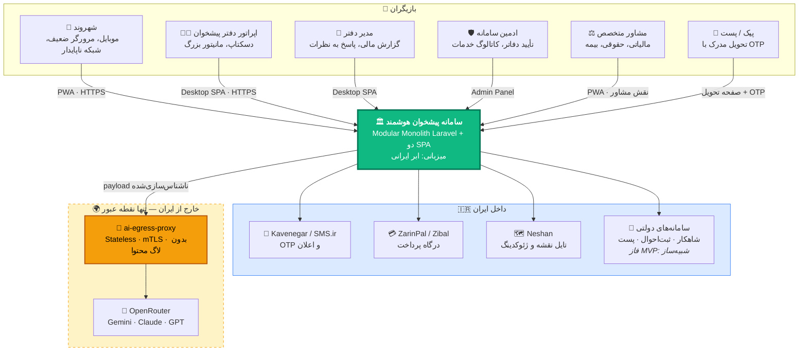

**قاعده مرزی حیاتی:** تنها یال خروجی از مرز کشور، یال `SYSTEM → PROXY` است و روی آن **لایه ناشناس‌سازی اجباری** (§۸.۱.۳) نصب است. هیچ کد دیگری در سامانه مجاز به فراخوانی خارجی نیست — این با Egress Firewall در سطح شبکه اعمال می‌شود، نه صرفاً با Code Review.

## ۳.۲. سطح ۲ — Container

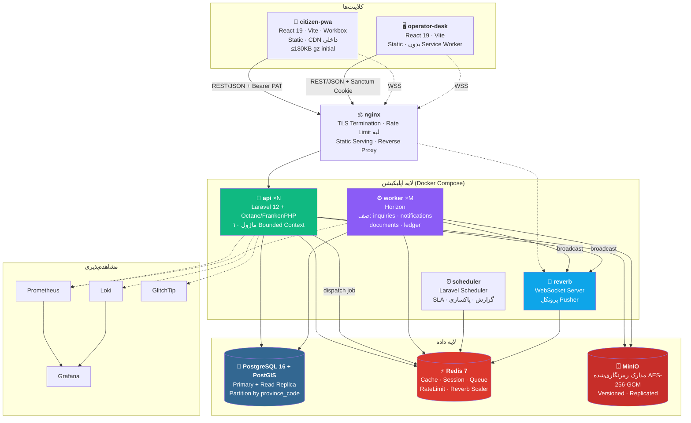

### جدول کانتینرها

| کانتینر | تکنولوژی | مسئولیت | مقیاس اولیه | مقیاس ملی |
|---|---|---|---|---|
| `citizen-pwa` | Static (nginx/CDN) | UI شهروند | ۱ | CDN |
| `operator-desk` | Static (nginx/CDN) | UI اپراتور و مدیر | ۱ | CDN |
| `api` | Laravel Octane | تمام منطق همزمان (Sync) | ۲ نمونه | ۱۲+ نمونه پشت LB |
| `worker` | Horizon | کارهای ناهمزمان | ۲ نمونه | ۲۰+ نمونه، جدا به‌ازای هر صف |
| `scheduler` | Laravel Scheduler | Cron ها | ۱ (Singleton اجباری) | ۱ + Leader Election با Redis Lock |
| `reverb` | Laravel Reverb | WebSocket | ۱ | ۴+ نمونه با Redis Scaling |
| `postgres` | PostgreSQL 16 | داده تراکنشی | Primary + 1 Replica | Primary + 3 Replica + PgBouncer |
| `redis` | Redis 7 | Cache/Queue/RT | ۱ | Sentinel با ۳ نود |
| `minio` | MinIO | مدارک | ۱ نود، ۴ دیسک | ۴ نود Distributed |

## ۳.۳. سطح ۳ — Component (داخل کانتینر `api`)

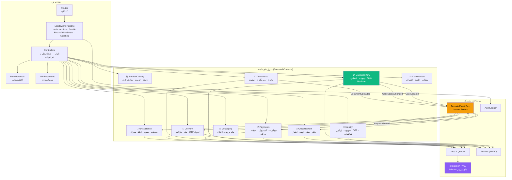

**قاعده مرزی ماژول‌ها (اجباری، با تست معماری در CI):**
1. ماژول A **هرگز** مدل Eloquent ماژول B را import نمی‌کند.
2. ارتباط فقط از دو راه: (الف) فراخوانی `Public Service Interface` ماژول مقصد، (ب) گوش‌دادن به Domain Event.
3. هر ماژول یک پوشه `Contracts/` دارد که تنها سطح عمومی آن است؛ باقی `Internal` است.
4. تست `tests/Architecture/ModuleBoundaryTest.php` با Pest Arch این قواعد را اعمال می‌کند و نقض آن باعث Fail شدن CI می‌شود.

## ۳.۴. جریان انتها-به-انتها: از ثبت درخواست تا تحویل مدرک

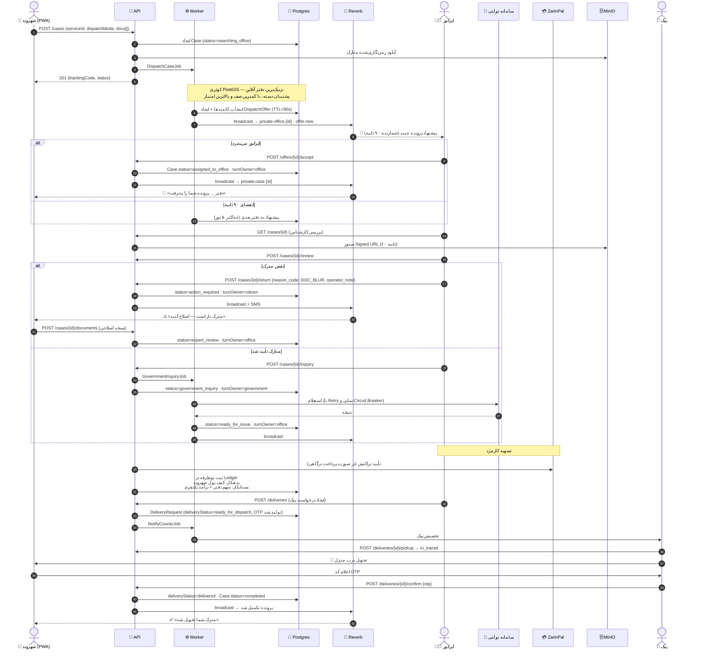

## ۳.۵. ماشین وضعیت پرونده (منبع حقیقت واحد)

این نمودار **قرارداد الزام‌آور** است. هیچ گذاری خارج از یال‌های زیر مجاز نیست؛ تلاش برای گذار نامعتبر باید `InvalidCaseTransitionException` پرتاب کند.

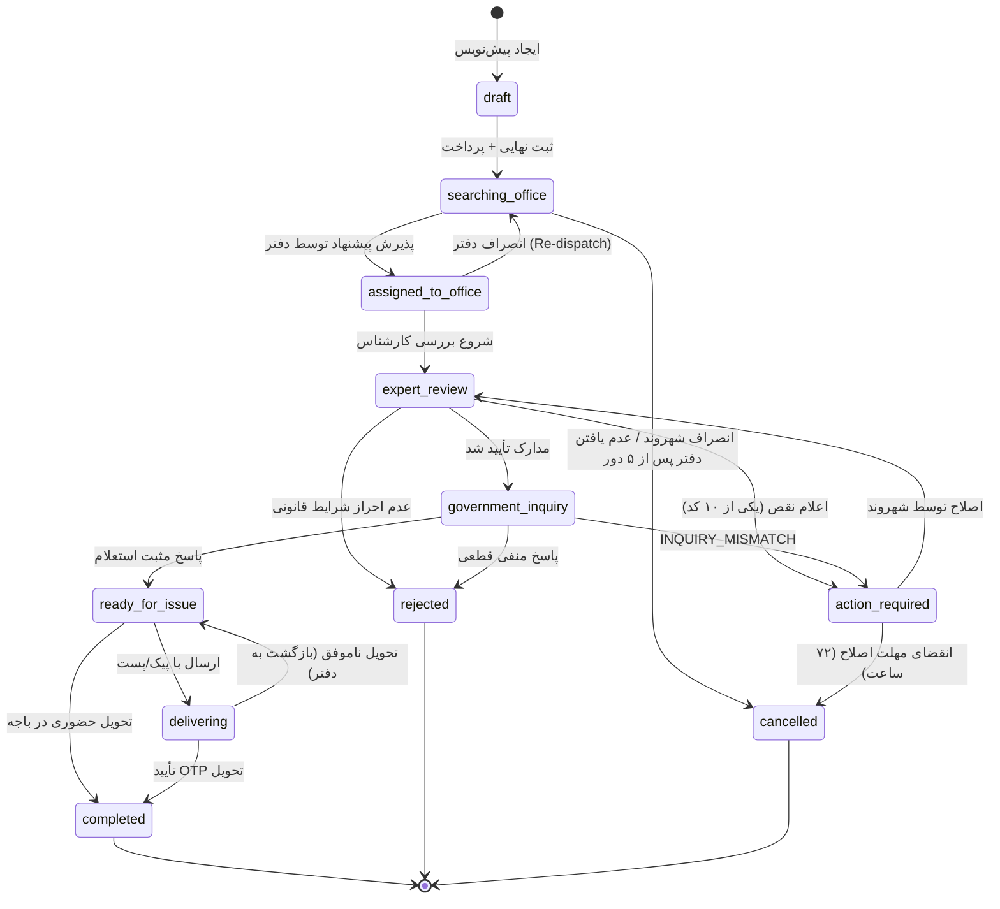

### جدول کامل گذارها و مالک نوبت

| از وضعیت | به وضعیت | رویداد | `turn_owner` مقصد | نقش مجاز | عارضه جانبی |
|---|---|---|---|---|---|
| `draft` | `searching_office` | `case.submitted` | `system` | Citizen | برداشت وجه، `DispatchCaseJob` |
| `searching_office` | `assigned_to_office` | `offer.accepted` | `office` | Operator | افزایش `current_waiting_queue` دفتر |
| `searching_office` | `cancelled` | `dispatch.exhausted` | `system` | System | استرداد کامل وجه |
| `assigned_to_office` | `expert_review` | `review.started` | `office` | Operator | شروع شمارنده SLA |
| `assigned_to_office` | `searching_office` | `office.declined` | `system` | Operator/Manager | جریمه SLA دفتر، Re-dispatch |
| `expert_review` | `action_required` | `case.returned` | `citizen` | Operator | SMS + Push، مهلت ۷۲ ساعت |
| `expert_review` | `government_inquiry` | `documents.approved` | `government` | Operator | `GovernmentInquiryJob` |
| `expert_review` | `rejected` | `case.rejected` | `system` | Manager / System Admin | استرداد جزئی طبق قاعده کارمزد |
| `action_required` | `expert_review` | `documents.resubmitted` | `office` | Citizen | ریست شمارنده SLA |
| `action_required` | `cancelled` | `deadline.expired` | `system` | System (Scheduler) | استرداد جزئی |
| `government_inquiry` | `ready_for_issue` | `inquiry.succeeded` | `office` | System | تسویه Ledger با دفتر |
| `government_inquiry` | `action_required` | `inquiry.mismatch` | `citizen` | System | کد `INQUIRY_MISMATCH` |
| `government_inquiry` | `rejected` | `inquiry.failed` | `system` | System | استرداد طبق قاعده |
| `ready_for_issue` | `delivering` | `delivery.created` | `postal` | Operator | تولید OTP تحویل، بارنامه |
| `ready_for_issue` | `completed` | `handover.inperson` | `system` | Operator | ثبت تحویل حضوری |
| `delivering` | `completed` | `delivery.confirmed` | `system` | Courier + OTP | نهایی‌سازی Ledger |
| `delivering` | `ready_for_issue` | `delivery.failed` | `office` | Courier | بازگشت به دفتر، اعلان شهروند |

> **نکته:** دو وضعیت `draft` و `delivering` و `cancelled` نسبت به پروتوتایپ **افزوده** شده‌اند. دلیل: پروتوتایپ پرونده را بلافاصله می‌ساخت (بدون امکان ذخیره پیش‌نویس آفلاین — که HC-2 لازمش دارد)، مرحله پیک را در وضعیت پرونده منعکس نمی‌کرد، و «لغو» را از «رد» تفکیک نمی‌کرد. هر سه برای یک سامانه واقعی الزامی‌اند.

---

# فصل ۴ — معماری Frontend

## ۴.۱. ساختار Monorepo

```
pishkhan/
├── pnpm-workspace.yaml
├── turbo.json
├── package.json                    # فقط اسکریپت‌های ریشه؛ هیچ dependency برنامه‌ای
├── .github/workflows/
│   ├── ci.yml
│   ├── deploy-staging.yml
│   ├── deploy-production.yml
│   └── constraint-guard.yml        # اجرای HC-1
├── docker/
│   ├── compose.yml
│   ├── compose.prod.yml
│   ├── nginx/
│   └── php/Dockerfile              # FrankenPHP + Octane
│
├── apps/
│   ├── citizen-pwa/                # 📱 موبایل-اول · PWA · Offline
│   │   ├── index.html
│   │   ├── vite.config.ts
│   │   ├── public/
│   │   │   ├── manifest.webmanifest
│   │   │   └── icons/              # 192 · 512 · maskable
│   │   └── src/
│   │       ├── main.tsx
│   │       ├── App.tsx             # ≤80 خط — فقط Provider ها و Router
│   │       ├── routes/             # تعریف مسیرها (React Router 7 Data Mode)
│   │       │   └── index.tsx
│   │       ├── features/           # ⭐ Feature-Sliced — هر تب یک اسلایس
│   │       │   ├── home/
│   │       │   ├── service-catalog/
│   │       │   ├── offices-map/
│   │       │   ├── case-tracking/
│   │       │   ├── profile/
│   │       │   ├── wallet/
│   │       │   ├── documents-vault/
│   │       │   ├── consultation/
│   │       │   ├── delegation/
│   │       │   ├── messaging/
│   │       │   ├── auth/
│   │       │   └── ai-assistant/
│   │       ├── shared/
│   │       │   ├── api/            # هوک‌های TanStack Query
│   │       │   ├── offline/        # Dexie · صف Background Sync
│   │       │   ├── hooks/
│   │       │   ├── lib/            # jalali · formatters · digits
│   │       │   └── realtime/       # Echo client
│   │       └── locales/fa/*.json
│   │
│   ├── operator-desk/              # 🖥️ دسکتاپ-اول · بدون SW
│   │   └── src/
│   │       ├── App.tsx
│   │       ├── routes/
│   │       ├── features/           # هفت میز کاری + مدیریت
│   │       │   ├── offers/         # پیشنهادهای ورودی (Dispatch)
│   │       │   ├── workspace/      # میز بررسی پرونده
│   │       │   ├── queue/          # صف و نوبت حضوری
│   │       │   ├── delivery/       # پیک و بارنامه
│   │       │   ├── finance/        # تسویه و گزارش مالی
│   │       │   ├── reviews/        # نظرات و کیفیت SLA
│   │       │   ├── office-profile/ # پروفایل، خدمات، اطلاعیه
│   │       │   └── auth/
│   │       └── shared/
│   │
│   └── api/                        # 🐘 Laravel (فصل ۵)
│
└── packages/
    ├── ui-kit/                     # Design System — Liquid Glass
    │   ├── src/tokens/             # رنگ · فاصله · شعاع · شیشه · انیمیشن
    │   ├── src/primitives/         # Button · Input · Sheet · Dialog · Badge …
    │   ├── src/patterns/           # GlassDock · GlassLens · StatusPill · Timeline
    │   └── src/styles/tailwind-preset.ts
    ├── api-client/                 # ⚙️ تولیدشده از OpenAPI — هرگز دستی ویرایش نشود
    │   ├── src/generated/          # خروجی orval
    │   └── src/index.ts
    ├── domain/                     # Enumها و منطق خالص مشترک دو اپ
    │   ├── src/case-status.ts      # ۸+۳ وضعیت · گذارهای مجاز · برچسب فارسی
    │   ├── src/turn-owner.ts
    │   ├── src/return-reasons.ts   # ۱۰ کد
    │   ├── src/service-tags.ts
    │   └── src/delivery.ts
    ├── config-eslint/
    ├── config-typescript/
    └── testing/                    # MSW handlers · fixtures مشترک
```

### چرا Feature-Sliced و نه پوشه `components/` تخت؟

مشکل اصلی پروتوتایپ این بود که `components/` تخت بود و در نتیجه `OfficePortalView.tsx` به ۴٬۵۱۰ خط رسید. در معماری اسلایسی، **هر اسلایس سقف اندازه دارد** و وقتی بزرگ شد، به‌طور طبیعی به اسلایس فرزند شکسته می‌شود. ساختار داخلی هر اسلایس ثابت و اجباری است:

```
features/<slice>/
├── index.ts              # تنها سطح عمومی اسلایس (Public API)
├── ui/                   # کامپوننت‌های ارائه — هر فایل ≤۲۰۰ خط
├── model/                # وضعیت (Zustand store) و منطق
├── api/                  # هوک‌های Query/Mutation این اسلایس
└── lib/                  # توابع کمکی محلی
```

**قاعده وابستگی (با ESLint `import/no-restricted-paths` اعمال می‌شود):** `features/*` نمی‌تواند از `features/*` دیگر import کند. اشتراک فقط از راه `shared/` یا `packages/`. این دقیقاً همان قاعده‌ای است که مانع تولد یک God Component دیگر می‌شود.

## ۴.۲. اجرای سقف اندازه فایل

```js
// packages/config-eslint/index.js — بخش مربوطه
rules: {
  'max-lines': ['error', { max: 400, skipBlankLines: true, skipComments: true }],
  'max-lines-per-function': ['error', { max: 60, skipBlankLines: true }],
  'complexity': ['error', 12],
  'max-depth': ['error', 4],
  'import/no-restricted-paths': ['error', {
    zones: [{
      target: './src/features',
      from: './src/features',
      except: ['./'],           // فقط import از خودِ اسلایس
      message: 'اسلایس‌ها نباید مستقیماً به هم وابسته شوند؛ از shared/ استفاده کنید.'
    }]
  }],
}
```

این قاعده **در CI به‌صورت Error** اجرا می‌شود، نه Warning. دلیل: مدل‌های AI به‌طور طبیعی به سمت فایل‌های بزرگ می‌روند و بدون یک مانع سخت، `OfficePortalView` دوباره متولد می‌شود.

## ۴.۳. State Management — قاعده سه‌لایه

| نوع State | ابزار | مثال | قاعده |
|---|---|---|---|
| **State سرور** (هر داده‌ای که مالکش بک‌اند است) | TanStack Query 5 | پرونده‌ها، خدمات، دفاتر، پیام‌ها، تراکنش‌ها | **هرگز** در Zustand کپی نشود. تنها منبع حقیقت، کش Query است. |
| **State UI سراسری** | Zustand 5 | مودال باز، تب فعال، فیلترهای نقشه، حالت اپ | فقط داده‌ای که چند اسلایس می‌بینند. |
| **State محلی** | `useState` / `useReducer` | مرحله فرم، متن ورودی، باز/بسته آکاردئون | پیش‌فرض. تا وقتی کافی است، بالاتر نرود. |

### پیکربندی دقیق QueryClient (اپ شهروند)

```ts
// apps/citizen-pwa/src/shared/api/query-client.ts
export const queryClient = new QueryClient({
  defaultOptions: {
    queries: {
      staleTime: 60_000,              // ۱ دقیقه — کاهش رفت‌وبرگشت روی شبکه ضعیف
      gcTime: 24 * 60 * 60 * 1000,    // ۲۴ ساعت — لازمه Offline
      retry: (failureCount, error) => {
        if (isHttpError(error) && error.status >= 400 && error.status < 500) return false;
        return failureCount < 3;
      },
      retryDelay: (i) => Math.min(1000 * 2 ** i, 30_000),
      refetchOnWindowFocus: false,    // روی موبایل ایرانی، ترافیک گران است
      refetchOnReconnect: true,
      networkMode: 'offlineFirst',    // ⭐ کلید HC-2
    },
    mutations: {
      networkMode: 'offlineFirst',
      retry: 2,
    },
  },
});
```

### کلیدهای کش — قرارداد اجباری

```ts
// apps/citizen-pwa/src/shared/api/query-keys.ts
export const qk = {
  services:   { all: ['services'] as const,
                list: (f: ServiceFilters) => ['services', 'list', f] as const,
                detail: (id: string) => ['services', 'detail', id] as const },
  offices:    { all: ['offices'] as const,
                nearby: (p: GeoQuery) => ['offices', 'nearby', p] as const,
                detail: (id: string) => ['offices', 'detail', id] as const },
  cases:      { all: ['cases'] as const,
                list: (s?: CaseStatus) => ['cases', 'list', s ?? 'all'] as const,
                detail: (id: string) => ['cases', 'detail', id] as const,
                timeline: (id: string) => ['cases', id, 'timeline'] as const },
  wallet:     { balance: ['wallet', 'balance'] as const,
                transactions: (p: number) => ['wallet', 'transactions', p] as const },
  documents:  { vault: ['documents', 'vault'] as const },
  messages:   { byCase: (id: string) => ['messages', id] as const },
  profile:    { me: ['profile', 'me'] as const },
} as const;
```

قاعده: هر Mutation باید صریحاً بگوید کدام کلیدها را باطل می‌کند. هیچ `invalidateQueries()` بدون آرگومان مجاز نیست.

## ۴.۴. Routing

مسیرها **معنادار و قابل اشتراک‌گذاری** هستند — برخلاف پروتوتایپ که کل ناوبری با `activeTab` انجام می‌شد و یعنی هیچ صفحه‌ای لینک مستقیم نداشت.

### اپ شهروند

| مسیر | صفحه | نیاز به احراز | Prefetch |
|---|---|---|---|
| `/` | خانه (کیف پول، دسته‌ها، اسلایدر) | ❌ | — |
| `/services` | کاتالوگ خدمات | ❌ | ✅ در Idle |
| `/services/:categoryId` | خدمات یک دسته | ❌ | — |
| `/services/:categoryId/:serviceId` | جزئیات خدمت | ❌ | — |
| `/request/:serviceId` | جریان ۵ مرحله‌ای درخواست | ✅ | — |
| `/map` | نقشه دفاتر | ❌ | Lazy (Leaflet جدا) |
| `/map/offices/:officeId` | جزئیات دفتر | ❌ | — |
| `/cases` | لیست پرونده‌ها | ✅ | ✅ |
| `/cases/:trackingCode` | رهگیری گرافیکی | ✅ | ✅ |
| `/cases/:trackingCode/chat` | گفتگو با دفتر | ✅ | — |
| `/consultation` | هاب مشاوره | ✅ | Lazy |
| `/consultation/advisors/:advisorId` | پروفایل مشاور | ✅ | — |
| `/consultation/sessions/:sessionId` | جلسه زنده | ✅ | Lazy |
| `/profile` | حساب کاربری | ✅ | — |
| `/profile/personal-info` | اطلاعات شخصی | ✅ | — |
| `/profile/documents` | مخزن مدارک | ✅ | — |
| `/profile/appointments` | نوبت‌های حضوری | ✅ | — |
| `/profile/reminders` | یادآور هوشمند | ✅ | — |
| `/profile/messages` | پیام‌ها و ابلاغیه‌ها | ✅ | — |
| `/profile/delegations` | نمایندگی حقوقی | ✅ | — |
| `/profile/settings` | تنظیمات | ✅ | — |
| `/profile/support` | پشتیبانی | ✅ | — |
| `/profile/about` | درباره | ❌ | — |
| `/wallet` | کیف پول | ✅ | — |
| `/wallet/transactions` | تراکنش‌ها | ✅ | — |
| `/login` | ورود (کد ملی + OTP) | ❌ | — |
| `/offline` | صفحه Offline Fallback | ❌ | Precache |

> نُه زیرصفحه `ProfileSubPage` پروتوتایپ (`main`, `personal_info`, `appointments`, `smart_reminder`, `documents_vault`, `messages_and_notices`, `settings`, `support`, `about`) همگی به مسیرهای بالا نگاشت شده‌اند، به‌علاوه `delegations` که در پروتوتایپ فقط مودال بود.

### اپ اپراتور

| مسیر | صفحه | نقش |
|---|---|---|
| `/login` | ورود دفتر (کد دفتر + کاربر + OTP) | — |
| `/offers` | پیشنهادهای ورودی Dispatch | Operator, Manager |
| `/workspace` | میز کار — لیست پرونده‌ها | Operator, Manager |
| `/workspace/:caseId` | بررسی پرونده و مدارک | Operator, Manager |
| `/queue` | صف و نوبت‌های حضوری | Operator, Manager |
| `/delivery` | درخواست پیک و بارنامه | Operator, Manager |
| `/delivery/:deliveryId/waybill` | چاپ بارنامه | Operator, Manager |
| `/finance` | تسویه، درآمد، مغایرت | **Manager فقط** |
| `/reviews` | نظرات شهروندان و کیفیت SLA | Manager (پاسخ) / Operator (مشاهده) |
| `/office-profile` | اطلاعات، خدمات، پذیرش، اطلاعیه | **Manager فقط** |

### Code Splitting

هر مسیر با `React.lazy` بارگذاری می‌شود. سه Chunk سنگین اجباراً جدا می‌شوند:

```ts
const MapPage        = lazy(() => import('@/features/offices-map'));      // Leaflet ~42KB
const ConsultationHub= lazy(() => import('@/features/consultation'));     // ~35KB
const AiAssistant    = lazy(() => import('@/features/ai-assistant'));     // ~18KB
```

## ۴.۵. Data Fetching و کلاینت تولیدشده

**هیچ `fetch` دستی در کد اپلیکیشن مجاز نیست.** زنجیره قرارداد:

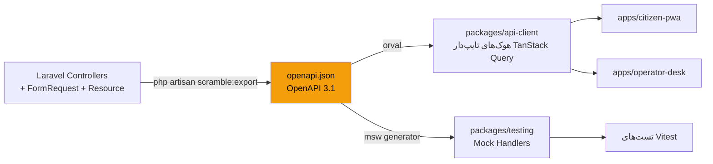

**دروازه CI (`contract-check`):** پس از `scramble:export`، اگر `git diff --exit-code packages/api-client/src/generated` تغییری نشان دهد، بیلد Fail می‌شود. یعنی هر تغییر API باید کلاینت تولیدشده‌اش هم Commit شود — قرارداد هرگز کهنه نمی‌ماند. این دقیقاً جایگزین «تایپ مشترک» است که با انتخاب PHP از دست رفت.

## ۴.۶. طراحی PWA و استراتژی Offline

### لایه‌های Service Worker

| لایه | محتوا | استراتژی Workbox | مدت اعتبار |
|---|---|---|---|
| App Shell | HTML، JS، CSS، فونت Vazirmatn (خودمیزبان، woff2 زیرمجموعه فارسی) | **Precache** (Revision-based) | تا نسخه بعد |
| کاتالوگ خدمات و دسته‌ها | `GET /api/v1/services`, `/categories` | **StaleWhileRevalidate** | ۷ روز |
| پرونده‌های خود کاربر | `GET /api/v1/cases`, `/cases/{code}` | **NetworkFirst** (timeout 3s) | ۲۴ ساعت |
| فراداده مخزن مدارک | `GET /api/v1/documents` | **NetworkFirst** | ۲۴ ساعت |
| لیست دفاتر | `GET /api/v1/offices` | **StaleWhileRevalidate** | ۳ روز |
| تایل نقشه (Neshan) | `https://api.neshan.org/v*/static?...` | **CacheFirst**, سقف ۳۰۰ تایل | ۳۰ روز |
| تصاویر خدمات | `/assets/*.avif|webp` | **CacheFirst**, سقف ۶۰ فایل | ۳۰ روز |
| مدارک (Signed URL) | MinIO | **هرگز کش نشود** (`NetworkOnly`) | — |
| پرداخت و OTP | `/api/v1/payments/*`, `/auth/*` | **NetworkOnly** | — |

### آنچه Offline کار می‌کند (قرارداد صریح)

✅ **خواندنی:** پوسته اپ، کل کاتالوگ خدمات و دسته‌ها، پرونده‌های خود کاربر با تایم‌لاین کامل، فراداده مخزن مدارک، لیست دفاتر و آخرین تایل‌های دیده‌شده نقشه، تاریخچه پیام‌های قبلاً بارگذاری‌شده، موجودی کیف پول (آخرین مقدار همگام، با برچسب «آخرین به‌روزرسانی: …»).

✅ **نوشتنی صف‌شونده:** ثبت درخواست خدمت جدید، آپلود مدرک اصلاحی، ارسال پیام در گفتگوی پرونده، ویرایش اطلاعات پروفایل. همگی در IndexedDB (Dexie) ذخیره و با Background Sync ارسال می‌شوند، با نشان «⏳ در انتظار ارسال» در UI.

❌ **نیازمند اتصال:** پرداخت، دریافت/تأیید OTP، صف زنده دفتر، مشاوره زنده، فراخوانی AI، تولید Signed URL مدرک، تأیید OTP تحویل.

### صف ارسال Offline

```ts
// apps/citizen-pwa/src/shared/offline/outbox.ts
export interface OutboxItem {
  id: string;                    // UUID v7 — هم کلید Idempotency است
  createdAt: number;
  endpoint: string;
  method: 'POST' | 'PATCH' | 'PUT';
  body: unknown;
  files?: { name: string; blob: Blob }[];
  status: 'pending' | 'syncing' | 'failed';
  attempts: number;
  lastError?: string;
}

export const db = new Dexie('pishkhan-outbox');
db.version(1).stores({ outbox: 'id, status, createdAt' });
```

**تضمین Idempotency:** هر آیتم صف یک `id` از نوع UUID v7 دارد که به‌عنوان هدر `Idempotency-Key` ارسال می‌شود. سمت سرور، Middleware `Idempotent` پاسخ اولین درخواست را ۲۴ ساعت در Redis نگه می‌دارد و درخواست تکراری با همان کلید، همان پاسخ را بدون اجرای مجدد می‌گیرد. این مانع از آن می‌شود که یک شهروند در تونل مترو، سه بار برای یک خدمت پول بدهد.

### فلوی به‌روزرسانی نسخه

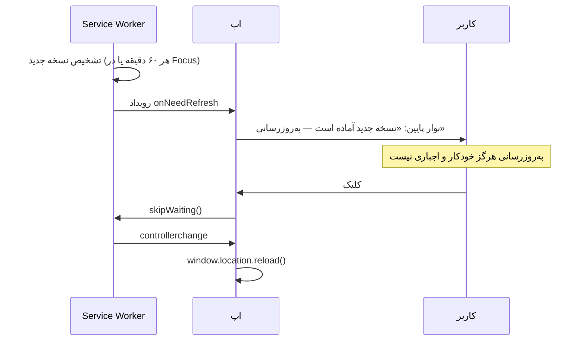

**قاعده:** `skipWaiting` هرگز خودکار فراخوانی نمی‌شود. اگر کاربری وسط پر کردن فرم درخواست خدمت باشد، رفرش اجباری یعنی از دست رفتن کارش. اما اگر نسخه جدید شامل `criticalUpdate: true` در Manifest باشد (مثلاً وصله امنیتی)، نوار غیرقابل‌بستن می‌شود و پس از ۵ دقیقه اجباری اعمال می‌شود.

## ۴.۷. Design System — «Liquid Glass» توکن‌محور

زبان بصری پروتوتایپ حفظ می‌شود اما از CSS پراکنده به توکن منتقل می‌شود.

```ts
// packages/ui-kit/src/tokens/index.ts
export const tokens = {
  color: {
    brand:   { 50:'#ecfdf5', 500:'#10b981', 600:'#059669', 700:'#047857' },
    surface: { base:'#f8fafc', raised:'#ffffff', sunken:'#f1f5f9', inverse:'#0f172a' },
    status: {
      done:'#10b981', current:'#3b82f6', pending:'#94a3b8',
      warning:'#f59e0b', failed:'#ef4444',
    },
    turnOwner: {
      citizen:'#3b82f6', office:'#10b981', government:'#8b5cf6',
      postal:'#f59e0b', system:'#64748b',
    },
  },
  glass: {
    dock:   { blur:'28px', saturate:'190%', bg:'rgba(255,255,255,0.62)', border:'rgba(255,255,255,0.55)' },
    lens:   { blur:'22px', saturate:'175%', bg:'rgba(255,255,255,0.42)' },
    button: { blur:'24px', saturate:'190%', bg:'rgba(255,255,255,0.58)' },
    dispersion: 'conic-gradient(from 180deg, #ff008040, #ffae0040, #00ffd140, #7a00ff40, #ff008040)',
  },
  radius:  { sm:'8px', md:'12px', lg:'16px', xl:'22px', pill:'999px' },
  space:   { 1:'4px', 2:'8px', 3:'12px', 4:'16px', 5:'20px', 6:'24px', 8:'32px' },
  motion:  {
    fast:'140ms', base:'240ms', slow:'420ms',
    ease:'cubic-bezier(0.25, 1, 0.5, 1)',   // همان منحنی پروتوتایپ
  },
  font: { family:'"Vazirmatn Variable", system-ui, sans-serif' },
  z:    { nav:40, sheet:50, modal:60, toast:70 },
} as const;
```

### Fallback اجباری برای مرورگرهای ضعیف (HC-2)

`backdrop-filter` روی اندروید قدیمی و برخی مرورگرهای داخلی یا پشتیبانی نمی‌شود یا فریم‌ریت را نابود می‌کند. هر سطح شیشه‌ای **باید** این الگو را داشته باشد:

```css
.glass-dock {
  background: rgb(248 250 252 / 0.92);        /* Fallback مات — پیش‌فرض */
  border: 1px solid rgb(226 232 240);
}
@supports (backdrop-filter: blur(1px)) {
  @media (prefers-reduced-transparency: no-preference) and (min-width: 0px) {
    .glass-dock {
      background: rgb(255 255 255 / 0.62);
      backdrop-filter: blur(28px) saturate(190%);
      -webkit-backdrop-filter: blur(28px) saturate(190%);
      border-color: rgb(255 255 255 / 0.55);
    }
  }
}
@media (prefers-reduced-motion: reduce) {
  .glass-lens::before { animation: none; }    /* حذف حلقه پاشش رنگی */
}
```

علاوه بر آن، یک هوک `useDeviceCapability()` وجود دارد که با `navigator.deviceMemory ?? 4` و `navigator.hardwareConcurrency` سطح دستگاه را می‌سنجد؛ روی `low` کلاس `data-perf="low"` روی `<html>` می‌نشیند و تمام افکت‌های شیشه‌ای و انیمیشن‌های Motion غیرفعال می‌شوند. **این تنها راه رعایت واقعی HC-2 است.**

### کامپوننت‌های الزامی `ui-kit`

`Button` · `IconButton` · `Input` · `NumericInput` (ارقام فارسی↔انگلیسی) · `Select` · `Checkbox` · `Radio` · `Switch` · `Textarea` · `FileDropzone` · `OtpInput` · `Sheet` (Bottom Sheet موبایل) · `Dialog` · `Drawer` · `Tabs` · `Accordion` · `Badge` · `StatusPill` (نگاشت ۸ وضعیت پرونده) · `TurnOwnerChip` (نگاشت ۵ نوبت‌دار) · `ServiceTagBadge` (online/semi-online/in-person) · `Timeline` · `Avatar` · `Rating` (با تفکیک سه‌بعدی مشاوران) · `Skeleton` · `EmptyState` · `Toast` · `Tooltip` · `GlassDock` · `GlassLens` · `DataGrid` (فقط برای Desk) · `Pagination` · `CurrencyText` (تومان با جداکننده فارسی) · `JalaliDate` · `CountdownTimer`.

هر کامپوننت اجباراً دارای: تست Vitest، داستان Storybook، و پشتیبانی کامل کیبورد و `aria-*`.

## ۴.۸. بودجه عملکرد (اعداد سخت — در CI اعمال می‌شود)

### اپ شهروند — دستگاه مرجع: **Moto G4 / اندروید ۸، شبکه 3G Slow (400kbps, RTT 400ms)**

| متریک | بودجه | ابزار سنجش | اقدام در صورت نقض |
|---|---|---|---|
| JS اولیه (gzip) | **≤ 180 KB** | `size-limit` | ❌ Fail CI |
| CSS اولیه (gzip) | **≤ 28 KB** | `size-limit` | ❌ Fail CI |
| فونت (woff2، زیرمجموعه فارسی) | **≤ 90 KB** | بازرسی دستی | ❌ Fail CI |
| هر Chunk مسیر (gzip) | **≤ 60 KB** | `size-limit` | ❌ Fail CI |
| هر تصویر | **≤ 80 KB** (AVIF با Fallback WebP) | اسکریپت بیلد | ❌ Fail CI |
| **LCP** | **≤ 2.5s** | Lighthouse CI | ❌ Fail CI |
| **INP** | **≤ 200ms** | Lighthouse CI | ❌ Fail CI |
| **CLS** | **≤ 0.05** | Lighthouse CI | ❌ Fail CI |
| **TTI** | **≤ 3.5s** | Lighthouse CI | ⚠️ هشدار |
| امتیاز Lighthouse Performance | **≥ 90** | Lighthouse CI | ❌ Fail CI |
| امتیاز Lighthouse Accessibility | **≥ 95** | Lighthouse CI | ❌ Fail CI |
| کل باندل PWA پس از Precache | **≤ 1.2 MB** | Workbox report | ⚠️ هشدار |

### اپ اپراتور — دستگاه مرجع: دسکتاپ معمولی، شبکه اداری

| متریک | بودجه |
|---|---|
| JS اولیه (gzip) | ≤ 400 KB |
| LCP | ≤ 1.8s |
| زمان رندر جدول ۵۰۰ ردیفی | ≤ 120ms (با Virtualization اجباری — TanStack Virtual) |
| Lighthouse Accessibility | ≥ 95 |

### حل مشکل ۶.۵ مگابایت تصاویر پروتوتایپ

۱۲ تصویر JPG سه‌بعدی موجود، در زمان بیلد با `vite-imagetools` به AVIF (کیفیت ۶۰) + WebP (Fallback) + JPEG (Fallback نهایی) در سه عرض `320/640/1024` تبدیل می‌شوند، همگی با `loading="lazy"` و `decoding="async"` و ابعاد صریح (برای CLS صفر). هدف: **کل بار تصاویر صفحه خانه ≤ ۱۲۰KB**.

## ۴.۹. استراتژی RTL و i18n

| موضوع | قاعده |
|---|---|
| جهت | `<html lang="fa" dir="rtl">` — `dir` از locale مشتق می‌شود، هرگز هاردکد نیست. |
| CSS | **فقط Logical Properties**: `margin-inline-start` نه `margin-left`؛ در Tailwind یعنی `ms-4` نه `ml-4`. ESLint rule سفارشی، کلاس‌های فیزیکی جهت‌دار را Error می‌کند. |
| آیکون‌های جهت‌دار | `ChevronLeft/Right`, `ArrowLeft/Right` از یک Wrapper `<DirectionalIcon>` می‌آیند که با locale می‌چرخد. |
| انیمیشن گذار تب | جهت `x` در Motion از `useDirection()` ضرب می‌شود، نه از عدد ثابت (باگ فعلی پروتوتایپ در حالت LTR). |
| ترجمه | `react-i18next` با Namespace به‌ازای هر اسلایس: `common`, `services`, `cases`, `offices`, `wallet`, `consultation`, `profile`, `errors`, `desk`. |
| رشته‌ها | **هیچ رشته فارسی در JSX مجاز نیست.** ESLint rule `no-literal-string` روی `apps/**/src/**/*.tsx` فعال است. |
| اعداد | همه اعداد از `formatNumber(n, locale)` عبور می‌کنند. ورودی‌های عددی، ارقام فارسی/عربی را قبول و به انگلیسی نرمال می‌کنند (`toEnglishDigits` — همان تابعی که پروتوتایپ داشت، به `packages/domain` منتقل می‌شود). |
| تاریخ | **DB همیشه UTC ISO-8601.** تبدیل جلالی فقط در لایه ارائه با `jalaali-js` (کلاینت) و `morilog/jalali` (سرور، برای SMS و PDF). کامپوننت `<JalaliDate value={iso} format="long" />`. |
| پول | همه‌جا **ریال به‌عنوان واحد ذخیره صحیح (integer)**، نمایش به تومان. دلیل: پروتوتایپ تومان اعشاری داشت که در محاسبات کارمزد به خطای گرد کردن می‌انجامد. `<CurrencyText rials={n} />`. |
| افزودن زبان جدید | فقط افزودن `locales/<lang>/*.json` + یک ورودی در `SUPPORTED_LOCALES`. هیچ تغییر کدی لازم نیست. |

## ۴.۱۰. Real-Time در فرانت‌اند

```ts
// apps/citizen-pwa/src/shared/realtime/echo.ts
import Echo from 'laravel-echo';
import Pusher from 'pusher-js';

export const echo = new Echo({
  broadcaster: 'reverb',
  key: import.meta.env.VITE_REVERB_APP_KEY,
  wsHost: import.meta.env.VITE_REVERB_HOST,
  wsPort: 443, wssPort: 443, forceTLS: true,
  enabledTransports: ['ws', 'wss'],
  authEndpoint: `${import.meta.env.VITE_API_URL}/broadcasting/auth`,
});
```

**قاعده طلایی:** رویداد Real-Time **هرگز مستقیماً State را نمی‌نویسد**؛ فقط کش TanStack Query را باطل یا Patch می‌کند. این تنها راه جلوگیری از واگرایی بین WebSocket و REST است.

```ts
useEffect(() => {
  const ch = echo.private(`case.${caseId}`);
  ch.listen('.case.status.changed', (e: CaseStatusChangedEvent) => {
    queryClient.setQueryData(qk.cases.detail(caseId), (old) =>
      old ? { ...old, status: e.status, turnOwner: e.turnOwner, updatedAt: e.at } : old);
    queryClient.invalidateQueries({ queryKey: qk.cases.timeline(caseId) });
  });
  return () => { echo.leave(`case.${caseId}`); };
}, [caseId]);
```

**Fallback اجباری:** اگر اتصال WebSocket بیش از ۱۰ ثانیه برقرار نشد (شبکه محدودکننده، پروکسی اداری دفتر)، هوک `useRealtimeOrPoll` به‌طور خودکار `refetchInterval: 15_000` را روی کوئری‌های حیاتی فعال می‌کند و یک نشانگر «حالت به‌روزرسانی کند» نمایش می‌دهد. بدون این، اپراتور در دفتری با فایروال سخت‌گیر، هیچ پیشنهاد پرونده‌ای نمی‌بیند.

## ۴.۱۱. مدیریت خطا و دسترس‌پذیری

- **Error Boundary سه‌لایه:** ریشه اپ (صفحه خطای کامل با دکمه گزارش) → هر مسیر (خطای صفحه با امکان تلاش مجدد) → هر ویجت مستقل (کارت خطای درجا). پروتوتایپ هیچ‌کدام را نداشت.
- **دسترس‌پذیری (هدف WCAG 2.1 AA):** نسبت کنتراست ≥ 4.5:1 روی همه سطوح شیشه‌ای (باید با ابزار تست شود — شیشه شفاف بزرگ‌ترین ریسک a11y این طراحی است)، ناوبری کامل با کیبورد، `focus-visible` مشهود، Landmarkهای ARIA، `aria-live="polite"` برای تغییر وضعیت پرونده، هدف لمسی ≥ ۴۴×۴۴ پیکسل، و پشتیبانی `prefers-reduced-motion` و `prefers-reduced-transparency`.
- **حذف `maximum-scale=1.0, user-scalable=no`** از متای Viewport پروتوتایپ — این نقض مستقیم WCAG 1.4.4 است و برای سامانه‌ای که کاربر سالمند دارد غیرقابل قبول است.

---

# فصل ۵ — معماری Backend

## ۵.۱. جدول تصمیم: Modular Monolith در برابر Microservices

| معیار | Modular Monolith ✅ | Microservices | Monolith ساده (بدون ماژول) |
|---|---|---|---|
| **هزینه زیرساخت** (۱۰۰k کاربر) | ~۳ VM · حدود ۸M تومان/ماه | ~۱۲ VM + Service Mesh + Registry · حدود ۳۵M تومان/ماه | ~۲ VM · ۵M تومان/ماه |
| **سرعت توسعه** با مدل AI | **بالا** — یک مخزن، یک زبان، یک تراکنش | پایین — هر تغییر دامنه‌ای، N سرویس و قرارداد بین‌سرویسی | خیلی بالا در ابتدا، سقوط شدید پس از ماه سوم |
| **مقیاس‌پذیری** تا ۱۰M کاربر | **کافی** — مقیاس افقی api/worker + Partition استانی + Read Replica | بهترین در تئوری | ناکافی — قفل‌شدگی و کوپلینگ |
| **نگه‌داری** | **بالا** — مرزها با تست معماری اعمال می‌شود | نیازمند SRE اختصاصی که وجود ندارد | فاجعه — دقیقاً تکرار `OfficePortalView` در بک‌اند |
| **یکپارچگی تراکنشی** | **ACID بومی** — ثبت پرونده + برداشت کیف پول + رزرو ظرفیت دفتر در یک تراکنش | نیازمند Saga و Compensating Transaction — منبع اصلی باگ‌های مالی | ACID بومی |
| **مسیر تجزیه آینده** | **باز** — هر ماژول مستقیماً به سرویس تبدیل می‌شود | — | بسته |
| **ریسک عملیاتی بدون DevOps** | **پایین** | **بحرانی** | پایین |

**تصمیم: Modular Monolith.** دلیل قطعی: بحرانی‌ترین تراکنش سامانه — «ثبت درخواست خدمت» — هم‌زمان پرونده می‌سازد، از کیف پول برداشت می‌کند، در دفتر کل دوطرفه ثبت می‌زند و ظرفیت دفتر را رزرو می‌کند. در Microservices این یک Saga چهارمرحله‌ای با جبران‌سازی است که با تیم AI-only تقریباً قطعاً پول شهروندان را گم می‌کند. در مونولیت ماژولار، این یک `DB::transaction()` است.

**مسیر تجزیه از پیش تعریف‌شده:** دو ماژول `AiAssistance` و بخش استعلام `Integration` از روز اول فقط از راه Job و Queue فراخوانی می‌شوند (هرگز همزمان)، پس تبدیلشان به سرویس مستقل در آینده صرفاً تعویض Transport است.

## ۵.۲. ساختار پوشه‌ها

```
apps/api/
├── app/
│   ├── Modules/                       # ⭐ Bounded Contexts
│   │   ├── Identity/
│   │   │   ├── Contracts/             # 🔓 تنها سطح عمومی ماژول
│   │   │   │   ├── IdentityServiceInterface.php
│   │   │   │   └── DTO/CitizenDto.php
│   │   │   ├── Domain/
│   │   │   │   ├── Models/            # Citizen, Operator, OtpChallenge, Delegation
│   │   │   │   ├── Enums/             # CitizenTier, DelegationStatus
│   │   │   │   ├── Events/            # CitizenRegistered, OtpVerified
│   │   │   │   └── Exceptions/
│   │   │   ├── Application/
│   │   │   │   ├── Actions/           # SendOtpAction, VerifyOtpAction …
│   │   │   │   └── Queries/
│   │   │   ├── Infrastructure/
│   │   │   │   ├── Repositories/
│   │   │   │   └── Policies/
│   │   │   ├── Http/
│   │   │   │   ├── Controllers/
│   │   │   │   ├── Requests/
│   │   │   │   └── Resources/
│   │   │   ├── Database/
│   │   │   │   ├── Migrations/
│   │   │   │   ├── Factories/
│   │   │   │   └── Seeders/
│   │   │   ├── Listeners/
│   │   │   ├── Jobs/
│   │   │   ├── routes.php
│   │   │   └── IdentityServiceProvider.php
│   │   ├── ServiceCatalog/            # همان ساختار داخلی
│   │   ├── CaseWorkflow/
│   │   ├── OfficeNetwork/
│   │   ├── Documents/
│   │   ├── Payments/
│   │   ├── Delivery/
│   │   ├── Consultation/
│   │   ├── Messaging/
│   │   └── AiAssistance/
│   │
│   ├── Integration/                   # 🛡️ Anti-Corruption Layer (فصل ۸)
│   │   ├── Sms/         { SmsGateway.php, Drivers/{Kavenegar,SmsIr,Fake}Driver.php }
│   │   ├── Payment/     { PaymentGateway.php, Drivers/{ZarinPal,Zibal,Fake}Driver.php }
│   │   ├── Ai/          { AiProvider.php, Drivers/{OpenRouter,LocalVllm,Fake}Driver.php }
│   │   ├── Geo/         { GeoProvider.php, Drivers/{Neshan,Fake}Driver.php }
│   │   └── Government/  { ShahkarClient.php, CivilRegistryClient.php, PostClient.php,
│   │                      Drivers/{Http,Simulator}/… }
│   │
│   └── Shared/
│       ├── Http/Middleware/           # EnsureOfficeScope, Idempotent, AuditLog, ForceJson
│       ├── Audit/                     # AuditLogger, AuditableAction
│       ├── Money/                     # Money value object (ریال، integer)
│       ├── Crypto/                    # EnvelopeEncryptor, KeyRing
│       ├── Events/                    # DomainEvent base
│       └── Pagination/
│
├── config/pishkhan.php                # تمام تنظیمات دامنه‌ای در یک فایل
├── routes/api.php                     # فقط include کردن routes.php ماژول‌ها
├── database/migrations/               # فقط جداول مشترک و Partitionها
└── tests/
    ├── Architecture/                  # Pest Arch — اعمال مرزها
    ├── Unit/
    ├── Feature/
    └── Contract/                      # قرارداد Adapterهای بیرونی
```

### تست معماری که مرزها را اجبار می‌کند

```php
// tests/Architecture/ModuleBoundaryTest.php
arch('ماژول‌ها فقط از راه Contracts با هم حرف می‌زنند')
    ->expect('App\Modules')
    ->not->toUse(collect(MODULES)
        ->flatMap(fn ($m) => ["App\\Modules\\{$m}\\Domain", "App\\Modules\\{$m}\\Infrastructure"])
        ->all())
    ->ignoring(fn (string $file) => sameModule($file));

arch('کنترلرها نازک بمانند')
    ->expect('App\Modules\*\Http\Controllers')
    ->not->toUse(['Illuminate\Support\Facades\DB', 'Illuminate\Database\Eloquent\Builder']);

arch('هیچ ماژولی مستقیماً به شبکه بیرون وصل نشود')
    ->expect('App\Modules')
    ->not->toUse(['Illuminate\Support\Facades\Http', 'GuzzleHttp\Client']);   // فقط Integration مجاز است

arch('Enum ها پشتیبان رشته‌ای داشته باشند')->expect('App\Modules\*\Domain\Enums')->toBeStringBackedEnums();
```

## ۵.۳. نگاشت DDD — از `types.ts` به Aggregate

| Aggregate Root | ماژول | موجودیت‌های داخل مرز | منبع در `types.ts` | Invariantهای الزامی |
|---|---|---|---|---|
| **Citizen** | Identity | `CitizenProfile`, `DocumentItem`(ارجاع), `LegalDelegation` | `CitizenProfile`, `LegalDelegation` | کد ملی یکتا و معتبر (الگوریتم چک‌دیجیت)؛ موبایل یکتا؛ ارتقای Tier فقط رو به جلو |
| **Operator** | Identity | `Operator`, `OperatorSession` | (جدید — پروتوتایپ نداشت) | هر اپراتور دقیقاً به یک دفتر تعلق دارد |
| **Delegation** | Identity | `LegalDelegation` | `LegalDelegation` | `validUntil` آینده؛ `maxAmountTomans` > 0؛ فعال‌سازی نیازمند OTP هر دو طرف |
| **ServiceCategory** | ServiceCatalog | `ServiceCategory` | `ServiceCategory` | `serviceCount` مشتق است، ذخیره نمی‌شود |
| **CitizenService** | ServiceCatalog | `CitizenService`, `RequiredDocument` | `CitizenService` | حداقل یک `ServiceTag`؛ `fee ≥ 0`؛ `requiredDocCodes` باید در `document_types` موجود باشد |
| **PishkhanOffice** | OfficeNetwork | `PishkhanOffice`, `OfficeSpecialty`, `OfficeMedal`, `OfficeReview`, `OfficeServiceCoverage`, `OfficeAnnouncement` | `PishkhanOffice`, `OfficeSpecialty`, `OfficeReview` | `isOnline=true` فقط اگر `membershipStatus='registered_online'`؛ `rating` مشتق از نظرات تأییدشده |
| **Appointment** | OfficeNetwork | `Appointment`, `AppointmentAttendance` | `Appointment` + `InPersonAppointment` (Desk) | تداخل نداشتن بازه؛ `queueNumber` یکتا در روز و دفتر |
| **CaseRequest** ⭐ | CaseWorkflow | `CaseTimelineStep`, `CaseDocument`, `CaseReturn`, `DispatchOffer` | `CaseRequest`, `CaseTimelineStep` | گذار وضعیت فقط طبق §۳.۵؛ `turn_owner` همیشه با وضعیت سازگار؛ `tracking_code` یکتای سراسری |
| **ReturnReason** | CaseWorkflow | `ReturnReasonDefinition` (جدول مرجع) | `ReturnReasonDefinition` | ۱۰ کد ثابت، فقط ادمین می‌افزاید |
| **DocumentVaultItem** | Documents | `DocumentItem`, `DocumentAttribute`, `DocumentVersion` | `DocumentItem` | هر نسخه تغییرناپذیر؛ حذف فقط منطقی (Soft Delete) |
| **LedgerAccount / LedgerEntry** ⭐ | Payments | `LedgerEntry`, `LedgerTransaction`, `PaymentIntent`, `Payout` | `WalletTransaction` (بازطراحی‌شده) | مجموع بدهکار = مجموع بستانکار در هر تراکنش؛ ورودی‌ها تغییرناپذیر |
| **DeliveryRequest** | Delivery | `DeliveryRequest`, `DeliveryEvent`, `Waybill` | `DocumentDeliveryRequest`, `ReadyDocumentCase` | `deliveryOtp` فقط یک‌بار مصرف؛ تحویل بدون OTP معتبر ممنوع |
| **ConsultationAdvisor** | Consultation | `AdvisorRatingBreakdown`, `AdvisorPricing`, `AdvisorSpecialty`, `AdvisorApplication` | `ConsultationAdvisor`, `AdvisorRegistrationForm` | فعال‌سازی فقط پس از تأیید ادمین و اعتبارسنجی شماره پروانه |
| **ConsultationSession** | Consultation | `ConsultationSession`, `SessionMessage` | `ConsultationSession` | محاسبه هزینه دقیقه‌ای فقط از مهر زمانی سرور، هرگز از کلاینت |
| **BusinessSubscription** | Consultation | `BusinessSubscriptionPlan`, `Subscription`, `QuotaUsage` | `BusinessSubscriptionPlan` | مصرف سهمیه هرگز منفی نشود |
| **Conversation** | Messaging | `ChatMessage`, `Notification`, `NotificationPreference` | `ChatMessage` | پیام پرونده فقط برای طرفین همان پرونده |
| **AiConversation** | AiAssistance | `AiConversation`, `AiMessage`, `AiUsageRecord` | (جدید) | هیچ PII خام در Payload خروجی |

### مفاهیم جدید که پروتوتایپ نداشت و سامانه واقعی بدون آن‌ها کار نمی‌کند

| مفهوم | چرا لازم است |
|---|---|
| `DispatchOffer` | پروتوتایپ «جستجوی دفتر» را با `setTimeout` شبیه‌سازی می‌کرد. در واقعیت باید پیشنهاد با TTL به دفاتر ارسال شود، پذیرش رقابتی باشد، و در صورت عدم پاسخ به دفتر بعدی برود. |
| `Operator` (جدا از `PishkhanOffice`) | پروتوتایپ دفتر را با `MOCK_OFFICES[0]` لاگین می‌کرد. یک دفتر چند اپراتور دارد و Audit Log باید بگوید **کدام انسان** مدرک را رد کرد. |
| `LedgerAccount` / `LedgerEntry` | جایگزین ستون `walletBalance` قابل نوشتن. |
| `IdempotencyKey` | لازمه صف Offline (§۴.۶). |
| `AuditLog` | الزام قانونی و §۷.۶. |
| `SlaClock` | پروتوتایپ `deadlineCountdown` را رشته ثابت داشت. باید از مهر زمانی سرور محاسبه شود. |
| `Province` / `City` | کلید Partition و مبنای مسیریابی ملی. |
| `DocumentType` | `requiredDocCodes` در پروتوتایپ رشته آزاد بود؛ باید جدول مرجع باشد. |

## ۵.۴. State Machine سمت سرور

```php
// app/Modules/CaseWorkflow/Domain/CaseStateMachine.php
final class CaseStateMachine
{
    /** @var array<string, list<string>> */
    private const TRANSITIONS = [
        'draft'              => ['searching_office', 'cancelled'],
        'searching_office'   => ['assigned_to_office', 'cancelled'],
        'assigned_to_office' => ['expert_review', 'searching_office'],
        'expert_review'      => ['action_required', 'government_inquiry', 'rejected'],
        'action_required'    => ['expert_review', 'cancelled'],
        'government_inquiry' => ['ready_for_issue', 'action_required', 'rejected'],
        'ready_for_issue'    => ['completed', 'delivering'],
        'delivering'         => ['completed', 'ready_for_issue'],
        'completed'          => [],
        'rejected'           => [],
        'cancelled'          => [],
    ];

    private const TURN_OWNER = [
        'draft' => 'citizen',            'searching_office'   => 'system',
        'assigned_to_office' => 'office','expert_review'      => 'office',
        'action_required' => 'citizen',  'government_inquiry' => 'government',
        'ready_for_issue' => 'office',   'delivering'         => 'postal',
        'completed' => 'system',         'rejected' => 'system', 'cancelled' => 'system',
    ];

    public function transition(CaseRequest $case, CaseStatus $to, TransitionContext $ctx): CaseRequest
    {
        if (! in_array($to->value, self::TRANSITIONS[$case->status->value], true)) {
            throw new InvalidCaseTransitionException($case->status, $to);
        }
        return DB::transaction(function () use ($case, $to, $ctx) {
            $from = $case->status;
            $case->status     = $to;
            $case->turn_owner = TurnOwner::from(self::TURN_OWNER[$to->value]);
            $case->updated_at = now();
            $case->save();

            $case->timeline()->create([
                'title'       => $ctx->title,
                'description' => $ctx->description,
                'status'      => $ctx->stepStatus,
                'turn_owner'  => $case->turn_owner,
                'actor_type'  => $ctx->actorType,
                'actor_id'    => $ctx->actorId,
                'occurred_at' => now(),
            ]);

            AuditLogger::record('case.transition', $case, [
                'from' => $from->value, 'to' => $to->value, 'reason' => $ctx->reasonCode,
            ]);

            event(new CaseStatusChanged($case, $from, $to, $ctx));
            return $case;
        });
    }
}
```

**قاعده اجباری:** هیچ کدی حق ندارد `$case->status = ...` را مستقیم بنویسد. تست معماری این را اجبار می‌کند: تنها کلاس مجاز به نوشتن روی این ویژگی `CaseStateMachine` است.

## ۵.۵. طراحی API — اصول عمومی

| موضوع | قاعده |
|---|---|
| Base URL | `https://api.pishkhan.ir/api/v1` |
| نسخه‌بندی | در مسیر (`/v1`). نسخه قدیمی حداقل ۶ ماه پس از انتشار جدید زنده می‌ماند. |
| احراز هویت | `Authorization: Bearer <PAT>` (PWA) یا کوکی Sanctum (Desk) |
| قالب پاسخ موفق | `{ "data": …, "meta": {…}? }` |
| قالب خطا | RFC 7807 Problem Details + کد دامنه‌ای + پیام فارسی آماده نمایش |
| صفحه‌بندی | Cursor-based: `?cursor=…&limit=20`؛ پاسخ شامل `meta.next_cursor` |
| مرتب‌سازی/فیلتر | `?sort=-created_at&filter[status]=action_required` |
| Idempotency | هدر `Idempotency-Key` روی همه POSTهای مالی و ایجادی |
| هدرهای اجباری پاسخ | `X-Request-Id`, `X-RateLimit-Remaining`, `X-RateLimit-Reset` |
| تاریخ‌ها | همیشه ISO-8601 UTC (`2026-09-08T11:24:03Z`). سرور هرگز تاریخ شمسی برنمی‌گرداند. |
| پول | همیشه **ریال** به‌صورت عدد صحیح، در فیلدهایی با پسوند `_rials` |

### قالب استاندارد خطا

```json
{
  "type": "https://api.pishkhan.ir/problems/case-invalid-transition",
  "title": "گذار وضعیت پرونده مجاز نیست",
  "status": 422,
  "code": "CASE_INVALID_TRANSITION",
  "detail": "پرونده در وضعیت «تکمیل‌شده» است و قابل بازگشت برای اصلاح مدرک نیست.",
  "instance": "/api/v1/cases/01J8X.../return",
  "request_id": "req_01J8XQ7K3M9",
  "errors": null
}
```

جدول کدهای خطای دامنه‌ای (نمونه — فهرست کامل در `config/pishkhan.php`):
`AUTH_OTP_INVALID` · `AUTH_OTP_EXPIRED` · `AUTH_OTP_TOO_MANY` · `AUTH_NATIONAL_ID_INVALID` · `CASE_INVALID_TRANSITION` · `CASE_NOT_YOUR_TURN` · `CASE_DEADLINE_EXPIRED` · `DISPATCH_NO_OFFICE_AVAILABLE` · `OFFER_EXPIRED` · `OFFER_ALREADY_TAKEN` · `WALLET_INSUFFICIENT_BALANCE` · `PAYMENT_GATEWAY_UNAVAILABLE` · `DOC_TYPE_NOT_ALLOWED` · `DOC_TOO_LARGE` · `DELIVERY_OTP_INVALID` · `DELEGATION_EXPIRED` · `DELEGATION_AMOUNT_EXCEEDED` · `OFFICE_OFFLINE` · `AI_PROVIDER_UNAVAILABLE` · `RATE_LIMITED`

## ۵.۶. قراردادهای کامل ۱۰ Endpoint کلیدی

### ۱) `POST /api/v1/auth/otp/request` — درخواست کد یک‌بارمصرف

```jsonc
// Request
{
  "mobile": "09123456781",
  "national_id": "0082345671",   // اختیاری؛ اگر کاربر جدید است الزامی
  "purpose": "citizen_login"     // citizen_login | operator_login | delegation_consent | high_value_action
}
```
```jsonc
// 200 OK
{
  "data": {
    "challenge_id": "01J8XQ7K3M9YV2N5B8T4",
    "expires_at": "2026-09-08T11:26:03Z",
    "resend_available_at": "2026-09-08T11:24:33Z",
    "masked_mobile": "0912***6781",
    "is_new_user": false
  }
}
```
```jsonc
// 429 Too Many Requests
{ "code": "AUTH_OTP_TOO_MANY", "title": "درخواست بیش از حد",
  "detail": "برای این شماره تا ۱۵ دقیقه دیگر امکان ارسال مجدد نیست.",
  "status": 429, "retry_after": 900 }
```
**قواعد:** حداکثر ۳ درخواست در ۱۵ دقیقه به‌ازای موبایل، ۳۰ به‌ازای IP و ۳۰۰ به‌ازای هر `/24` (فقط IPv4). **نکته CGNAT:** اپراتورهای موبایل ایران صدها کاربر را پشت یک IP مشترک نگه می‌دارند؛ سقف IP باید به‌اندازه باز باشد که کاربران عادی پشت CGNAT قربانی مهار حملات SMS-Bombing شوند — کنترل اصلی همیشه سقف به‌ازای موبایل است. کد ۵ رقمی، اعتبار ۱۲۰ ثانیه، فقط **هش** آن (bcrypt) ذخیره می‌شود. کد **هرگز** در پاسخ برنمی‌گردد (باگ امنیتی پروتوتایپ که کد را از پیش پر می‌کرد) — به‌جز در محیط `local` که با `Fake` Driver در لاگ می‌آید.

---

### ۲) `POST /api/v1/auth/otp/verify` — تأیید و ورود

```jsonc
// Request
{ "challenge_id": "01J8XQ7K3M9YV2N5B8T4", "code": "48291", "device_name": "Android · Chrome 120" }
```
```jsonc
// 200 OK
{
  "data": {
    "token": "142|kR8vQ2mZ...",
    "token_type": "Bearer",
    "expires_at": "2026-09-15T11:24:03Z",
    "citizen": {
      "id": "01J8X...", "full_name": "سید علی حسینی",
      "national_id_masked": "008****671", "mobile_masked": "0912***6781",
      "tier": "silver", "tier_name": "شهروند نقره‌ای",
      "sana_verified": true, "digital_signature_active": false,
      "credit_score": 720, "wallet_balance_rials": 12450000,
      "province_code": "THR", "city_code": "THR-01"
    },
    "abilities": ["case:create","case:read","document:upload","wallet:topup","consultation:book"]
  }
}
```

---

### ۳) `GET /api/v1/services` — کاتالوگ خدمات

```
GET /api/v1/services?filter[category_id]=identity&filter[tag]=in-person&q=کارت+ملی&sort=-is_popular&limit=20
```
```jsonc
// 200 OK
{
  "data": [{
    "id": "svc_identity_smart_card",
    "title": "صدور و تعویض کارت هوشمند ملی (بیومتریک)",
    "slug": "smart-national-card",
    "category": { "id": "identity", "title": "هویتی و ثبت احوال", "color": "#3b82f6", "icon": "IdCard" },
    "tags": ["in-person", "semi-online"],
    "description": "ثبت‌نام، تمدید و تعویض کارت هوشمند ملی با احراز بیومتریک در باجه دفتر پیشخوان.",
    "requirements": ["شناسنامه عکس‌دار", "کد پستی ده‌رقمی محل سکونت", "عکس پرسنلی جدید"],
    "required_documents": [
      { "code": "DOC_BIRTH_CERT", "title": "شناسنامه عکس‌دار", "is_mandatory": true, "accepts": ["image/jpeg","image/png","application/pdf"] },
      { "code": "DOC_POSTAL_CODE", "title": "تأییدیه کد پستی", "is_mandatory": true, "accepts": ["image/jpeg","application/pdf"] }
    ],
    "estimated_days": { "min": 7, "max": 21, "label": "۷ تا ۲۱ روز کاری" },
    "fee_rials": 3400000,
    "department": "سازمان ثبت احوال کشور",
    "is_popular": true, "is_new": false,
    "image": { "avif": "/img/svc/smart-card-640.avif", "webp": "/img/svc/smart-card-640.webp",
               "width": 640, "height": 360, "blurhash": "L6PZfSi_.AyE_3t7t7R**0o#DgR4" },
    "requires_in_person": true,
    "supports_delivery": true
  }],
  "meta": { "next_cursor": "eyJpZCI6InN2Y18...", "total_estimate": 49 }
}
```
**کش:** `Cache-Control: public, max-age=3600, stale-while-revalidate=86400` + `ETag`. این Endpoint در Service Worker با StaleWhileRevalidate کش می‌شود و ستون فقرات حالت Offline است.

---

### ۴) `GET /api/v1/offices/nearby` — نزدیک‌ترین دفاتر (کوئری PostGIS)

```
GET /api/v1/offices/nearby?lat=35.7480&lng=51.4120&radius_km=8&category_id=identity&only_online=true&min_rating=4&sort=smart&limit=20
```
```jsonc
// 200 OK
{
  "data": [{
    "id": "off_thr_0142", "code": "۷۲۳۱۴۵", "name": "دفتر پیشخوان دولت ولیعصر",
    "manager_name": "مهندس رضا کریمی",
    "membership_status": "registered_online", "is_online": true,
    "rating": 4.9, "review_count": 1284,
    "medals": ["دفتر برتر استان", "پاسخگویی زیر ۳۰ دقیقه", "رضایت ۹۹٪"],
    "specialties": ["تخصصی ثبت احوال", "خدمات خودرویی VIP"],
    "address": "تهران، میدان ولیعصر، ابتدای کریمخان، پلاک ۱۲",
    "province_code": "THR", "city": "تهران", "region": "منطقه ۶",
    "coords": { "lat": 35.7489, "lng": 51.4098 },
    "distance_km": 0.31,
    "phone": "۰۲۱۸۸۹۰۱۲۳۴",
    "working_hours": { "label": "شنبه تا چهارشنبه ۸:۰۰–۱۸:۰۰", "is_open_now": true },
    "active_counters": 4, "current_waiting_queue": 3,
    "estimated_wait_minutes": 12,
    "supported_category_ids": ["identity","vehicle","postal"],
    "smart_score": 0.94
  }],
  "meta": { "center": { "lat": 35.7480, "lng": 51.4120 }, "radius_km": 8, "count": 17 }
}
```

**کوئری واقعی (نه مرتب‌سازی روی `distanceKm` هاردکد پروتوتایپ):**

```sql
SELECT o.*,
       ST_Distance(o.location::geography, ST_MakePoint(:lng, :lat)::geography) / 1000 AS distance_km,
       (  0.45 * (1 - LEAST(ST_Distance(o.location::geography,
              ST_MakePoint(:lng,:lat)::geography) / (:radius_km * 1000), 1))
        + 0.30 * (o.rating / 5.0)
        + 0.15 * (1 - LEAST(o.current_waiting_queue::float / 20, 1))
        + 0.10 * (o.sla_score / 100.0)
       ) AS smart_score
FROM offices o
JOIN office_service_coverage c ON c.office_id = o.id AND c.category_id = :category_id
WHERE o.is_online = TRUE
  AND o.membership_status = 'registered_online'
  AND o.deleted_at IS NULL
  AND ST_DWithin(o.location::geography, ST_MakePoint(:lng, :lat)::geography, :radius_km * 1000)
ORDER BY smart_score DESC
LIMIT :limit;
```
ایندکس لازم: `CREATE INDEX offices_location_gist ON offices USING GIST (location);`

---

### ۵) `POST /api/v1/cases` — ثبت درخواست خدمت ⭐ (بحرانی‌ترین Endpoint)

```jsonc
// Request  — هدر اجباری: Idempotency-Key: 01J8XQ7K3M9YV2N5B8T4
{
  "service_id": "svc_identity_smart_card",
  "dispatch_mode": "auto",          // auto | manual
  "office_id": null,                 // فقط وقتی dispatch_mode=manual
  "payment_method": "wallet",        // wallet | gateway
  "delivery_preference": "courier",  // in_person | courier | post
  "delivery_address_id": "addr_01J8X...",
  "on_behalf_of_delegation_id": null,
  "documents": [
    { "document_type_code": "DOC_BIRTH_CERT", "upload_id": "upl_01J8XA..." },
    { "document_type_code": "DOC_POSTAL_CODE", "upload_id": "upl_01J8XB..." }
  ],
  "commitment_signed": true,
  "citizen_location": { "lat": 35.7480, "lng": 51.4120 }
}
```
```jsonc
// 201 Created
{
  "data": {
    "id": "01J8XQ8M2P4RT6V9",
    "tracking_code": "CR-1405-99841",
    "status": "searching_office",
    "turn_owner": "system",
    "turn_owner_label": "در حال یافتن دفتر مناسب",
    "service": { "id": "svc_identity_smart_card", "title": "صدور و تعویض کارت هوشمند ملی (بیومتریک)", "tag": "in-person" },
    "assigned_office": null,
    "current_step": 1, "total_steps": 6,
    "fee_paid_rials": 3400000,
    "office_share_rials": 1700000,
    "platform_share_rials": 1700000,
    "created_at": "2026-09-08T11:31:07Z",
    "estimated_completion": "2026-09-22T00:00:00Z",
    "sla": { "current_deadline": "2026-09-08T11:32:37Z", "phase": "dispatch" },
    "timeline": [{
      "id": "tl_01J8XQ8M...", "title": "ثبت درخواست",
      "description": "درخواست شما با موفقیت ثبت و هزینه از کیف پول کسر شد.",
      "status": "done", "turn_owner": "citizen", "turn_owner_label": "شهروند",
      "occurred_at": "2026-09-08T11:31:07Z", "duration_typical_minutes": null
    }],
    "realtime_channel": "private-case.01J8XQ8M2P4RT6V9"
  }
}
```
```jsonc
// 402 Payment Required
{ "code": "WALLET_INSUFFICIENT_BALANCE", "status": 402,
  "title": "موجودی کیف پول کافی نیست",
  "detail": "برای این خدمت ۳۴۰٬۰۰۰ تومان لازم است؛ موجودی شما ۱۲۴٬۵۰۰ تومان است.",
  "meta": { "required_rials": 3400000, "available_rials": 1245000, "shortfall_rials": 2155000,
            "topup_url": "/api/v1/wallet/topup" } }
```

**اتمی‌سیته (تمام مراحل در یک `DB::transaction`):** ۱) قفل بدبینانه روی حساب کیف پول با `SELECT … FOR UPDATE` ← ۲) بررسی موجودی ← ۳) ثبت دو ورودی دفتر کل ← ۴) ایجاد پرونده در وضعیت `searching_office` ← ۵) ثبت اولین گام تایم‌لاین ← ۶) اتصال آپلودها به پرونده ← ۷) `DispatchCaseJob` روی صف (پس از Commit با `afterCommit()`).

---

### ۶) `GET /api/v1/cases/{trackingCode}` — رهگیری پرونده

```jsonc
// 200 OK — نمونه پرونده در وضعیت نقص مدرک
{
  "data": {
    "id": "01J8XQ8M2P4RT6V9", "tracking_code": "CR-1405-99841",
    "status": "action_required",
    "turn_owner": "citizen", "turn_owner_label": "نوبت شماست",
    "last_change_text": "دفتر پیشخوان ولیعصر مدرک شما را برای اصلاح بازگرداند.",
    "service": { "id": "svc_identity_smart_card", "title": "صدور و تعویض کارت هوشمند ملی (بیومتریک)",
                 "category": "identity", "tag": "in-person" },
    "assigned_office": { "id": "off_thr_0142", "name": "دفتر پیشخوان دولت ولیعصر",
                         "phone": "۰۲۱۸۸۹۰۱۲۳۴", "rating": 4.9,
                         "coords": { "lat": 35.7489, "lng": 51.4098 } },
    "current_step": 3, "total_steps": 6,
    "return_reason": {
      "code": "DOC_BLUR",
      "title": "تصویر تار / سریال ناخوانا",
      "message": "تصویر شناسنامه تار است و شماره سریال خوانا نیست. لطفاً در نور کافی مجدداً عکس بگیرید.",
      "operator_note": "لطفاً صفحه اول شناسنامه، کامل و بدون انعکاس نور.",
      "target_document_type_code": "DOC_BIRTH_CERT",
      "sample_image_url": "/img/samples/doc-blur.avif",
      "returned_at": "2026-09-09T08:12:44Z"
    },
    "sla": { "current_deadline": "2026-09-12T08:12:44Z", "remaining_seconds": 246180, "phase": "citizen_fix" },
    "documents": [
      { "id": "cdoc_01J8XA...", "document_type_code": "DOC_BIRTH_CERT", "title": "شناسنامه عکس‌دار",
        "status": "rejected", "reason_code": "DOC_BLUR", "version": 1,
        "quality_warnings": ["blur"], "uploaded_at": "2026-09-08T11:30:52Z" },
      { "id": "cdoc_01J8XB...", "document_type_code": "DOC_POSTAL_CODE", "title": "تأییدیه کد پستی",
        "status": "verified", "version": 1, "quality_warnings": [], "uploaded_at": "2026-09-08T11:30:58Z" }
    ],
    "timeline": [
      { "id":"tl_1","title":"ثبت درخواست","description":"درخواست ثبت و هزینه کسر شد.","status":"done",
        "turn_owner":"citizen","turn_owner_label":"شهروند","occurred_at":"2026-09-08T11:31:07Z",
        "duration_actual_minutes":0,"duration_typical_minutes":1 },
      { "id":"tl_2","title":"اختصاص دفتر","description":"دفتر ولیعصر پرونده را پذیرفت.","status":"done",
        "turn_owner":"office","turn_owner_label":"دفتر پیشخوان","occurred_at":"2026-09-08T11:32:19Z",
        "duration_actual_minutes":1,"duration_typical_minutes":5 },
      { "id":"tl_3","title":"بررسی کارشناس","description":"مدرک شناسنامه به دلیل تاری بازگردانده شد.",
        "status":"warning","turn_owner":"citizen","turn_owner_label":"شهروند",
        "occurred_at":"2026-09-09T08:12:44Z","office_note":"لطفاً در نور کافی عکس بگیرید.",
        "duration_typical_minutes":180 },
      { "id":"tl_4","title":"استعلام دولتی","description":"در انتظار اصلاح مدرک.","status":"pending",
        "turn_owner":"government","turn_owner_label":"سامانه ثبت احوال","duration_typical_minutes":2880 },
      { "id":"tl_5","title":"آماده صدور","status":"pending","turn_owner":"office","turn_owner_label":"دفتر پیشخوان" },
      { "id":"tl_6","title":"تحویل","status":"pending","turn_owner":"postal","turn_owner_label":"پست / پیک" }
    ],
    "available_actions": ["upload_fix_document", "open_chat", "cancel_case"],
    "realtime_channel": "private-case.01J8XQ8M2P4RT6V9"
  }
}
```

فیلد `available_actions` **حیاتی** است: کلاینت هرگز خودش تصمیم نمی‌گیرد کدام دکمه فعال باشد؛ سرور می‌گوید. این تنها راه جلوگیری از واگرایی منطق مجوز بین دو اپ است.

---

### ۷) `POST /api/v1/cases/{id}/return` — بازگشت پرونده برای اصلاح (اپراتور)

```jsonc
// Request  — نقش لازم: office_operator | office_manager، با Scope همان دفتر
{
  "reason_code": "DOC_BLUR",
  "target_document_type_code": "DOC_BIRTH_CERT",
  "operator_note": "لطفاً صفحه اول شناسنامه، کامل و بدون انعکاس نور.",
  "deadline_hours": 72
}
```
```jsonc
// 200 OK
{ "data": { "id": "01J8XQ8M2P4RT6V9", "status": "action_required", "turn_owner": "citizen",
            "returned_at": "2026-09-09T08:12:44Z",
            "deadline_at": "2026-09-12T08:12:44Z",
            "notifications_sent": ["push", "sms"] } }
```
`reason_code` باید یکی از ۱۰ کد باشد: `DOC_BLUR` · `DOC_CROP` · `DOC_EXPIRED` · `DOC_MISMATCH` · `DOC_MISSING` · `DOC_WRONG_TYPE` · `FORM_INVALID` · `INQUIRY_MISMATCH` · `ELIGIBILITY_FAIL` · `PRESENCE_REQUIRED`.

عوارض جانبی: ثبت `AuditLog` با شناسه اپراتور، `SendCaseNotificationJob` (SMS+Push)، شروع شمارنده مهلت، ثبت در `sla_events` برای امتیاز کیفیت دفتر.

---

### ۸) `POST /api/v1/documents/upload` — آپلود امن دو مرحله‌ای

مرحله ۱ — دریافت مجوز آپلود:
```jsonc
// POST /api/v1/documents/upload-intent
{ "document_type_code": "DOC_BIRTH_CERT", "filename": "shenasnameh.jpg",
  "mime_type": "image/jpeg", "size_bytes": 2148576, "case_id": "01J8XQ8M2P4RT6V9" }
```
```jsonc
// 201 Created
{ "data": { "upload_id": "upl_01J8XA...",
            "upload_url": "https://s3.pishkhan.ir/uploads/…?X-Amz-Signature=…",
            "method": "PUT",
            "headers": { "Content-Type": "image/jpeg" },
            "expires_at": "2026-09-08T11:36:07Z",
            "max_size_bytes": 10485760 } }
```
مرحله ۲ — نهایی‌سازی:
```jsonc
// POST /api/v1/documents/upload-complete   { "upload_id": "upl_01J8XA..." }
// 200 OK
{ "data": { "id": "cdoc_01J8XA...", "status": "processing",
            "quality_check": { "state": "queued", "job_id": "job_01J8XC..." } } }
```

**زنجیره پردازش (Job `ProcessDocumentJob`):** ۱) بررسی MIME واقعی با محتوای فایل (نه پسوند) ← ۲) اسکن بدافزار با ClamAV ← ۳) حذف کامل EXIF (شامل مختصات GPS — نشت PII) ← ۴) نرمال‌سازی به JPEG کیفیت ۸۵، حداکثر ضلع ۲۴۰۰px ← ۵) تحلیل کیفیت (تاری با واریانس لاپلاسین، تشخیص برش، تشخیص چرخش) ← ۶) رمزنگاری پاکتی AES-256-GCM ← ۷) ذخیره در MinIO ← ۸) اگر هشدار کیفیت بود، پرچم `quality_warnings` برای دیدن اپراتور.

سقف‌ها: هر فایل ۱۰MB، هر پرونده ۲۰ فایل، هر شهروند ۵۰ آپلود در ساعت. فرمت‌های مجاز: `image/jpeg`, `image/png`, `image/heic`, `application/pdf` (حداکثر ۱۰ صفحه).

---

### ۹) `POST /api/v1/wallet/topup` — شارژ کیف پول

```jsonc
// Request  — Idempotency-Key اجباری
{ "amount_rials": 5000000, "gateway": "zarinpal",
  "return_url": "https://app.pishkhan.ir/wallet/callback" }
```
```jsonc
// 201 Created
{ "data": { "payment_intent_id": "pi_01J8XD...",
            "redirect_url": "https://www.zarinpal.com/pg/StartPay/A0000000000000000000000000000ec53a2b",
            "authority": "A0000000000000000000000000000ec53a2b",
            "expires_at": "2026-09-08T11:46:07Z", "amount_rials": 5000000 } }
```
پس از بازگشت از درگاه، سرور با `POST /api/v1/wallet/topup/verify` تأیید را از ZarinPal می‌گیرد و **فقط در صورت تأیید مستقیم درگاه** (هرگز بر اساس پارامترهای بازگشتی مرورگر) دو ورودی دفتر کل ثبت می‌کند. یک Job پشتیبان `ReconcilePaymentIntentsJob` هر ۵ دقیقه Intentهای بلاتکلیف را با درگاه مغایرت‌گیری می‌کند تا هیچ پرداخت موفقی گم نشود.

---

### ۱۰) `POST /api/v1/ai/chat` — چت‌بات هوشمند (سمت سرور، HC-5)

```jsonc
// Request
{ "conversation_id": "01J8XE...",   // null برای شروع مکالمه جدید
  "message": "برای تعویض کارت ملی چه مدارکی لازم است و نزدیک‌ترین دفتر کجاست؟",
  "context": { "current_route": "/services", "case_id": null,
               "location": { "lat": 35.7480, "lng": 51.4120 } } }
```
```jsonc
// 200 OK  (پشتیبانی از SSE با هدر Accept: text/event-stream)
{
  "data": {
    "conversation_id": "01J8XE...",
    "message_id": "msg_01J8XF...",
    "reply": "برای «صدور و تعویض کارت هوشمند ملی» سه مدرک لازم است: شناسنامه عکس‌دار، تأییدیه کد پستی و عکس پرسنلی جدید. این خدمت حضوری است. نزدیک‌ترین دفتر آنلاین به شما «دفتر پیشخوان دولت ولیعصر» با ۰٫۳ کیلومتر فاصله و صف ۳ نفره است.",
    "intent": "service_inquiry",
    "confidence": 0.94,
    "citations": [{ "type": "service", "id": "svc_identity_smart_card" },
                  { "type": "office",  "id": "off_thr_0142" }],
    "suggested_actions": [
      { "type": "open_service", "label": "درخواست این خدمت", "payload": { "service_id": "svc_identity_smart_card" } },
      { "type": "open_office",  "label": "مشاهده دفتر روی نقشه", "payload": { "office_id": "off_thr_0142" } }
    ],
    "usage": { "model": "google/gemini-2.5-flash", "input_tokens": 1284, "output_tokens": 176, "cost_rials": 890 }
  }
}
```

**معماری پاسخ (RAG، نه Prompt خام):** ۱) تشخیص نیت با یک فراخوانی کوچک ← ۲) بازیابی خدمات مرتبط از PostgreSQL FTS + دفاتر نزدیک از PostGIS + پرونده‌های خود کاربر ← ۳) **ناشناس‌سازی**: هر کد ملی، نام، شماره تلفن و آدرس با توکن جایگزین (`[CITIZEN_NAME]`, `[NID]`) می‌شود ← ۴) ساخت Prompt با زمینه بازیابی‌شده ← ۵) فراخوانی OpenRouter از راه `ai-egress-proxy` ← ۶) **بازگردانی توکن‌ها** به مقادیر واقعی در پاسخ (فقط سمت سرور) ← ۷) ثبت مصرف در `ai_usage_records`.

سقف مصرف: ۳۰ پیام در ساعت به‌ازای شهروند، ۲۰۰ در روز. بودجه ماهانه سراسری با Circuit Breaker؛ در صورت اتمام، پاسخ Fallback مبتنی بر جستجوی کاتالوگ (بدون LLM) داده می‌شود، نه خطا.

## ۵.۷. Real-Time — طراحی کانال‌ها

| کانال | نوع | مجوز | رویدادها |
|---|---|---|---|
| `private-citizen.{citizenId}` | Private | خود شهروند | `case.status.changed` · `case.returned` · `wallet.updated` · `notification.new` · `delivery.updated` |
| `private-case.{caseId}` | Private | شهروند مالک + اپراتورهای دفتر مسئول | `case.status.changed` · `case.timeline.appended` · `message.new` · `document.reviewed` |
| `private-office.{officeId}` | Private | اپراتورها و مدیر همان دفتر | `offer.new` · `offer.expired` · `offer.taken` · `queue.updated` · `appointment.checkedin` · `delivery.assigned` |
| `presence-office-desk.{officeId}` | Presence | اپراتورهای همان دفتر | حضور همکاران و باجه‌ای که هرکس روی آن کار می‌کند (جلوگیری از بررسی هم‌زمان یک پرونده) |
| `private-consultation.{sessionId}` | Private | مشاور + متقاضی | `session.message` · `session.timer.tick` · `session.ended` |
| `private-admin.system` | Private | ادمین سامانه | `office.registration.pending` · `advisor.application.pending` · `sla.breach` |

مجوزدهی در `routes/channels.php` با همان Policyهای HTTP انجام می‌شود — بدون منطق مجوز موازی.

**رویداد نمونه:**
```jsonc
// .case.status.changed  روی  private-case.{caseId}
{ "case_id": "01J8XQ8M2P4RT6V9", "tracking_code": "CR-1405-99841",
  "from": "expert_review", "to": "action_required",
  "turn_owner": "citizen", "turn_owner_label": "نوبت شماست",
  "reason_code": "DOC_BLUR",
  "headline": "مدرک شما نیاز به اصلاح دارد",
  "at": "2026-09-09T08:12:44Z" }
```
**قاعده اندازه:** هیچ رویدادی بیش از ۴KB نباشد و **هرگز PII کامل نبرد** (نه کد ملی کامل، نه آدرس). کلاینت با دریافت رویداد، در صورت نیاز داده کامل را با REST می‌گیرد.

## ۵.۸. صف کارهای پس‌زمینه

| صف | اولویت | Job ها | تلاش مجدد | Timeout |
|---|---|---|---|---|
| `dispatch` | ۱ (بالاترین) | `DispatchCaseJob`, `ExpireDispatchOfferJob` | 3 · نمایی | 30s |
| `notifications` | ۲ | `SendSmsJob`, `SendPushJob`, `SendCaseNotificationJob` | 5 · نمایی | 20s |
| `inquiries` | ۳ | `GovernmentInquiryJob`, `ShahkarVerifyJob`, `PostTrackingSyncJob` | 8 · نمایی تا ۶ ساعت | 120s |
| `documents` | ۴ | `ProcessDocumentJob`, `AnalyzeDocumentQualityJob`, `VirusScanJob` | 3 | 180s |
| `ledger` | ۵ | `SettleCaseFeeJob`, `ReconcilePaymentIntentsJob`, `GenerateOfficePayoutJob` | 5 | 60s |
| `ai` | ۶ | `GenerateAiReplyJob`, `TranscribeVoiceJob`, `SummarizeCaseJob` | 2 | 90s |
| `default` | ۷ | گزارش، پاکسازی، ایمیل | 3 | 60s |

### `DispatchCaseJob` — قلب فلوی Snapp-style

```php
final class DispatchCaseJob implements ShouldQueue
{
    public int $tries = 3;
    public array $backoff = [5, 15, 45];

    public function __construct(public readonly string $caseId, public readonly int $round = 1) {}

    public function handle(OfficeFinder $finder, CaseStateMachine $sm): void
    {
        $case = CaseRequest::findOrFail($this->caseId);
        if ($case->status !== CaseStatus::SearchingOffice) return;   // قبلاً پذیرفته شده

        if ($this->round > config('pishkhan.dispatch.max_rounds')) {   // = 5
            $sm->transition($case, CaseStatus::Cancelled, TransitionContext::dispatchExhausted());
            RefundCaseFeeJob::dispatch($case->id);
            return;
        }

        $candidates = $finder->findCandidates(
            location: $case->citizen_location,
            categoryId: $case->service->category_id,
            radiusKm: config('pishkhan.dispatch.radius_km')[$this->round] ?? 25,  // [5,10,15,25,40]
            excludeOfficeIds: $case->declinedOfficeIds(),
            limit: config('pishkhan.dispatch.batch_size'),                        // = 3
        );

        if ($candidates->isEmpty()) {
            self::dispatch($this->caseId, $this->round + 1)->delay(now()->addSeconds(10));
            return;
        }

        foreach ($candidates as $office) {
            $offer = DispatchOffer::create([
                'case_id'   => $case->id, 'office_id' => $office->id,
                'round'     => $this->round, 'status' => 'pending',
                'expires_at'=> now()->addSeconds(config('pishkhan.dispatch.offer_ttl_seconds')), // = 90
            ]);
            broadcast(new DispatchOfferCreated($offer));
            ExpireDispatchOfferJob::dispatch($offer->id)->delay($offer->expires_at);
        }

        self::dispatch($this->caseId, $this->round + 1)
            ->delay(now()->addSeconds(config('pishkhan.dispatch.offer_ttl_seconds') + 5));
    }
}
```

**رقابت پذیرش:** `POST /offers/{id}/accept` داخل تراکنش، ابتدا `SELECT … FOR UPDATE` روی خود پرونده می‌زند و اگر وضعیت دیگر `searching_office` نباشد، `409 OFFER_ALREADY_TAKEN` برمی‌گرداند. این تنها راه جلوگیری از پذیرش هم‌زمان یک پرونده توسط دو دفتر است.

### `GovernmentInquiryJob` — با Circuit Breaker

```php
final class GovernmentInquiryJob implements ShouldQueue
{
    public int $tries = 8;
    public function backoff(): array { return [60, 300, 900, 1800, 3600, 7200, 14400, 21600]; }
    public function middleware(): array {
        return [ (new RateLimited('government-api')),
                 (new CircuitBreaker('civil-registry', failures: 5, cooldownSeconds: 300)) ];
    }
    // در صورت باز بودن مدار: پرونده در government_inquiry می‌ماند،
    // شهروند پیام «سامانه مرجع موقتاً در دسترس نیست» می‌بیند، و Job در صف باقی می‌ماند.
}
```

## ۵.۹. کارهای زمان‌بندی‌شده (Scheduler)

| زمان‌بندی | کار | هدف |
|---|---|---|
| هر دقیقه | `ExpireDispatchOffersCommand` | انقضای پیشنهادهای بی‌پاسخ |
| هر ۵ دقیقه | `ReconcilePaymentIntentsCommand` | مغایرت‌گیری پرداخت‌های بلاتکلیف |
| هر ۱۵ دقیقه | `CheckSlaBreachesCommand` | تشخیص نقض SLA دفاتر و اعلان به مدیر |
| هر ساعت | `ExpireActionRequiredCasesCommand` | لغو پرونده‌های اصلاح‌نشده پس از ۷۲ ساعت |
| هر ساعت | `SyncPostTrackingCommand` | به‌روزرسانی وضعیت مرسولات پستی |
| روزانه ۰۲:۰۰ | `GenerateOfficePayoutsCommand` | تسویه روزانه با دفاتر |
| روزانه ۰۳:۰۰ | `RecalculateOfficeScoresCommand` | امتیاز و SLA دفاتر |
| روزانه ۰۴:۰۰ | `PurgeExpiredUploadsCommand` | حذف آپلودهای نهایی‌نشده >۲۴ ساعت |
| روزانه ۰۵:۰۰ | `AnonymizeStaleDataCommand` | ناشناس‌سازی پرونده‌های بسته >۵ سال |
| هفتگی یکشنبه ۰۱:۰۰ | `RefreshMaterializedViewsCommand` | ویوهای گزارشی |

---

# فصل ۶ — مدل داده و دیتابیس

## ۶.۱. ERD کامل

```mermaid
erDiagram
    PROVINCES ||--o{ CITIES : "شامل"
    CITIES ||--o{ OFFICES : "میزبان"
    CITIES ||--o{ CITIZENS : "محل سکونت"

    CITIZENS ||--o{ CASE_REQUESTS : "ثبت می‌کند"
    CITIZENS ||--o{ VAULT_DOCUMENTS : "مالک"
    CITIZENS ||--o{ APPOINTMENTS : "رزرو می‌کند"
    CITIZENS ||--o{ LEDGER_ACCOUNTS : "دارد"
    CITIZENS ||--o{ DELEGATIONS : "موکل"
    CITIZENS ||--o{ NOTIFICATIONS : "دریافت"
    CITIZENS ||--o{ NOTIFICATION_PREFERENCES : "تنظیم می‌کند"
    CITIZENS ||--o{ AI_CONVERSATIONS : "دارد"
    CITIZENS ||--o{ CONSULTATION_SESSIONS : "متقاضی"
    CITIZENS ||--o{ OTP_CHALLENGES : "درخواست"

    OFFICES ||--o{ OPERATORS : "استخدام"
    OFFICES ||--o{ OFFICE_SERVICE_COVERAGE : "پشتیبانی"
    OFFICES ||--o{ OFFICE_SPECIALTIES : "دارد"
    OFFICES ||--o{ OFFICE_MEDALS : "کسب"
    OFFICES ||--o{ OFFICE_REVIEWS : "دریافت"
    OFFICES ||--o{ OFFICE_ANNOUNCEMENTS : "منتشر"
    OFFICES ||--o{ CASE_REQUESTS : "رسیدگی"
    OFFICES ||--o{ DISPATCH_OFFERS : "دریافت"
    OFFICES ||--o{ APPOINTMENTS : "میزبان"
    OFFICES ||--o{ DELIVERY_REQUESTS : "مبدأ"
    OFFICES ||--o{ LEDGER_ACCOUNTS : "دارد"
    OFFICES ||--o{ OFFICE_SLA_EVENTS : "ثبت"

    SERVICE_CATEGORIES ||--o{ SERVICES : "شامل"
    SERVICES ||--o{ SERVICE_REQUIRED_DOCS : "نیازمند"
    SERVICES ||--o{ CASE_REQUESTS : "موضوع"
    DOCUMENT_TYPES ||--o{ SERVICE_REQUIRED_DOCS : "مرجع"
    DOCUMENT_TYPES ||--o{ VAULT_DOCUMENTS : "نوع"
    DOCUMENT_TYPES ||--o{ CASE_DOCUMENTS : "نوع"

    CASE_REQUESTS ||--o{ CASE_TIMELINE_STEPS : "دارد"
    CASE_REQUESTS ||--o{ CASE_DOCUMENTS : "پیوست"
    CASE_REQUESTS ||--o{ CASE_RETURNS : "بازگشت"
    CASE_REQUESTS ||--o{ DISPATCH_OFFERS : "پیشنهاد"
    CASE_REQUESTS ||--o{ CASE_MESSAGES : "گفتگو"
    CASE_REQUESTS ||--o{ DELIVERY_REQUESTS : "تحویل"
    CASE_REQUESTS ||--o{ GOV_INQUIRIES : "استعلام"
    CASE_REQUESTS ||--o{ LEDGER_TRANSACTIONS : "مالی"

    RETURN_REASONS ||--o{ CASE_RETURNS : "دلیل"
    OPERATORS ||--o{ CASE_TIMELINE_STEPS : "عامل"
    OPERATORS ||--o{ CASE_RETURNS : "صادرکننده"
    OPERATORS ||--o{ AUDIT_LOGS : "عامل"

    VAULT_DOCUMENTS ||--o{ VAULT_DOCUMENT_VERSIONS : "نسخه"
    VAULT_DOCUMENTS ||--o{ VAULT_DOCUMENT_ATTRIBUTES : "ویژگی"

    LEDGER_ACCOUNTS ||--o{ LEDGER_ENTRIES : "ورودی"
    LEDGER_TRANSACTIONS ||--o{ LEDGER_ENTRIES : "شامل"
    PAYMENT_INTENTS ||--o| LEDGER_TRANSACTIONS : "منجر به"
    PAYOUTS ||--o{ LEDGER_ENTRIES : "تسویه"

    DELIVERY_REQUESTS ||--o{ DELIVERY_EVENTS : "رویداد"

    ADVISORS ||--o{ CONSULTATION_SESSIONS : "ارائه"
    ADVISORS ||--o{ ADVISOR_SPECIALTIES : "تخصص"
    ADVISORS ||--o{ ADVISOR_REVIEWS : "نظر"
    CONSULTATION_SESSIONS ||--o{ SESSION_MESSAGES : "پیام"
    SUBSCRIPTION_PLANS ||--o{ SUBSCRIPTIONS : "نمونه"
    SUBSCRIPTIONS ||--o{ QUOTA_USAGES : "مصرف"

    AI_CONVERSATIONS ||--o{ AI_MESSAGES : "پیام"
    AI_CONVERSATIONS ||--o{ AI_USAGE_RECORDS : "مصرف"

    PROVINCES {
        char province_code PK "THR, ESF, …"
        string name
        int office_count
    }
    CITIES {
        uuid id PK
        char province_code FK
        string name
        geography center
    }

    CITIZENS {
        uuid id PK
        bytea national_id_encrypted "AES-GCM"
        char national_id_hash UK "SHA-256 + pepper — برای جستجو"
        bytea mobile_encrypted
        char mobile_hash UK
        string full_name
        string father_name
        date birth_date
        char postal_code
        text address
        uuid city_id FK
        char province_code FK
        enum tier "bronze|silver|gold"
        bool sana_verified
        bool digital_signature_active
        int credit_score
        timestamptz created_at
        timestamptz deleted_at
    }

    OPERATORS {
        uuid id PK
        uuid office_id FK
        string full_name
        char national_id_hash UK
        char mobile_hash
        enum role "operator|manager"
        int counter_number
        bool is_active
        timestamptz last_login_at
    }

    OFFICES {
        uuid id PK
        char code UK
        string name
        string manager_name
        enum membership_status "registered_online|registered_offline|unregistered"
        bool is_online
        numeric rating
        int review_count
        text address
        uuid city_id FK
        char province_code FK
        geography location "POINT 4326 — ایندکس GIST"
        string phone
        jsonb working_hours
        int active_counters
        int current_waiting_queue
        numeric sla_score
        timestamptz deleted_at
    }

    SERVICE_CATEGORIES {
        string id PK
        string title
        string short_title
        string icon_name
        char color
        string badge
        text description
        int sort_order
    }
    SERVICES {
        uuid id PK
        string slug UK
        string title
        string category_id FK
        text description
        jsonb tags "online|semi-online|in-person"
        jsonb requirements
        int estimated_days_min
        int estimated_days_max
        bigint fee_rials
        numeric office_share_percent
        string department
        bool is_popular
        bool is_new
        bool is_active
        tsvector search_vector
    }
    DOCUMENT_TYPES {
        string code PK
        string title
        jsonb accepted_mimes
        bool requires_original
        int validity_months
    }
    SERVICE_REQUIRED_DOCS {
        uuid id PK
        uuid service_id FK
        string document_type_code FK
        bool is_mandatory
        int sort_order
    }

    CASE_REQUESTS {
        uuid id PK
        char tracking_code UK
        uuid citizen_id FK
        uuid service_id FK
        uuid office_id FK
        char province_code "🔑 کلید Partition"
        enum status "۱۱ وضعیت"
        enum turn_owner "citizen|office|government|postal|system"
        int current_step
        int total_steps
        bigint fee_paid_rials
        bigint office_share_rials
        bigint platform_share_rials
        geography citizen_location
        uuid delegation_id FK
        enum delivery_preference "in_person|courier|post"
        timestamptz sla_deadline_at
        timestamptz created_at
        timestamptz updated_at
        timestamptz closed_at
    }
    CASE_TIMELINE_STEPS {
        uuid id PK
        uuid case_id FK
        int sequence
        string title
        text description
        enum status "done|current|pending|failed|warning"
        enum turn_owner
        string turn_owner_label
        enum actor_type "citizen|operator|system|government|courier"
        uuid actor_id
        text office_note
        int duration_actual_minutes
        int duration_typical_minutes
        timestamptz occurred_at
    }
    CASE_DOCUMENTS {
        uuid id PK
        uuid case_id FK
        string document_type_code FK
        int version
        enum status "pending|processing|verified|rejected"
        string storage_key
        bytea encrypted_data_key
        char content_sha256
        bigint size_bytes
        string mime_type
        jsonb quality_warnings
        string reason_code FK
        uuid reviewed_by FK
        timestamptz uploaded_at
    }
    RETURN_REASONS {
        string code PK
        string title
        text default_message
        string sample_image_url
        bool is_active
    }
    CASE_RETURNS {
        uuid id PK
        uuid case_id FK
        string reason_code FK
        string target_document_type_code FK
        text operator_note
        uuid operator_id FK
        timestamptz deadline_at
        timestamptz resolved_at
    }
    DISPATCH_OFFERS {
        uuid id PK
        uuid case_id FK
        uuid office_id FK
        int round
        enum status "pending|accepted|declined|expired"
        timestamptz expires_at
        timestamptz responded_at
        uuid responded_by FK
    }
    GOV_INQUIRIES {
        uuid id PK
        uuid case_id FK
        string provider "shahkar|civil_registry|post"
        enum status "queued|in_progress|succeeded|failed|mismatch"
        jsonb request_snapshot
        jsonb response_snapshot
        int attempts
        text last_error
        timestamptz completed_at
    }

    LEDGER_ACCOUNTS {
        uuid id PK
        enum owner_type "citizen|office|advisor|platform|gateway"
        uuid owner_id
        enum kind "wallet|payable|revenue|clearing|escrow"
        char currency "IRR"
        timestamptz created_at
    }
    LEDGER_TRANSACTIONS {
        uuid id PK
        string reference UK
        enum type "topup|service_fee|refund|payout|cashback|consultation_fee|shipping_fee"
        uuid case_id FK
        uuid payment_intent_id FK
        text description
        timestamptz posted_at
    }
    LEDGER_ENTRIES {
        uuid id PK
        uuid transaction_id FK
        uuid account_id FK
        enum direction "debit|credit"
        bigint amount_rials
        timestamptz created_at
    }
    PAYMENT_INTENTS {
        uuid id PK
        uuid citizen_id FK
        bigint amount_rials
        string gateway
        string authority UK
        enum status "created|redirected|paid|failed|expired|reconciled"
        string ref_id
        string card_pan_masked
        timestamptz expires_at
        timestamptz verified_at
    }

    DELIVERY_REQUESTS {
        uuid id PK
        uuid case_id FK
        uuid office_id FK
        enum doc_type "smart_card|identity_booklet|official_certificate|sealed_dossier|business_license|postal_packet"
        string doc_type_name
        string doc_serial_number
        text destination_address
        char destination_postal_code
        string destination_zone
        enum courier_type "express_courier|special_post|registered_post"
        enum delivery_status "ready_for_dispatch|courier_assigned|in_transit|delivered|failed"
        string courier_name
        string courier_phone
        string courier_plate
        char otp_hash
        timestamptz otp_expires_at
        bigint shipping_fee_rials
        enum payment_method "cod|prepaid|office_wallet"
        bool require_old_doc_return
        bool is_sealed_pack
        text security_note
        string tracking_barcode
        timestamptz dispatched_at
        timestamptz delivered_at
    }
    DELIVERY_EVENTS {
        uuid id PK
        uuid delivery_request_id FK
        string event
        string location
        text note
        timestamptz occurred_at
    }

    VAULT_DOCUMENTS {
        uuid id PK
        uuid citizen_id FK
        string document_type_code FK
        string title
        string doc_number
        date issue_date
        date expiry_date
        bool is_verified
        int current_version
        timestamptz deleted_at
    }
    VAULT_DOCUMENT_VERSIONS {
        uuid id PK
        uuid vault_document_id FK
        int version
        string storage_key
        bytea encrypted_data_key
        char content_sha256
        timestamptz created_at
    }
    VAULT_DOCUMENT_ATTRIBUTES {
        uuid id PK
        uuid vault_document_id FK
        string label
        string value
    }

    DELEGATIONS {
        uuid id PK
        uuid principal_citizen_id FK
        uuid agent_citizen_id FK
        string relation
        date valid_until
        jsonb allowed_service_ids
        bigint max_amount_rials
        enum status "pending_otp|active|revoked|expired"
        string document_number
        timestamptz activated_at
        timestamptz revoked_at
    }

    APPOINTMENTS {
        uuid id PK
        uuid citizen_id FK
        uuid office_id FK
        uuid service_id FK
        date appointment_date
        string time_slot
        char tracking_code UK
        enum status "active|completed|cancelled"
        enum attendance "pending|attended|absent"
        enum completion "pending|in_progress|completed|not_completed"
        text completion_reason
        string queue_number
        int counter_number
        bool reminder_enabled
        enum reminder_type "sms|push|all"
        timestamptz reminder_at
    }

    OFFICE_REVIEWS {
        uuid id PK
        uuid office_id FK
        uuid citizen_id FK
        uuid case_id FK
        int rating
        text comment
        jsonb tags
        int likes
        bool is_verified
        text manager_reply
        timestamptz replied_at
        timestamptz created_at
    }
    OFFICE_SLA_EVENTS {
        uuid id PK
        uuid office_id FK
        uuid case_id FK
        string event_type
        int duration_minutes
        bool is_breach
        timestamptz occurred_at
    }

    ADVISORS {
        uuid id PK
        uuid citizen_id FK
        string display_name
        string avatar_key
        string title
        enum category "tax|insurance_labor|legal_registry|tenders_permits|municipal|business_startup"
        string credentials_badge
        string license_number
        int experience_years
        numeric rating
        int review_count
        numeric rating_accuracy
        numeric rating_eloquence
        numeric rating_patience
        bool is_online
        bool is_verified
        text bio
        int consultation_count
        bigint price_text_chat_rials
        bigint price_phone_per_minute_rials
        bigint price_deep_review_rials
        enum application_status "pending|approved|rejected"
    }
    CONSULTATION_SESSIONS {
        uuid id PK
        uuid advisor_id FK
        uuid citizen_id FK
        enum mode "text|call|case_review"
        enum status "scheduled|active|completed|cancelled"
        int duration_seconds
        bigint total_fee_rials
        char tracking_code UK
        int uploaded_docs_count
        text advisor_verdict
        uuid linked_service_id FK
        timestamptz started_at
        timestamptz ended_at
    }
    SUBSCRIPTION_PLANS {
        uuid id PK
        string title
        string badge
        bool is_popular
        bigint price_monthly_rials
        string target_audience
        jsonb features
        jsonb quota
    }
    SUBSCRIPTIONS {
        uuid id PK
        uuid plan_id FK
        uuid citizen_id FK
        enum status "active|expired|cancelled"
        date started_on
        date expires_on
    }
    QUOTA_USAGES {
        uuid id PK
        uuid subscription_id FK
        string quota_key
        int used
        int limit
        date period_start
    }

    CASE_MESSAGES {
        uuid id PK
        uuid case_id FK
        enum sender_type "citizen|operator|system"
        uuid sender_id
        string sender_name
        text body
        string attachment_key
        timestamptz read_at
        timestamptz created_at
    }
    NOTIFICATIONS {
        uuid id PK
        uuid citizen_id FK
        string type
        string title
        text body
        jsonb payload
        timestamptz read_at
        timestamptz created_at
    }
    NOTIFICATION_PREFERENCES {
        uuid id PK
        uuid citizen_id FK "یکتا به‌ازای (citizen_id, notification_type)"
        string notification_type
        bool sms_enabled
        bool push_enabled
        timestamptz updated_at
    }

    AI_CONVERSATIONS {
        uuid id PK
        uuid citizen_id FK
        string channel "chat|voice"
        string title
        timestamptz created_at
    }
    AI_MESSAGES {
        uuid id PK
        uuid conversation_id FK
        enum role "user|assistant|system"
        text content
        jsonb citations
        jsonb suggested_actions
        timestamptz created_at
    }
    AI_USAGE_RECORDS {
        uuid id PK
        uuid conversation_id FK
        string model
        int input_tokens
        int output_tokens
        bigint cost_rials
        timestamptz created_at
    }

    AUDIT_LOGS {
        bigint id PK
        string action
        enum actor_type "citizen|operator|admin|system"
        uuid actor_id
        string subject_type
        uuid subject_id
        jsonb changes
        inet ip_address
        string user_agent
        char request_id
        char prev_hash
        char entry_hash
        timestamptz occurred_at
    }
    OTP_CHALLENGES {
        uuid id PK
        char mobile_hash
        char code_hash
        enum purpose
        int attempts
        timestamptz expires_at
        timestamptz verified_at
        inet ip_address
    }
    IDEMPOTENCY_KEYS {
        char key PK
        uuid actor_id
        string endpoint
        char request_hash
        jsonb response_body
        int response_status
        timestamptz expires_at
    }
```

## ۶.۲. تصمیمات کلیدی نرمال‌سازی

| تصمیم | چرا |
|---|---|
| **`WalletTransaction` پروتوتایپ → سه جدول `ledger_accounts` / `ledger_transactions` / `ledger_entries`** | با ۱۰k دفتر که سهم می‌گیرند، مشاورانی که تسویه می‌شوند و پرداخت در محل پیک، تنها مدل دفتر کل دوطرفه قابل مغایرت‌گیری است. موجودی = `SUM(credit) - SUM(debit)`، هرگز ستون قابل نوشتن. |
| **`timeline` از آرایه تودرتوی JSON به جدول `case_timeline_steps`** | باید بر اساس آن گزارش گرفت («میانگین زمان بررسی کارشناس در استان تهران»)، ایندکس زد و مالک هر گام (اپراتور واقعی) را برای Audit ثبت کرد. |
| **`uploadedDocuments` تودرتو → `case_documents` با نسخه‌بندی** | چرخه اصلاح مدرک ذاتاً چندنسخه‌ای است؛ نسخه رد شده باید برای بازرسی و اعتراض باقی بماند. |
| **`returnReason` رشته آزاد → `return_reasons` جدول مرجع + `case_returns`** | ۱۰ کد ثابت باید یکپارچه باشند و باید بتوان پرسید «کدام دفتر بیشترین DOC_BLUR را می‌زند؟» |
| **`specialties` / `medals` آرایه رشته → جداول مستقل** | برای فیلتر و جستجو در نقشه لازم است. |
| **`coords.mapX/mapY` حذف شد** | باقی‌مانده نقشه تصویری پروتوتایپ. جای آن `geography(POINT, 4326)` واقعی. |
| **`distanceKm` حذف شد** | مشتق است، در زمان کوئری با PostGIS محاسبه می‌شود. ذخیره‌اش یعنی داده غلط. |
| **کد ملی و موبایل: رمزنگاری‌شده + ستون هش جداگانه** | جستجو با هش (SHA-256 + pepper از KMS) انجام می‌شود؛ مقدار خام هرگز به‌صورت plaintext روی دیسک نیست. |
| **`serviceCount` در دسته‌ها ذخیره نمی‌شود** | مشتق است؛ در Redis با TTL ۱۰ دقیقه کش می‌شود. |
| **JSONB فقط برای «باز» ها** | `working_hours`, `quality_warnings`, `allowed_service_ids`, `audit.changes`, `quota`. هر چیزی که روی آن فیلتر یا Join می‌شود، ستون واقعی است. |
| **`fee` تومان اعشاری → `*_rials` عدد صحیح** | حذف کامل خطای ممیز شناور در محاسبه سهم کارمزد. |

## ۶.۳. Enumها — منبع حقیقت واحد

هر Enum در سه جا و **دقیقاً یکسان** تعریف می‌شود: Postgres (`CREATE TYPE`)، PHP (`enum ... : string`)، TypeScript (`packages/domain`). یک تست قرارداد (`tests/Contract/EnumParityTest.php`) هر سه را با هم مقایسه می‌کند و در صورت واگرایی، CI را Fail می‌کند.

```sql
CREATE TYPE case_status AS ENUM ('draft','searching_office','assigned_to_office','expert_review',
    'action_required','government_inquiry','ready_for_issue','delivering','completed','rejected','cancelled');
CREATE TYPE turn_owner AS ENUM ('citizen','office','government','postal','system');
CREATE TYPE service_tag AS ENUM ('online','semi-online','in-person');
CREATE TYPE office_membership_status AS ENUM ('registered_online','registered_offline','unregistered');
CREATE TYPE timeline_step_status AS ENUM ('done','current','pending','failed','warning');
CREATE TYPE delivery_doc_type AS ENUM ('smart_card','identity_booklet','official_certificate',
    'sealed_dossier','business_license','postal_packet');
CREATE TYPE delivery_status AS ENUM ('ready_for_dispatch','courier_assigned','in_transit','delivered','failed');
CREATE TYPE courier_type AS ENUM ('express_courier','special_post','registered_post');
CREATE TYPE delivery_payment_method AS ENUM ('cod','prepaid','office_wallet');
CREATE TYPE consultation_category AS ENUM ('tax','insurance_labor','legal_registry',
    'tenders_permits','municipal','business_startup');
CREATE TYPE consultation_mode AS ENUM ('text','call','case_review');
CREATE TYPE citizen_tier AS ENUM ('bronze','silver','gold');
CREATE TYPE delegation_status AS ENUM ('pending_otp','active','revoked','expired');
CREATE TYPE ledger_direction AS ENUM ('debit','credit');
```

جدول مرجع `return_reasons` با دقیقاً همان ۱۰ کد پروتوتایپ Seed می‌شود: `DOC_BLUR`, `DOC_CROP`, `DOC_EXPIRED`, `DOC_MISMATCH`, `DOC_MISSING`, `DOC_WRONG_TYPE`, `FORM_INVALID`, `INQUIRY_MISMATCH`, `ELIGIBILITY_FAIL`, `PRESENCE_REQUIRED` — به‌همراه متن `default_message` فارسی که در `mockData.ts` موجود است.

## ۶.۴. ایندکس‌ها

```sql
-- 🔥 مسیرهای داغ
CREATE INDEX idx_cases_citizen_status   ON case_requests (citizen_id, status, created_at DESC);
CREATE INDEX idx_cases_office_status    ON case_requests (office_id, status, sla_deadline_at)
                                        WHERE status IN ('assigned_to_office','expert_review','ready_for_issue');
CREATE UNIQUE INDEX idx_cases_tracking  ON case_requests (tracking_code);
CREATE INDEX idx_cases_turn_owner       ON case_requests (turn_owner, sla_deadline_at)
                                        WHERE status NOT IN ('completed','rejected','cancelled');
CREATE INDEX idx_timeline_case_seq      ON case_timeline_steps (case_id, sequence);
CREATE INDEX idx_offers_office_pending  ON dispatch_offers (office_id, status, expires_at) WHERE status = 'pending';
CREATE INDEX idx_offers_case            ON dispatch_offers (case_id, round);

-- 🗺️ ژئواسپیشال
CREATE INDEX idx_offices_location       ON offices USING GIST (location);
CREATE INDEX idx_offices_online_prov    ON offices (province_code, is_online, rating DESC)
                                        WHERE deleted_at IS NULL;
CREATE INDEX idx_coverage_category      ON office_service_coverage (category_id, office_id);

-- 🔍 جستجوی فارسی
CREATE INDEX idx_services_search        ON services USING GIN (search_vector);
CREATE INDEX idx_services_title_trgm    ON services USING GIN (title gin_trgm_ops);
CREATE INDEX idx_offices_name_trgm      ON offices USING GIN (name gin_trgm_ops);

-- 💰 دفتر کل
CREATE INDEX idx_entries_account        ON ledger_entries (account_id, created_at DESC);
CREATE INDEX idx_entries_transaction    ON ledger_entries (transaction_id);
CREATE UNIQUE INDEX idx_tx_reference    ON ledger_transactions (reference);
CREATE UNIQUE INDEX idx_intents_auth    ON payment_intents (gateway, authority);

-- 🔐 هویت و امنیت
CREATE UNIQUE INDEX idx_citizens_nid_hash    ON citizens (national_id_hash) WHERE deleted_at IS NULL;
CREATE UNIQUE INDEX idx_citizens_mobile_hash ON citizens (mobile_hash) WHERE deleted_at IS NULL;
CREATE INDEX idx_otp_mobile_purpose          ON otp_challenges (mobile_hash, purpose, expires_at);
CREATE INDEX idx_audit_subject               ON audit_logs (subject_type, subject_id, occurred_at DESC);
CREATE INDEX idx_audit_actor                 ON audit_logs (actor_type, actor_id, occurred_at DESC);

-- 📦 تحویل و نوبت
CREATE INDEX idx_delivery_office_status ON delivery_requests (office_id, delivery_status, created_at DESC);
CREATE UNIQUE INDEX idx_delivery_barcode ON delivery_requests (tracking_barcode);
CREATE INDEX idx_appointments_office_day ON appointments (office_id, appointment_date, status);
CREATE UNIQUE INDEX idx_appointments_queue ON appointments (office_id, appointment_date, queue_number);

-- 💬 پیام و اعلان
CREATE INDEX idx_messages_case          ON case_messages (case_id, created_at DESC);
CREATE INDEX idx_notifications_unread   ON notifications (citizen_id, created_at DESC) WHERE read_at IS NULL;
```

### جستجوی فارسی

```sql
CREATE TEXT SEARCH CONFIGURATION persian (COPY = simple);
-- به‌روزرسانی search_vector با Trigger
CREATE FUNCTION services_search_trigger() RETURNS trigger AS $$
BEGIN
  NEW.search_vector :=
      setweight(to_tsvector('persian', coalesce(NEW.title,'')), 'A') ||
      setweight(to_tsvector('persian', coalesce(NEW.description,'')), 'B') ||
      setweight(to_tsvector('persian', coalesce(NEW.department,'')), 'C');
  RETURN NEW;
END $$ LANGUAGE plpgsql;
```
برای فارسی، `simple` به‌جای stemmer انگلیسی استفاده می‌شود (که برای فارسی نتایج غلط می‌دهد) و ضعف آن با `pg_trgm` برای تطبیق فازی و نرمال‌سازی «ی/ي» و «ک/ك» در لایه اپلیکیشن جبران می‌شود.

## ۶.۵. پارتیشن‌بندی برای مقیاس ملی

جدول `case_requests` با ۱۰M شهروند و میانگین ۳ پرونده در سال، ظرف ۵ سال به ~۱۵۰M ردیف می‌رسد.

```sql
CREATE TABLE case_requests (
    id uuid NOT NULL,
    province_code char(3) NOT NULL,
    ...
    PRIMARY KEY (id, province_code)
) PARTITION BY LIST (province_code);

CREATE TABLE case_requests_thr PARTITION OF case_requests FOR VALUES IN ('THR');
CREATE TABLE case_requests_esf PARTITION OF case_requests FOR VALUES IN ('ESF');
-- … ۳۱ استان …
CREATE TABLE case_requests_default PARTITION OF case_requests DEFAULT;
```

**چرا استان و نه تاریخ؟** بیش از ۹۰٪ کوئری‌های عملیاتی محدود به یک استان‌اند (اپراتور فقط پرونده‌های دفتر خودش، شهروند فقط پرونده‌های خودش، گزارش‌ها استانی). پارتیشن استانی هم Pruning مؤثر می‌دهد، هم مسیر آینده به Sharding فیزیکی (هر استان روی یک نمونه). پارتیشن تاریخی برای `audit_logs` و `ai_usage_records` استفاده می‌شود (`PARTITION BY RANGE (occurred_at)` ماهانه).

**فاز اجرا:** پارتیشن‌بندی از **همان فازی که جدول در آن ساخته می‌شود** پیاده می‌شود، نه بعداً — طبق نقشه راه یعنی `audit_logs` (ماهانه) از فاز ۰ و `case_requests` (استانی) از فاز ۳، هر دو در لحظه ایجاد جدول. تبدیل یک جدول ۱۰۰M ردیفیِ موجود به پارتیشن‌شده در تولید، عملیاتی پرریسک و چندساعته است.

## ۶.۶. استراتژی Migration

| قاعده | جزئیات |
|---|---|
| ابزار | Laravel Migrations، هر ماژول در `Modules/*/Database/Migrations` |
| نام‌گذاری | `YYYY_MM_DD_HHMMSS_<module>_<verb>_<object>.php` |
| برگشت‌پذیری | هر مهاجرت باید `down()` واقعی داشته باشد؛ تست `MigrationRollbackTest` روی هر PR اجرا می‌شود |
| بدون قفل | افزودن ستون همیشه `NULL`-پذیر و بدون `DEFAULT` سنگین؛ ایندکس‌ها با `CREATE INDEX CONCURRENTLY` |
| تغییرات مخرب | الگوی سه‌فازی **Expand → Migrate → Contract** در سه Release جدا. هرگز `DROP COLUMN` در همان Release که کد آن را حذف کرده. |
| داده | Seeder جدا از Migration. Seederهای مرجع (استان‌ها، دسته‌ها، انواع مدرک، ۱۰ کد بازگشت) در تولید هم اجرا می‌شوند و Idempotent هستند (`updateOrCreate`). |
| قبل از اجرا در تولید | بکاپ خودکار + `pg_dump --schema-only` مقایسه‌ای در CI |

## ۶.۷. Redis — دقیقاً برای چه چیزی

| کاربرد | الگوی کلید | TTL | یادداشت |
|---|---|---|---|
| Cache کاتالوگ خدمات | `svc:list:{filterHash}` | 1h | باطل‌سازی با Tag هنگام تغییر کاتالوگ |
| Cache دسته‌ها + شمارش | `cat:all` | 10m | |
| Cache موجودی کیف پول | `wallet:{citizenId}:balance` | 5m | **کش است، نه منبع حقیقت** — منبع همیشه `SUM(ledger_entries)` |
| صف زنده دفتر | `office:{officeId}:queue` | 30s | نمایش لحظه‌ای |
| Session (Desk) | `sess:{id}` | 8h | |
| Rate Limiting | `rl:{scope}:{key}` | متغیر | §۷.۵ |
| Idempotency | `idem:{key}` | 24h | ذخیره پاسخ کامل |
| قفل توزیع‌شده | `lock:dispatch:{caseId}`, `lock:sched:{cmd}` | 30s | با `Cache::lock()` |
| Reverb Scaling | داخلی Pusher | — | Pub/Sub بین نمونه‌های Reverb |
| صف Horizon | `queues:*` | — | |
| بودجه AI | `ai:budget:month:{YYYYMM}` | 35d | Circuit Breaker مصرف |
| Circuit Breaker | `cb:{service}:state` | 5m | وضعیت مدار سرویس‌های بیرونی |

**قاعده صریح:** Redis برای هیچ داده‌ای **منبع حقیقت** نیست. کل پاک شدن Redis باید فقط باعث کندی موقت شود، نه از دست رفتن داده. تست `RedisFlushResilienceTest` این را بررسی می‌کند.

## ۶.۸. MinIO — چیدمان و رمزنگاری

```
s3://pishkhan-documents/
  case-documents/{province}/{yyyy}/{mm}/{caseId}/{documentId}/v{n}.enc
  vault/{province}/{citizenIdHash8}/{documentId}/v{n}.enc
  delivery-waybills/{province}/{yyyy}/{mm}/{deliveryId}.pdf.enc
  consultation-attachments/{sessionId}/{attachmentId}.enc

s3://pishkhan-public/            # بدون رمزنگاری، محتوای عمومی
  service-images/{serviceId}-{w}.avif|webp
  category-icons/
  sample-images/                 # نمونه مدارک برای کدهای بازگشت

s3://pishkhan-backups/           # بکاپ رمزنگاری‌شده، Retention ۹۰ روز
```

### طرح رمزنگاری پاکتی

```
┌──────────────────────────────────────────────────────────────┐
│ Master Key (KEK)  — در متغیر محیطی/HSM، هرگز در DB           │
│        │  چرخش سالانه · نسخه‌دار (kek_v1, kek_v2 …)          │
│        ▼                                                      │
│ Data Encryption Key (DEK)  — یکتا به‌ازای هر فایل، AES-256   │
│        │  با KEK رمز و در ستون encrypted_data_key ذخیره      │
│        ▼                                                      │
│ محتوای فایل — AES-256-GCM با IV تصادفی ۹۶ بیتی + Auth Tag    │
└──────────────────────────────────────────────────────────────┘
```

**نتیجه امنیتی:** نشت کامل باکت MinIO بدون دسترسی هم‌زمان به دیتابیس (که DEK رمزشده در آن است) **و** به KEK (که در جای سومی است) هیچ ارزشی ندارد. چرخش KEK فقط نیازمند رمزگذاری مجدد DEKهاست، نه کل فایل‌ها — عملیاتی که روی میلیون‌ها فایل در چند دقیقه انجام می‌شود.

**دسترسی:** هیچ آبجکتی عمومی نیست. Backend یک Signed URL با اعتبار **۶۰ ثانیه** تولید می‌کند که در آن رمزگشایی توسط سرویس Proxy انجام می‌شود. هر تولید Signed URL در `audit_logs` ثبت می‌شود — یعنی همیشه معلوم است کدام اپراتور، کدام مدرک شهروند را، چه ساعتی دیده است.

## ۶.۹. تبدیل `mockData.ts` به Seeder

`mockData.ts` **حذف نمی‌شود بلکه ترجمه می‌شود**. یک اسکریپت یک‌بارمصرف `tools/extract-seed-data.ts` آن را می‌خواند و به JSON در `apps/api/database/seeders/data/` تبدیل می‌کند:

| فایل خروجی | منبع | ردیف |
|---|---|---|
| `provinces.json` | جدید (۳۱ استان ایران) | ۳۱ |
| `service_categories.json` | `CATEGORIES` | ۱۰ |
| `services.json` | `CITIZEN_SERVICES` | ۴۹+ |
| `document_types.json` | استخراج از `requiredDocCodes` + `DocumentItem` | ~۲۵ |
| `return_reasons.json` | `RETURN_REASON_DICTIONARY` | **۱۰** |
| `offices.json` | `MOCK_OFFICES` (با مختصات واقعی تهران) | ~۱۵ |
| `advisors.json` | `MOCK_ADVISORS` | ~۸ |
| `consultation_specialties.json` | `CONSULTATION_SPECIALTIES` | ۶ |
| `subscription_plans.json` | `BUSINESS_SUBSCRIPTION_PLANS` | ۳ |
| `demo_citizens.json` | `INITIAL_CITIZEN_PROFILE` + `REGISTERED_USERS_DB` | ۳ |
| `demo_cases.json` | `INITIAL_CASES` | ۴ |

Seederهای مرجع (۶ مورد اول) در **تولید** هم اجرا می‌شوند. Seederهای دمو (۵ مورد آخر) فقط در `local` و `staging` — با یک محافظ صریح `abort_if(app()->isProduction())`.

---

# فصل ۷ — امنیت

> این سامانه کد ملی، شناسنامه، آدرس منزل و اسناد هویتی میلیون‌ها شهروند را نگه می‌دارد. یک نشت، جبران‌ناپذیر است. این فصل **الزام‌آور** است، نه پیشنهادی.

## ۷.۱. مدل تهدید (Threat Model)

| # | تهدید | بردار حمله | احتمال | اثر | کنترل |
|---|---|---|---|---|---|
| T1 | افشای انبوه مدارک شهروندان | نفوذ به MinIO یا سرقت بکاپ | متوسط | **فاجعه‌بار** | رمزنگاری پاکتی (§۷.۴)، جداسازی KEK، بکاپ رمزنگاری‌شده |
| T2 | اپراتور فضول (Insider) | اپراتور مدارک شهروندانی را که پرونده‌شان را ندارد می‌بیند | **بالا** | زیاد | Scope دفتری اجباری، Signed URL کوتاه، Audit Log هر بازکردن مدرک، تشخیص ناهنجاری حجم مشاهده |
| T3 | ربودن حساب شهروند | حمله SIM-Swap یا Brute-Force روی OTP | بالا | زیاد | محدودیت نرخ چندلایه، قفل حساب، اعلان ورود از دستگاه جدید، Re-OTP برای اقدامات مالی |
| T4 | سوءاستفاده از نمایندگی حقوقی | ثبت نماینده جعلی برای دسترسی به مدارک دیگری | متوسط | **فاجعه‌بار** | OTP دوطرفه (موکل + وکیل)، سقف مبلغ، انقضای اجباری، اعلان به موکل در هر استفاده |
| T5 | تقلب مالی | دستکاری مبلغ در کلاینت یا Replay پرداخت | متوسط | زیاد | مبلغ همیشه سمت سرور، تأیید مستقیم از درگاه، دفتر کل تغییرناپذیر، Idempotency |
| T6 | نشت PII به مدل زبانی | ارسال کد ملی/نام در Prompt | **بالا** | زیاد | لایه ناشناس‌سازی اجباری (§۸.۱.۳)، تست خودکار نشت |
| T7 | تصاحب پرونده توسط دفتر رقیب | حدس `caseId` و پذیرش پیشنهاد | کم | متوسط | UUID v7 غیرقابل حدس، Policy مالکیت پیشنهاد، قفل تراکنشی |
| T8 | آپلود بدافزار | فایل مخرب به‌جای مدرک | بالا | متوسط | تشخیص MIME واقعی، اسکن ClamAV، نرمال‌سازی مجدد تصویر، هرگز اجرای فایل |
| T9 | DoS روی استعلام دولتی | ثبت انبوه پرونده جعلی | متوسط | متوسط | محدودیت نرخ به‌ازای کاربر، الزام پرداخت پیش از استعلام، Circuit Breaker |
| T10 | جعل هویت اپراتور | سرقت کوکی Session | متوسط | زیاد | کوکی `HttpOnly`+`Secure`+`SameSite=Strict`، اتصال Session به IP و دستگاه، انقضای ۸ ساعته |

## ۷.۲. احراز هویت

### فلوی شهروند

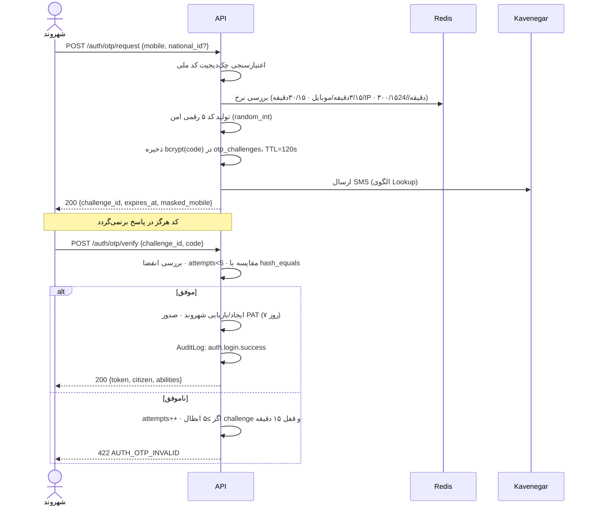

**اصلاح باگ‌های امنیتی پروتوتایپ:**

| باگ پروتوتایپ | اصلاح |
|---|---|
| کد OTP از پیش در فیلد پر می‌شد (`setOtpCode(generatedCode)`) | کد فقط از راه SMS. در `local` با Fake Driver در لاگ. |
| `REGISTERED_USERS_DB` سمت کلاینت — یعنی لیست کاربران در باندل | تمام جستجوی کاربر سمت سرور. |
| ورود دفتر همیشه `MOCK_OFFICES[0]` | اپراتور واقعی با نام کاربری + رمز + OTP، متصل به دفتر خودش. |
| دکمه «۴۸۲۹۱» برای پر کردن سریع کد | حذف کامل در تولید. |

### احراز هویت اپراتور (سه عاملی سبک)

کد دفتر + نام کاربری + رمز عبور (Argon2id، حداقل ۱۲ کاراکتر) + OTP پیامکی به موبایل ثبت‌شده اپراتور. Session کوکی Sanctum با انقضای ۸ ساعت و انقضای بی‌فعالیتی ۳۰ دقیقه. **قفل IP اختیاری:** مدیر دفتر می‌تواند رنج IP دفتر را ثبت کند تا ورود از خارج آن ممکن نباشد.

### مدیریت توکن

| موضوع | قاعده |
|---|---|
| نوع | Sanctum PAT، هش‌شده در DB (خود توکن ذخیره نمی‌شود) |
| عمر | ۷ روز؛ تمدید خودکار هنگام استفاده اگر <۲۴ ساعت مانده باشد |
| ذخیره در کلاینت | **`localStorage` ممنوع.** توکن دسترسی فقط در حافظه؛ Refresh در کوکی `HttpOnly`+`Secure`. برای درخواست‌های پس‌زمینه Service Worker (صف Offline و Background Sync)، یک PAT کوتاه‌عمر (۱۵ دقیقه) از راه `POST /auth/refresh` با همان کوکی صادر و فقط تا پایان TTL خودش در IndexedDB نگه داشته می‌شود. دلیل: XSS نباید بتواند توکن بلندعمر بدزدد و SW هم باید بتواند بدون دسترسی به کوکی HttpOnly ارسال کند. |
| ابطال | خروج، تغییر رمز، تشخیص ناهنجاری، درخواست کاربر از «دستگاه‌های فعال» |
| Abilities | هر توکن فقط توانمندی‌های لازم را دارد (مثلاً توکن مشاور، `case:create` ندارد) |
| Re-authentication | اقدامات حساس (تغییر شماره موبایل، ایجاد نمایندگی، برداشت >۵M ریال) نیازمند OTP تازه در ۵ دقیقه اخیر |

## ۷.۳. RBAC — ماتریس دقیق

### نقش‌ها

| نقش | محدوده | توضیح |
|---|---|---|
| `citizen` | داده خودش | شهروند عادی |
| `citizen_delegate` | داده موکل، محدود به `allowed_service_ids` و `max_amount_rials` | نماینده حقوقی/خانوادگی |
| `advisor` | جلسات مشاوره خودش | مشاور تأییدشده |
| `office_operator` | پرونده‌های **دفتر خودش** | باجه‌دار |
| `office_manager` | همه‌چیز دفتر خودش + مالی + پاسخ به نظرات + مدیریت اپراتورها | مدیر دفتر |
| `system_admin` | سراسری | ادمین سامانه |
| `auditor` | فقط خواندن Audit Log و گزارش‌های تجمیعی — **بدون دسترسی به محتوای مدرک** | بازرس |

### ماتریس مجوز

| عملیات | citizen | delegate | operator | manager | admin | auditor |
|---|:---:|:---:|:---:|:---:|:---:|:---:|
| مشاهده کاتالوگ خدمات | ✅ | ✅ | ✅ | ✅ | ✅ | ✅ |
| ثبت پرونده | ✅ خود | ⚠️ محدود | ❌ | ❌ | ❌ | ❌ |
| مشاهده پرونده | ✅ خود | ⚠️ موکل | ✅ دفتر خود | ✅ دفتر خود | ✅ همه | 🔒 فراداده |
| **دانلود مدرک پرونده** | ✅ خود | ⚠️ موکل | ✅ **فقط پرونده اختصاص‌یافته و باز** | ✅ دفتر خود | ⚠️ با ثبت دلیل | ❌ |
| پذیرش پیشنهاد Dispatch | ❌ | ❌ | ✅ | ✅ | ❌ | ❌ |
| بازگشت پرونده (۱۰ کد) | ❌ | ❌ | ✅ | ✅ | ❌ | ❌ |
| رد نهایی پرونده | ❌ | ❌ | ❌ | ✅ | ✅ | ❌ |
| تکمیل پرونده | ❌ | ❌ | ✅ | ✅ | ❌ | ❌ |
| ایجاد درخواست پیک | ❌ | ❌ | ✅ | ✅ | ❌ | ❌ |
| تأیید OTP تحویل (پیک) | ❌ | ❌ | ✅ (در باجه) | ✅ (در باجه) | ❌ | ❌ |
| مشاهده مالی دفتر | ❌ | ❌ | ❌ | ✅ | ✅ | 🔒 تجمیعی |
| پاسخ به نظر شهروند | ❌ | ❌ | ❌ | ✅ | ✅ | ❌ |
| تغییر پروفایل و خدمات دفتر | ❌ | ❌ | ❌ | ✅ | ✅ | ❌ |
| مدیریت اپراتورهای دفتر | ❌ | ❌ | ❌ | ✅ | ✅ | ❌ |
| تأیید ثبت‌نام دفتر | ❌ | ❌ | ❌ | ❌ | ✅ | ❌ |
| تأیید ثبت‌نام مشاور | ❌ | ❌ | ❌ | ❌ | ✅ | ❌ |
| ویرایش کاتالوگ خدمات | ❌ | ❌ | ❌ | ❌ | ✅ | ❌ |
| ایجاد نمایندگی | ✅ خود | ❌ | ❌ | ❌ | ❌ | ❌ |
| مشاهده Audit Log | ❌ | ❌ | ❌ | 🔒 دفتر خود | ✅ | ✅ |

✅ مجاز · ⚠️ مشروط · 🔒 محدود/ناشناس‌شده · ❌ ممنوع

> **نکته پیک:** مأمور تحویل کاربر سامانه نیست و نقش ندارد. تأیید تحویل درب منزل از راه Endpoint نیمه‌عمومی `POST /deliveries/{id}/confirm` انجام می‌شود که در آن خودِ `delivery_id` (UUID v7 غیرقابل حدس) به‌همراه کد OTP تنها عامل احراز است؛ سقف ۵ تلاش به‌ازای مرسوله و Rate-Limit به‌ازای IP دارد و پس از ۳ تلاش ناموفق، OTP ابطال و کد جدید برای شهروند پیامک می‌شود. اپراتور/مدیر همان تأیید را در باجه (تحویل حضوری) انجام می‌دهد.

### اجرای Scope دفتری (حیاتی‌ترین کنترل)

سه لایه دفاعی، چون نشت افقی داده بین دفاتر بزرگ‌ترین ریسک عملیاتی است:

```php
// لایه ۱ — Global Scope خودکار روی مدل
final class OfficeScope implements Scope {
    public function apply(Builder $b, Model $m): void {
        $u = auth()->user();
        if ($u instanceof Operator) { $b->where("{$m->getTable()}.office_id", $u->office_id); }
    }
}

// لایه ۲ — Policy صریح روی هر اقدام
public function view(Operator $op, CaseRequest $case): bool {
    return $case->office_id === $op->office_id
        && in_array($case->status, CaseStatus::officeActionable(), true);
}

// لایه ۳ — Middleware روی مسیرها
Route::middleware(['auth:sanctum', 'role:office_operator|office_manager', 'office.scope'])
     ->group(base_path('app/Modules/OfficeNetwork/routes-desk.php'));
```

تست `tests/Feature/Security/CrossOfficeIsolationTest.php` **اجباری** است: برای هر Endpoint اپراتور، تأیید می‌کند که دسترسی به منبع دفتر دیگر `404` (نه `403` — تا وجود منبع فاش نشود) برمی‌گرداند.

## ۷.۴. رمزنگاری

### در حال انتقال (In-Transit)

| مسیر | کنترل |
|---|---|
| مرورگر ↔ nginx | TLS 1.3 فقط (1.2 حداقل برای مرورگرهای قدیمی HC-2)، HSTS با `max-age=31536000; includeSubDomains; preload` |
| nginx ↔ اپلیکیشن | شبکه داخلی Docker، بدون خروج از هاست |
| اپلیکیشن ↔ Postgres | `sslmode=verify-full` با CA داخلی |
| اپلیکیشن ↔ Redis | TLS + `requirepass` |
| اپلیکیشن ↔ MinIO | TLS |
| اپلیکیشن ↔ `ai-egress-proxy` | **mTLS** با گواهی کلاینت اختصاصی |
| WebSocket | WSS فقط |

Cipher Suites مجاز: `TLS_AES_256_GCM_SHA384`, `TLS_CHACHA20_POLY1305_SHA256`, `TLS_AES_128_GCM_SHA256`, و برای TLS 1.2 فقط ECDHE+AEAD.

### در حال سکون (At-Rest)

| داده | روش |
|---|---|
| فایل مدارک | AES-256-GCM پاکتی (§۶.۸) |
| کد ملی، موبایل | رمزنگاری ستونی AES-256-GCM + ستون هش `SHA-256(value ‖ pepper)` برای جستجو |
| رمز عبور اپراتور | Argon2id (`memory=64MB, time=4, threads=2`) |
| کد OTP | bcrypt (cost 10) — سریع‌تر از Argon چون TTL کوتاه است و باید در حجم بالا تأیید شود |
| OTP تحویل | bcrypt |
| توکن API | SHA-256 (Sanctum) |
| کل دیسک دیتابیس | LUKS روی حجم |
| بکاپ | `age` با کلید عمومی؛ کلید خصوصی خارج از سرورهای تولید |
| لاگ‌ها | ماسک‌شده پیش از نوشتن (§۷.۷) |

### مدیریت کلید

```
KEK_v1  → متغیر محیطی روی هاست، فقط توسط سرویس api و worker خوانده می‌شود
        → نسخه‌دار؛ چرخش سالانه یا در صورت مشکوک شدن
        → پشتیبان آفلاین در گاوصندوق فیزیکی (Shamir 3-of-5)
PEPPER  → جدا از KEK، برای هش کد ملی/موبایل
APP_KEY → کلید Laravel، جدا از هر دو
```

## ۷.۵. محدودیت نرخ (Rate Limiting)

سه لایه: nginx (لبه، دفاع در برابر سیل)، Laravel `RateLimiter` (منطق کسب‌وکار)، و محدودیت هزینه AI.

| Endpoint / محدوده | محدودیت | کلید | پاسخ نقض |
|---|---|---|---|
| سراسری هر IP | ۳۰۰/دقیقه | IP | 429 |
| `POST /auth/otp/request` | ۳/۱۵دقیقه · ۳۰/۱۵دقیقه · ۳۰۰/۱۵دقیقه (IPv4) | موبایل · IP · `/24` | 429 + `retry_after` |
| `POST /auth/otp/verify` | ۵ تلاش به‌ازای challenge · ۲۰/ساعت به‌ازای IP | challenge · IP | ابطال + قفل ۱۵ دقیقه |
| `POST /cases` | ۱۰/ساعت · ۳۰/روز | شهروند | 429 |
| `POST /documents/upload-intent` | ۵۰/ساعت | شهروند | 429 |
| `POST /ai/chat` | ۳۰/ساعت · ۲۰۰/روز | شهروند | 429 + پاسخ Fallback |
| `POST /wallet/topup` | ۵/ساعت | شهروند | 429 |
| `GET /offices/nearby` | ۶۰/دقیقه | شهروند یا IP | 429 |
| `POST /offers/{id}/accept` | ۱۲۰/دقیقه | دفتر | 429 |
| `POST /cases/{id}/return` | ۶۰/ساعت | اپراتور | 429 + هشدار به مدیر |
| کل API به‌ازای اپراتور | ۶۰۰/دقیقه | اپراتور | 429 |
| هزینه AI ماهانه | بودجه پیکربندی‌شده | سراسری | Circuit Breaker → Fallback |

**قاعده:** هر پاسخ ۴۲۹ باید هدرهای `Retry-After`، `X-RateLimit-Limit`، `X-RateLimit-Remaining`، `X-RateLimit-Reset` داشته باشد و بدنه‌اش پیام فارسی قابل نمایش باشد.

## ۷.۶. Audit Log — زنجیره تغییرناپذیر

هر اقدام اپراتور و هر دسترسی به داده حساس ثبت می‌شود. جدول `audit_logs` **فقط افزودنی** است: مجوز `UPDATE`/`DELETE` روی آن به نقش اپلیکیشن در Postgres داده نمی‌شود.

### اقدامات با ثبت اجباری

| دسته | اقدامات |
|---|---|
| احراز هویت | `auth.login.success` · `auth.login.failed` · `auth.logout` · `auth.token.revoked` · `auth.otp.requested` · `auth.device.new` |
| پرونده | `case.created` · `case.transition` · `case.returned` · `case.rejected` · `case.completed` · `case.cancelled` |
| Dispatch | `offer.created` · `offer.accepted` · `offer.declined` · `offer.expired` |
| **مدارک** | `document.uploaded` · **`document.viewed`** · `document.downloaded` · `document.approved` · `document.rejected` · `document.deleted` |
| مالی | `payment.initiated` · `payment.verified` · `payment.failed` · `ledger.posted` · `refund.issued` · `payout.generated` |
| تحویل | `delivery.created` · `delivery.dispatched` · `delivery.otp.verified` · `delivery.failed` |
| نمایندگی | `delegation.created` · `delegation.activated` · `delegation.used` · `delegation.revoked` |
| اداری | `office.approved` · `office.suspended` · `operator.created` · `operator.disabled` · `advisor.approved` · `service.updated` · `role.changed` |
| PII | `pii.exported` · `pii.searched` · `pii.anonymized` |

**`document.viewed` مهم‌ترین ردیف این جدول است.** بدون آن، هیچ‌وقت نمی‌توان ثابت کرد یا رد کرد که اپراتوری مدارک شهروندی را بی‌دلیل دیده است.

### ساختار و زنجیره هش

```php
AuditLogger::record(
    action: 'document.viewed',
    subject: $caseDocument,
    context: ['case_id' => $case->id, 'document_type' => 'DOC_BIRTH_CERT', 'reason' => 'expert_review'],
);
// ذخیره‌شده:
// entry_hash = SHA256(prev_hash ‖ action ‖ actor_type ‖ actor_id ‖ subject ‖ changes ‖ occurred_at)
```

هر رکورد، هش رکورد قبلی را در بر می‌گیرد؛ پس دستکاری یا حذف یک ردیف، زنجیره را می‌شکند. یک کار روزانه `VerifyAuditChainCommand` کل زنجیره روز قبل را بررسی و در صورت شکست، هشدار بحرانی صادر می‌کند.

**نگهداشت:** ۷ سال (الزام اسناد دولتی). پارتیشن ماهانه؛ پارتیشن‌های قدیمی‌تر از ۱۲ ماه به Storage سرد منتقل می‌شوند.

**تشخیص ناهنجاری:** یک کار ساعتی، اپراتورهایی را که در یک ساعت بیش از سه برابر میانگین دفتر مدرک باز کرده‌اند، به مدیر دفتر و ادمین گزارش می‌دهد.

## ۷.۷. حفاظت PII

| کنترل | جزئیات |
|---|---|
| **کمینه‌سازی** | هر Endpoint فقط فیلدهای لازم را برمی‌گرداند. لیست پرونده‌ها کد ملی ندارد. |
| **ماسک پیش‌فرض** | کد ملی `008****671`، موبایل `0912***6781`، کارت `6037-****-****-1234`. مقدار کامل فقط با مجوز صریح و ثبت در Audit. |
| **ماسک لاگ** | یک Processor روی Monolog، هر رشته منطبق بر الگوی کد ملی (`\d{10}`)، موبایل (`09\d{9}`)، کارت (`\d{16}`) و کد پستی را پیش از نوشتن جایگزین می‌کند. تست خودکار `LogRedactionTest` این را بررسی می‌کند. |
| **بدون PII در URL** | هرگز کد ملی یا موبایل در Query String — چون در لاگ nginx، Referer و تاریخچه مرورگر می‌ماند. |
| **بدون PII در رویداد Real-Time** | §۵.۷ |
| **بدون PII در Prompt هوش مصنوعی** | §۸.۱.۳ |
| **حذف EXIF** | همه تصاویر آپلودی؛ GPS تصویر شناسنامه یعنی آدرس منزل. |
| **حق فراموشی** | `POST /api/v1/privacy/erasure-request` → پس از تأیید ادمین، ناشناس‌سازی (نه حذف) رکوردها: نام → «شهروند حذف‌شده»، کد ملی → NULL، فایل‌ها → حذف فیزیکی. پرونده‌های مالی به‌صورت ناشناس برای الزام حسابداری باقی می‌مانند. |
| **قابلیت انتقال داده** | `GET /api/v1/privacy/export` → ZIP شامل JSON کامل داده کاربر + مدارکش، با لینک یک‌بارمصرف ۲۴ ساعته. |
| **نگهداشت** | پرونده بسته: ۵ سال، سپس ناشناس‌سازی. مدارک پرونده: ۲ سال پس از بستن، سپس حذف فیزیکی (نسخه مخزن شخصی باقی می‌ماند). لاگ Audit: ۷ سال. |

## ۷.۸. چک‌لیست OWASP Top 10 (2021)

| # | ریسک | کنترل مشخص در این سامانه | تست تأییدکننده |
|---|---|---|---|
| **A01** Broken Access Control | Policy روی هر مدل · `OfficeScope` Global Scope · Middleware نقش · بازگرداندن `404` به‌جای `403` برای منابع دفتر دیگر · `available_actions` سمت سرور | `CrossOfficeIsolationTest`، `PolicyCoverageTest` (هر مدل باید Policy داشته باشد) |
| **A02** Cryptographic Failures | TLS 1.3 · رمزنگاری پاکتی مدارک · Argon2id · رمزنگاری ستونی PII · KEK جدا · بکاپ رمزنگاری‌شده | `EncryptionAtRestTest`، اسکن TLS با `testssl.sh` در CI |
| **A03** Injection | Eloquent/Query Builder با Binding · هیچ `DB::raw` با ورودی کاربر · اعتبارسنجی FormRequest · React (بدون `dangerouslySetInnerHTML`) · CSP سخت | Larastan level 8، `SqlInjectionRegressionTest` |
| **A04** Insecure Design | Threat Model (§۷.۱) · State Machine اجباری · دفتر کل تغییرناپذیر · Idempotency · تفکیک نقش‌ها | تست‌های معماری Pest |
| **A05** Security Misconfiguration | `APP_DEBUG=false` اجباری در تولید (تست Deploy) · هدرهای امنیتی nginx · حذف `X-Powered-By` · اسکن ایمیج با Trivy · تنظیمات پیش‌فرض امن | `ProductionConfigTest`، Trivy در CI |
| **A06** Vulnerable Components | `composer audit` + `pnpm audit` در CI (Fail روی high/critical) · Dependabot هفتگی · **پاکسازی وابستگی‌های مرده پروتوتایپ** (`@google/genai`, `express`, `dotenv`) | `dependency-audit` job |
| **A07** Identification & Auth Failures | OTP با نرخ محدود · Argon2id · انقضای Session · اتصال Session به دستگاه · اعلان ورود جدید · Re-OTP برای اقدام حساس · بدون کد OTP در پاسخ | `OtpBruteForceTest`، `SessionFixationTest` |
| **A08** Software & Data Integrity | امضای ایمیج داکر · `composer.lock`/`pnpm-lock` قفل‌شده · SRI برای هر اسکریپت خارجی (که تعدادش صفر است) · زنجیره هش Audit · تأیید پرداخت فقط از درگاه | `AuditChainIntegrityTest` |
| **A09** Logging & Monitoring Failures | Audit Log جامع (§۷.۶) · ماسک PII · لاگ ساخت‌یافته JSON با `request_id` · هشدار روی الگوهای مشکوک · نگهداشت ۷ ساله | `LogRedactionTest`، هشدارهای Grafana |
| **A10** SSRF | هیچ ماژول دامنه‌ای حق `Http::` ندارد (تست معماری) · فقط `Integration/` با Allowlist دامنه · Egress Firewall در سطح شبکه · بدون واکشی URL ارائه‌شده توسط کاربر | تست معماری، قاعده فایروال |

### هدرهای امنیتی اجباری

```nginx
add_header Strict-Transport-Security "max-age=31536000; includeSubDomains; preload" always;
add_header X-Content-Type-Options    "nosniff" always;
add_header X-Frame-Options           "DENY" always;
add_header Referrer-Policy           "strict-origin-when-cross-origin" always;
add_header Permissions-Policy        "geolocation=(self), camera=(self), microphone=(self), payment=()" always;
add_header Content-Security-Policy   "default-src 'self';
    script-src 'self';
    style-src 'self' 'unsafe-inline';
    img-src 'self' data: blob: https://static.neshan.org;
    font-src 'self';
    connect-src 'self' https://api.pishkhan.ir wss://ws.pishkhan.ir https://api.neshan.org;
    frame-src https://www.zarinpal.com;
    object-src 'none'; base-uri 'self'; form-action 'self'; frame-ancestors 'none'" always;
```

**نکته HC-5:** `connect-src` عمداً هیچ دامنه AI ندارد. حتی اگر مدلی روزی کد کلاینت بنویسد که مستقیم به OpenRouter وصل شود، مرورگر آن را مسدود می‌کند. این یک کنترل ساختاری است، نه اتکا به Code Review.

---

# فصل ۸ — یکپارچه‌سازی‌های خارجی

## ۸.۰. الگوی حاکم: Anti-Corruption Layer

هر سرویس بیرونی پشت یک **Port** (اینترفیس دامنه‌ای) قرار می‌گیرد که با واژگان دامنه ما صحبت می‌کند، نه واژگان آن سرویس. هر Port حداقل سه Driver دارد:

```
Port (interface)  ←  Real Driver     (تولید)
                  ←  Fallback Driver (پشتیبان، اختیاری)
                  ←  Fake Driver     (تست و توسعه — قطعی و بدون شبکه)
```

**قواعد الزام‌آور:**
1. هیچ ماژول دامنه‌ای نمی‌تواند `Http::` یا `GuzzleHttp` را import کند — با تست معماری اجرا می‌شود.
2. هر Driver واقعی یک **Contract Test** دارد که پاسخ‌های ضبط‌شده واقعی سرویس را Replay می‌کند.
3. هر Driver دارای Timeout، Retry، Circuit Breaker و لاگ ساخت‌یافته است.
4. مدل داده بیرونی هرگز به دامنه نشت نمی‌کند؛ همیشه به DTO خودمان نگاشت می‌شود.

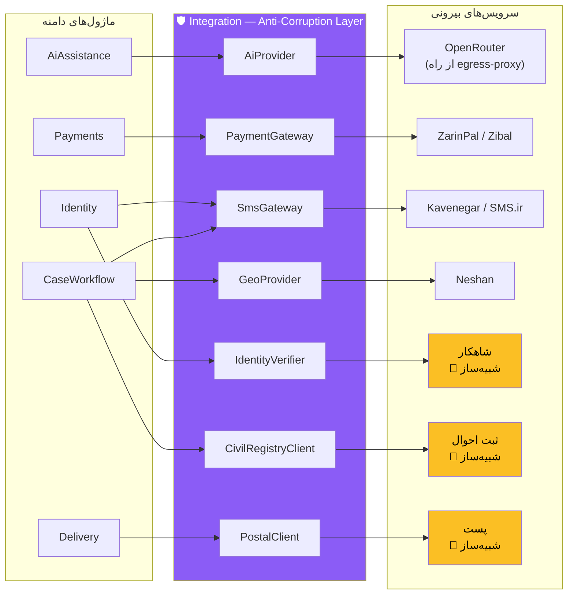

## ۸.۱. AI — OpenRouter

### ۸.۱.۱. تعریف Port

```php
namespace App\Integration\Ai;

interface AiProvider
{
    public function complete(AiRequest $request): AiResponse;
    /** @return \Generator<AiChunk> */
    public function stream(AiRequest $request): \Generator;
    public function transcribe(AudioFile $audio, string $language = 'fa'): TranscriptionResult;
    public function analyzeImage(ImageFile $image, string $instruction): ImageAnalysisResult;
    public function isAvailable(): bool;
}
```

### ۸.۱.۲. نگاشت وظیفه به مدل

پیکربندی در `config/pishkhan.php` — تغییر مدل نیازمند Deploy نیست، فقط متغیر محیطی.

| وظیفه | مدل اصلی | مدل پشتیبان | حداکثر توکن | یادداشت |
|---|---|---|---|---|
| چت‌بات (پاسخ) | `google/gemini-2.5-flash` | `anthropic/claude-haiku-4.5` | 1024 | **HC-5 اینجا تأمین می‌شود** |
| تشخیص نیت | `google/gemini-2.5-flash-lite` | `openai/gpt-4o-mini` | 128 | ارزان و سریع |
| رونویسی صوت فارسی | `openai/whisper-large-v3` | `google/gemini-2.5-flash` | — | Whisper برای فارسی به‌مراتب دقیق‌تر |
| تحلیل کیفیت مدرک | `google/gemini-2.5-flash` (چندوجهی) | تحلیل محلی OpenCV | 512 | خروجی ساخت‌یافته |
| خلاصه پرونده برای اپراتور | `anthropic/claude-sonnet-4.5` | `google/gemini-2.5-pro` | 2048 | زمینه بلند |

### ۸.۱.۳. لایه ناشناس‌سازی (اجباری — بدون استثنا)

```php
final class PiiRedactor
{
    private const PATTERNS = [
        'NID'         => '/\b\d{10}\b/u',
        'MOBILE'      => '/\b09\d{9}\b/u',
        'POSTAL'      => '/\b\d{5}[-\s]?\d{5}\b/u',   // کد پستی ۱۰ رقمی — جدا از NID
        'CARD'        => '/\b\d{16}\b/u',
        'IBAN'        => '/\bIR\d{24}\b/iu',
        'TRACKING'    => '/\bCR-\d{4}-\d{5}\b/u',
    ];

    public function redact(string $text, RedactionMap $map): string;   // مقدار → [NID_1]
    public function restore(string $text, RedactionMap $map): string;  // [NID_1] → مقدار (فقط سمت سرور)
}
```

علاوه بر الگوها، **نام‌های موجودیت‌های شناخته‌شده** (نام شهروند، نام پدر، آدرس) نیز پیش از ارسال با توکن جایگزین می‌شوند، چون Regex نام فارسی را نمی‌گیرد. برای رفع برخورد کد ملی و کد پستی (هر دو ۱۰ رقم)، هر عدد ۱۰‌رقمی پیش از جایگزینی با الگوریتم چک‌دیجیت کد ملی اعتبارسنجی می‌شود: معتبر = توکن `NID`، نامعتبر = توکن `POSTAL`.

**تست نشت اجباری (`tests/Feature/Ai/PiiLeakTest.php`):** برای ۵۰ سناریوی واقعی، Payload خروجی به `ai-egress-proxy` رهگیری و تأیید می‌شود که هیچ کد ملی، موبایل، کد پستی، نام کامل یا آدرس در آن نیست. **این تست بخشی از CI است و نقض آن Deploy را متوقف می‌کند.**

**تصاویر مدارک:** به‌طور پیش‌فرض **هرگز** به OpenRouter ارسال نمی‌شوند. تحلیل کیفیت (تاری/برش/چرخش) به‌صورت محلی با OpenCV انجام می‌شود. تنها اگر ادمین به‌صورت صریح `AI_DOCUMENT_VISION=true` را فعال کند، تصویر پس از حذف EXIF و ماسک کردن نواحی متنی حساس ارسال می‌شود — و این تصمیم در Audit Log ثبت می‌گردد.

### ۸.۱.۴. `ai-egress-proxy`

تنها مؤلفه خارج از ایران. یک باینری Go کوچک (~۸MB، بدون State، بدون دیسک):

| ویژگی | جزئیات |
|---|---|
| احراز هویت | mTLS — فقط گواهی کلاینت سرورهای api/worker پذیرفته می‌شود |
| مسیر | فقط `POST /v1/chat/completions`, `/v1/audio/transcriptions` به `openrouter.ai` |
| لاگ | **فقط فراداده** (زمان، مدل، تعداد توکن، وضعیت). **هرگز محتوای Prompt یا پاسخ.** |
| نگهداشت | صفر — بدون دیسک، بدون پایگاه داده |
| کلید | `OPENROUTER_API_KEY` فقط روی همین پروکسی است، نه روی سرورهای ایران |
| مقاوم‌سازی | فقط پورت ۴۴۳، فایروال ورودی محدود به IP سرورهای ایران، بدون SSH با رمز |
| Failover | دو نمونه در دو ارائه‌دهنده مختلف |

**اگر پروکسی از دسترس خارج شد:** `AiProvider::isAvailable()` مقدار `false` برمی‌گرداند، Circuit Breaker باز می‌شود، و چت‌بات به حالت Fallback مبتنی بر جستجوی کاتالوگ می‌رود (پاسخ‌های الگومحور روی نتایج FTS) — تجربه ضعیف‌تر، ولی سامانه از کار نمی‌افتد.

### ۸.۱.۵. دستیار صوتی (جایگزین شبیه‌سازی پروتوتایپ)

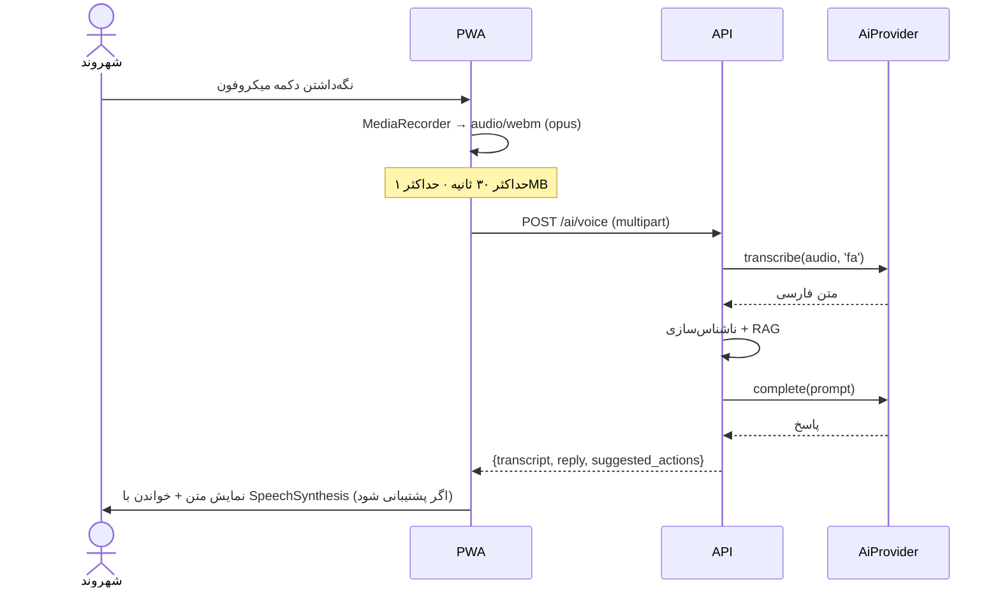
**Fallback برای HC-2:** اگر `MediaRecorder` پشتیبانی نشود (مرورگر بسیار قدیمی)، دکمه میکروفون پنهان و به‌جای آن ورودی متنی چت‌بات پیشنهاد می‌شود. `SpeechSynthesis` هم اختیاری است؛ نبودش فقط یعنی پاسخ خوانده نمی‌شود.

## ۸.۲. درگاه پرداخت — ZarinPal

```php
interface PaymentGateway {
    public function createIntent(Money $amount, string $description, string $callbackUrl, array $meta = []): PaymentIntentResult;
    public function verify(string $authority, Money $expectedAmount): PaymentVerificationResult;
    public function refund(string $refId, Money $amount, string $reason): RefundResult;
    public function name(): string;
}
```

### قواعد امنیتی پرداخت (غیرقابل مذاکره)

1. مبلغ **همیشه** سمت سرور از کاتالوگ خدمات محاسبه می‌شود. مبلغ ارسالی از کلاینت **نادیده گرفته می‌شود**.
2. تأیید فقط با فراخوانی مستقیم `verify` به درگاه. پارامترهای بازگشتی مرورگر (`Status=OK`) هرگز مبنای واریز نیستند.
3. `verify` مبلغ برگشتی را با مبلغ Intent مقایسه می‌کند؛ عدم تطابق = رد + هشدار بحرانی.
4. هر `authority` فقط یک‌بار قابل تأیید است (ایندکس یکتا + قفل تراکنشی).
5. `ReconcilePaymentIntentsJob` هر ۵ دقیقه Intentهای `redirected` قدیمی‌تر از ۱۰ دقیقه را با درگاه مغایرت‌گیری می‌کند — تا پرداخت موفقی که کاربر وسط راه مرورگر را بست، گم نشود.
6. استرداد فقط از راه ماژول Payments و با ثبت دوطرفه در دفتر کل.

### قاعده تقسیم کارمزد

```
هزینه خدمت (fee_rials)
  ├─ سهم دفتر    = fee × office_share_percent      (پیش‌فرض ۵۰٪، قابل تنظیم به‌ازای خدمت)
  └─ سهم پلتفرم  = fee − سهم دفتر
هزینه ارسال (shipping_fee_rials) → کامل به حساب شرکت پیک/پست
هزینه مشاوره   → ۸۰٪ مشاور · ۲۰٪ پلتفرم
```

ثبت دفتر کل هنگام تکمیل پرونده:
```
تراکنش «service_fee» برای پرونده CR-1405-99841:
  بدهکار  کیف پول شهروند             ۳٬۴۰۰٬۰۰۰ ریال
  بستانکار حساب پرداختنی دفتر off_thr_0142   ۱٬۷۰۰٬۰۰۰ ریال
  بستانکار درآمد پلتفرم                       ۱٬۷۰۰٬۰۰۰ ریال
  ✔ مجموع بدهکار = مجموع بستانکار
```

**زمان‌بندی تراز (رفع ابهام):** برداشتِ ثبت پرونده کل وجه را از کیف پول به حساب `escrow` می‌برد؛ مقادیر `office_share_rials`/`platform_share_rials` که در همان لحظه در پاسخ `POST /cases` و ستون‌های پرونده ثبت می‌شوند «سهم محاسبه‌شده» هستند، نه تراز قطعی. تراز قطعی هنگام تکمیل پرونده ثبت می‌شود: برداشت از `escrow`، واریز به حساب پرداختنی دفتر و درآمد پلتفرم. به این ترتیب استرداد کاملِ انصراف پیش از اختصاص دفتر، فقط یک ورودی معکوس از `escrow` است و دفتری که پرونده را رد کرده هیچ بستانکاری نگرفته است.

## ۸.۳. پیامک — Kavenegar

```php
interface SmsGateway {
    public function sendOtp(string $mobile, string $code, OtpPurpose $purpose): SmsResult;
    public function sendTemplate(string $mobile, string $template, array $params): SmsResult;
    public function status(string $messageId): SmsDeliveryStatus;
}
```

| الگو | متن | زمان ارسال |
|---|---|---|
| `otp-login` | «کد ورود شما به سامانه پیشخوان: {code}» | درخواست OTP |
| `case-assigned` | «پرونده {tracking} به دفتر {office} اختصاص یافت.» | پذیرش پیشنهاد |
| `case-returned` | «⚠️ پرونده {tracking} نیاز به اصلاح مدرک دارد. مهلت: {hours} ساعت» | بازگشت پرونده |
| `case-ready` | «مدرک پرونده {tracking} آماده تحویل است.» | `ready_for_issue` |
| `delivery-otp` | «کد تحویل مرسوله {tracking}: {code} — فقط به مأمور تحویل اعلام کنید.» | تخصیص پیک |
| `appointment-reminder` | «یادآوری نوبت {date} ساعت {time} در دفتر {office}» | ۲۴ و ۲ ساعت قبل |
| `deadline-warning` | «۲۴ ساعت تا پایان مهلت اصلاح پرونده {tracking}» | ۲۴ ساعت مانده |

**Failover:** اگر Kavenegar سه بار متوالی خطا دهد، Circuit Breaker باز و SMS.ir فعال می‌شود؛ هر ۵ دقیقه یک درخواست آزمایشی برای بازگشت. پیامک‌های OTP اولویت بالاتری از اعلان‌ها دارند و در صف جداگانه‌اند.

**کنترل هزینه:** سقف روزانه پیامک قابل پیکربندی؛ عبور از ۸۰٪ سقف، هشدار به ادمین.

## ۸.۴. نقشه و ژئوکدینگ — Neshan

```php
interface GeoProvider {
    public function reverseGeocode(float $lat, float $lng): AddressResult;
    public function geocode(string $address, ?string $city = null): Collection;   // <GeoPoint>
    public function distanceMatrix(GeoPoint $origin, array $destinations): Collection;
    public function tileUrlTemplate(MapTheme $theme): string;
}
```
سه تم نقشه پروتوتایپ (OSM / Voyager / Positron) به سه تم Neshan نگاشت می‌شوند: `standard-day` · `neshan` · `dreamy`. کلید Neshan **سمت سرور** نگه داشته می‌شود و تایل‌ها از راه یک Reverse Proxy با کش nginx (۳۰ روز) سرو می‌شوند — هم کلید فاش نمی‌شود، هم هزینه و تأخیر کاهش می‌یابد.

**Fallback موقعیت کاربر:** پروتوتایپ موقعیت را روی میدان ولیعصر هاردکد کرده بود. در محصول: `navigator.geolocation` با Timeout ۸ ثانیه ← در صورت رد یا خطا، انتخاب شهر از فهرست ← در صورت خالی بودن، مرکز استان پروفایل کاربر.

## ۸.۵. سامانه‌های دولتی — Adapter با شبیه‌ساز

طبق تصمیم کارفرما، این سه سرویس در MVP **شبیه‌ساز** دارند، اما Adapter و قرارداد کامل نوشته می‌شود تا تعویض به نسخه واقعی فقط تغییر یک متغیر محیطی باشد.

```php
interface IdentityVerifier {                 // شاهکار — تطبیق کد ملی و شماره موبایل
    public function verifyMobileOwnership(string $nationalId, string $mobile): ShahkarResult;
}
interface CivilRegistryClient {              // ثبت احوال
    public function getPersonSummary(string $nationalId, string $birthDate): PersonSummary;
    public function verifyBirthCertificate(string $nationalId, string $serial): DocumentVerification;
}
interface PostalClient {                     // پست
    public function validatePostalCode(string $postalCode): PostalAddress;
    public function createShipment(ShipmentRequest $r): ShipmentResult;
    public function trackShipment(string $barcode): TrackingResult;
}
```

### رفتار شبیه‌سازها (قطعی و آموزنده، نه تصادفی)

شبیه‌ساز باید همه مسیرهای خطا را قابل بازتولید کند، وگرنه فاز ۵ هرگز به‌درستی تست نمی‌شود:

| ورودی | خروجی شبیه‌ساز |
|---|---|
| کد ملی با رقم آخر `0` | ✅ تأیید موفق |
| کد ملی با رقم آخر `1` | ❌ عدم تطابق → `INQUIRY_MISMATCH` |
| کد ملی با رقم آخر `2` | ⏳ تأخیر ۳۰ ثانیه‌ای (تست Timeout) |
| کد ملی با رقم آخر `3` | 💥 خطای ۵۰۰ (تست Circuit Breaker) |
| کد ملی با رقم آخر `4` | 🚫 عدم احراز شرایط → `ELIGIBILITY_FAIL` |
| سایر | ✅ تأیید موفق پس از تأخیر تصادفی ۱–۵ ثانیه |

Contract Test برای هر شبیه‌ساز تضمین می‌کند که شکل پاسخ آن دقیقاً با DTOهای مورد انتظار Driver واقعی یکی است.

### مسیر اتصال واقعی (چک‌لیست آماده)

۱) عقد تفاهم‌نامه با دستگاه ← ۲) دریافت گواهی و IP مجاز ← ۳) برقراری لینک اختصاصی یا VPN ← ۴) پیاده‌سازی `HttpDriver` مقابل مستندات رسمی ← ۵) اجرای Contract Test مقابل محیط آزمون دستگاه ← ۶) تغییر `GOV_DRIVER=simulator` به `http` ← ۷) انتشار تدریجی (۵٪ → ۲۵٪ → ۱۰۰٪) با Feature Flag.

---

# فصل ۹ — قابلیت اطمینان و مقیاس

## ۹.۱. توپولوژی استقرار

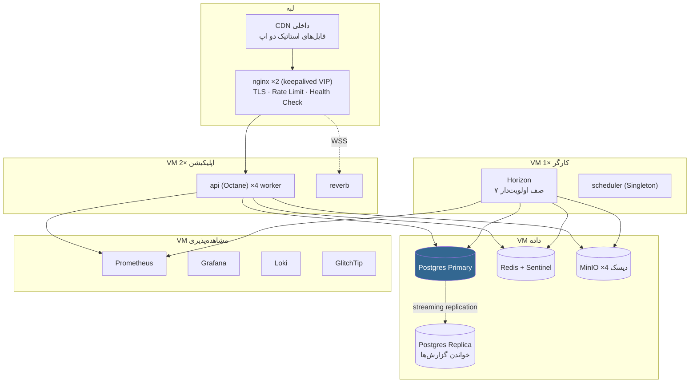

### تخصیص منابع

| مرحله | کاربر فعال ماهانه | VM ها | مشخصات |
|---|---|---|---|
| **MVP (پایلوت تهران)** | تا ۱۰۰k | ۳ | App 4vCPU/8GB · Data 8vCPU/32GB/500GB NVMe · Obs 2vCPU/4GB |
| **استانی** | ۱–۲M | ۶ | App ×2 8vCPU/16GB · Worker 8vCPU/16GB · DB 16vCPU/64GB/2TB · Replica · Obs |
| **ملی** | ۱۰M+ | ۱۵+ | App ×6 · Worker ×4 (به تفکیک صف) · DB 32vCPU/128GB + ۳ Replica + PgBouncer · Redis Sentinel ×3 · MinIO ×4 · Reverb ×4 |

## ۹.۲. استراتژی مقیاس‌پذیری

| مؤلفه | نوع مقیاس | ماشه (Trigger) | سقف |
|---|---|---|---|
| `api` | افقی (بدون State) | CPU > 70٪ به‌مدت ۵ دقیقه یا p95 > 400ms | نامحدود |
| `worker` | افقی به‌تفکیک صف | طول صف > ۱۰۰۰ یا زمان انتظار > ۶۰ ثانیه | نامحدود |
| `reverb` | افقی با Redis | اتصالات > ۱۰k به‌ازای نمونه | نامحدود |
| Postgres خواندن | Read Replica | نسبت خواندن > ۸۰٪ | ۵ Replica |
| Postgres نوشتن | عمودی، سپس Sharding استانی | IOPS > ۸۰٪ ظرفیت | ← Sharding |
| Redis | عمودی، سپس Cluster | حافظه > ۷۵٪ | ← Cluster |
| MinIO | افقی (Distributed) | فضا > ۷۰٪ | نامحدود |

### گلوگاه‌های شناخته‌شده و راه‌حل از پیش تعیین‌شده

| گلوگاه | نشانه | راه‌حل |
|---|---|---|
| کوئری `offices/nearby` | p95 > 200ms | کش نتیجه به‌ازای شبکه ژئوهش (Geohash precision 6) با TTL ۶۰ ثانیه |
| نوشتن `case_timeline_steps` | تورم جدول | پارتیشن استانی + آرشیو گام‌های پرونده‌های بسته |
| محاسبه موجودی کیف پول | Aggregate سنگین | Materialized Balance با Snapshot روزانه + دلتای پس از Snapshot |
| Broadcast صف دفتر | طوفان رویداد | Debounce ۲ ثانیه‌ای در سرور، ارسال تجمیعی |
| اتصالات Postgres | خطای `too many connections` | PgBouncer در حالت Transaction Pooling |
| Job استعلام کند | انباشت صف | صف اختصاصی + Worker مجزا + Circuit Breaker |

## ۹.۳. بکاپ و بازیابی

| دارایی | روش | تناوب | نگهداشت | محل |
|---|---|---|---|---|
| Postgres | `pgBackRest` — Full + WAL پیوسته | Full روزانه ۰۲:۰۰ · WAL هر ۶۰ ثانیه | ۳۰ روز روزانه · ۱۲ ماه ماهانه | ۲ مکان جغرافیایی داخل ایران |
| MinIO | تکرار باکت + Snapshot | پیوسته + Snapshot روزانه | ۹۰ روز | مکان دوم |
| Redis | RDB + AOF | RDB هر ساعت | ۷ روز | محلی (داده بحرانی نیست) |
| پیکربندی | Git + Ansible Vault | هر تغییر | نامحدود | مخزن |
| کلید رمزنگاری | آفلاین، Shamir 3-of-5 | در هر چرخش | نامحدود | گاوصندوق فیزیکی |

**RPO = ۶۰ ثانیه** (بایگانی پیوسته WAL) · **RTO = ۴ ساعت** (بازیابی کامل روی سخت‌افزار جدید).

**اعتبارسنجی اجباری:** یک کار خودکار هفتگی، بکاپ شب قبل را در یک محیط ایزوله بازیابی می‌کند، مهاجرت‌ها را اجرا می‌کند، و یک آزمون سلامت داده انجام می‌دهد. **بکاپی که بازیابی‌اش تست نشده، بکاپ نیست.** نتیجه در Grafana ثبت و شکست آن هشدار بحرانی است.

## ۹.۴. برنامه بازیابی از فاجعه

| سناریو | تشخیص | اقدام | RTO |
|---|---|---|---|
| از کار افتادن یک نمونه `api` | Health Check nginx | حذف خودکار از Pool، راه‌اندازی مجدد کانتینر | < ۳۰ ثانیه |
| از کار افتادن Postgres Primary | Patroni/repmgr | Failover خودکار به Replica، ارتقا به Primary | < ۲ دقیقه |
| خرابی کامل VM داده | نبود متریک | بازیابی از pgBackRest روی VM جدید | < ۴ ساعت |
| از کار افتادن کل دیتاسنتر | نبود همه متریک‌ها | بازیابی در مکان دوم، تغییر DNS | < ۸ ساعت |
| خرابی Redis | خطای اتصال | سامانه در حالت تخریب‌یافته کار می‌کند (کش رد می‌شود، صف متوقف)؛ راه‌اندازی مجدد | < ۱۵ دقیقه |
| قطع دسترسی AI | Circuit Breaker | حالت Fallback بدون LLM | آنی |
| قطع درگاه پرداخت | خطاهای متوالی | تعویض به درگاه پشتیبان؛ اگر هر دو قطع بودند، فقط پرداخت از کیف پول | < ۵ دقیقه |
| باج‌افزار / خرابی داده | تشخیص ناهنجاری، شکست زنجیره Audit | بازیابی نقطه‌ای (PITR) به قبل از حادثه | < ۶ ساعت |

## ۹.۵. SLO ها (با عدد)

| سرویس | SLI | هدف | پنجره | بودجه خطا |
|---|---|---|---|---|
| در دسترس بودن API | نسبت درخواست‌های غیر-5xx | **۹۹٫۵٪** | ۳۰ روز | ۳ ساعت ۳۶ دقیقه |
| تأخیر API (خواندن) | p95 زمان پاسخ | **≤ ۳۰۰ms** | ۳۰ روز | ۵٪ |
| تأخیر API (نوشتن) | p95 | **≤ ۸۰۰ms** | ۳۰ روز | ۵٪ |
| `POST /cases` | p99 | **≤ ۲s** | ۳۰ روز | ۱٪ |
| اساین دفتر | نسبت پرونده‌های اساین‌شده < ۵ دقیقه | **≥ ۹۵٪** | ۷ روز | ۵٪ |
| تحویل پیام Real-Time | p95 از رویداد تا کلاینت | **≤ ۲s** | ۷ روز | ۵٪ |
| تحویل OTP | نسبت تحویل < ۳۰ ثانیه | **≥ ۹۸٪** | ۷ روز | ۲٪ |
| پردازش مدرک | p95 آپلود تا نتیجه کیفیت | **≤ ۱۵s** | ۷ روز | ۵٪ |
| پاسخ چت‌بات | p95 | **≤ ۴s** | ۷ روز | ۵٪ |
| موفقیت پرداخت | نسبت تأیید موفق | **≥ ۹۹٪** | ۳۰ روز | ۱٪ |
| صحت دفتر کل | مغایرت بدهکار/بستانکار | **۱۰۰٪** | همیشه | **صفر** |
| LCP اپ شهروند (میدانی) | p75 روی 3G | **≤ ۲٫۵s** | ۲۸ روز | — |

**سیاست بودجه خطا:** اگر بودجه خطای یک SLO تمام شود، تا پایان پنجره **هیچ ویژگی جدیدی منتشر نمی‌شود** و کل ظرفیت به پایداری اختصاص می‌یابد. تنها SLO با بودجه صفر، «صحت دفتر کل» است — هر مغایرت یعنی توقف فوری و بررسی.

## ۹.۶. مشاهده‌پذیری

### متریک‌های کلیدی

| دسته | متریک |
|---|---|
| زیرساخت | CPU، حافظه، دیسک، شبکه، File Descriptor به‌ازای کانتینر |
| HTTP | نرخ، خطا، تأخیر (p50/p95/p99) به تفکیک Endpoint و نقش |
| صف | طول، زمان انتظار، نرخ پردازش، Job های شکست‌خورده به‌تفکیک صف |
| دیتابیس | اتصالات، کوئری‌های کند (>500ms)، تأخیر Replication، تورم جداول، Cache Hit Ratio |
| Redis | حافظه، Hit Ratio، دستورات کند، تعداد کلید |
| **دامنه** ⭐ | پرونده‌های ایجادشده/ساعت · زمان اساین (هیستوگرام) · نرخ بازگشت مدرک به‌تفکیک ۱۰ کد · نقض SLA به‌تفکیک دفتر · موفقیت پرداخت · تحویل OTP · هزینه AI/روز · اتصالات فعال Reverb · پرونده‌های `action_required` منقضی‌شده |

متریک‌های دامنه از متریک‌های فنی مهم‌ترند: افت نرخ اساین دفتر، بسیار زودتر از افت CPU خبر از مشکل واقعی می‌دهد.

### هشدارها

| هشدار | شرط | شدت | مقصد |
|---|---|---|---|
| API Down | Health Check ۳ بار متوالی ناموفق | 🔴 بحرانی | SMS + تلفن |
| نرخ خطای بالا | 5xx > ۲٪ به‌مدت ۵ دقیقه | 🔴 بحرانی | SMS |
| **مغایرت دفتر کل** | بدهکار ≠ بستانکار | 🔴 بحرانی | SMS + توقف تسویه |
| **شکست زنجیره Audit** | تأیید هش ناموفق | 🔴 بحرانی | SMS |
| دیسک پر | > ۸۵٪ | 🔴 بحرانی | SMS |
| تأخیر Replication | > ۶۰ ثانیه | 🟠 مهم | Slack/Bale |
| انباشت صف | > ۵۰۰۰ Job در انتظار | 🟠 مهم | Slack |
| اساین کند | میانه > ۵ دقیقه به‌مدت ۱۵ دقیقه | 🟠 مهم | Slack |
| افت تحویل OTP | < ۹۵٪ به‌مدت ۱۰ دقیقه | 🟠 مهم | Slack |
| Circuit Breaker باز | هر سرویس بیرونی | 🟠 مهم | Slack |
| بودجه AI | > ۸۰٪ ماهانه | 🟡 اطلاع | Slack |
| **ناهنجاری مشاهده مدرک** | اپراتور > ۳× میانگین دفتر | 🟠 مهم | ادمین + مدیر دفتر |
| نقض بودجه عملکرد | Lighthouse CI Fail | 🟡 اطلاع | PR Comment |

### لاگ ساخت‌یافته

```json
{ "timestamp":"2026-09-08T11:31:07.482Z", "level":"info", "env":"production",
  "service":"api", "request_id":"req_01J8XQ7K3M9", "trace_id":"4bf92f...",
  "actor_type":"citizen", "actor_id":"01J8X...", "route":"POST /api/v1/cases",
  "status":201, "duration_ms":642, "message":"case.created",
  "context":{"case_id":"01J8XQ8M...","service_id":"svc_identity_smart_card","province":"THR"} }
```
هر پاسخ HTTP هدر `X-Request-Id` دارد؛ کاربر می‌تواند آن را به پشتیبانی بدهد و کل مسیر درخواست در Loki قابل ردیابی است. **هیچ PII در لاگ نیست** (§۷.۷).

---

# فصل ۱۰ — کیفیت

## ۱۰.۱. هرم تست

```
        ╱╲          E2E — Playwright  (~۲۵ سناریو، ۵٪)
       ╱──╲         دو سفر بحرانی + مسیرهای امنیتی
      ╱────╲        Integration — Pest Feature + Vitest+MSW  (~۴۰۰ تست، ۲۵٪)
     ╱──────╲       Endpointها، Jobها، Policyها، هوک‌ها
    ╱────────╲      Unit — Pest + Vitest  (~۱۲۰۰ تست، ۶۵٪)
   ╱──────────╲     State Machine، Ledger، Redactor، فرمترها
  ╱────────────╲    Architecture — Pest Arch  (~۳۰ قاعده، ۵٪)
 ╱──────────────╲   مرزهای ماژول، سقف فایل، ممنوعیت Http در دامنه
```

## ۱۰.۲. ابزار دقیق و آستانه‌ها

| لایه | ابزار | آستانه پوشش | اجرا |
|---|---|---|---|
| Backend Unit + Feature | **Pest 3** (روی PHPUnit 11) | ≥ ۸۰٪ خطوط · **۱۰۰٪ برای `CaseStateMachine`، `Ledger`، `PiiRedactor`، `PaymentGateway`** | هر PR |
| Backend Architecture | **Pest Arch** | همه قواعد باید Pass شوند | هر PR |
| Backend Static | **Larastan level 8** | صفر خطا | هر PR |
| Backend Style | **Laravel Pint** (پیش‌تنظیم `laravel`) | صفر تفاوت | هر PR |
| Frontend Unit + Component | **Vitest 3 + React Testing Library** | ≥ ۷۵٪ خطوط · ۱۰۰٪ برای `packages/domain` | هر PR |
| Frontend Mock API | **MSW 2** (handlerهای تولیدشده از OpenAPI) | — | هر PR |
| Frontend Static | **TypeScript strict + ESLint** | صفر خطا | هر PR |
| Frontend Style | **Prettier** | صفر تفاوت | هر PR |
| E2E | **Playwright 1.5x** (Chromium + WebKit + Chrome موبایل شبیه‌سازی‌شده) | همه سناریوهای بحرانی سبز | هر PR + شبانه |
| دسترس‌پذیری | **axe-core** درون Playwright | صفر نقض جدی/بحرانی | هر PR |
| عملکرد | **Lighthouse CI** + **size-limit** | بودجه §۴.۸ | هر PR |
| بار | **k6** | SLOهای §۹.۵ | شبانه + پیش از انتشار |
| امنیت | `composer audit` · `pnpm audit` · **Trivy** · **testssl.sh** | صفر آسیب‌پذیری high/critical | هر PR + هفتگی |
| قرارداد | Contract Test هر Adapter | همه سبز | هر PR |
| Visual Regression | **Playwright screenshots** روی `ui-kit` | صفر تفاوت غیرمنتظره | هر PR |

## ۱۰.۳. سناریوهای E2E اجباری

هر سناریو باید در هر دو مرورگر Chromium و WebKit سبز باشد.

| # | سناریو | مسیر |
|---|---|---|
| E1 | **سفر کامل شهروند (مسیر شاد)** | ورود با OTP → یافتن خدمت → درخواست با اساین خودکار → آپلود مدرک → مشاهده اساین شدن → پیگیری تا تکمیل |
| E2 | **حلقه اصلاح مدرک** | اپراتور با `DOC_BLUR` بازمی‌گرداند → شهروند اعلان می‌گیرد → مدرک اصلاحی آپلود می‌کند → پرونده به بررسی برمی‌گردد |
| E3 | **رقابت Dispatch** | دو اپراتور هم‌زمان یک پیشنهاد را می‌پذیرند → دقیقاً یکی موفق، دیگری `409 OFFER_ALREADY_TAKEN` |
| E4 | **انقضای پیشنهاد** | دفتر پاسخ نمی‌دهد → پس از ۹۰ ثانیه به دفتر بعدی می‌رود |
| E5 | **ثبت درخواست به‌صورت Offline** | قطع شبکه → ثبت درخواست → صف شدن → وصل شدن شبکه → ارسال خودکار، بدون تکرار |
| E6 | **Idempotency** | ارسال دوباره همان `Idempotency-Key` → همان پاسخ، بدون کسر مجدد وجه |
| E7 | **جداسازی بین دفاتر** | اپراتور دفتر A به پرونده دفتر B دسترسی می‌خواهد → `404` |
| E8 | **مهار نرخ OTP** | ۴ درخواست پیاپی → چهارمی `429` با `Retry-After` |
| E9 | **پرداخت و دفتر کل** | شارژ کیف پول → ثبت پرونده → بررسی تراز دفتر کل (بدهکار = بستانکار) |
| E10 | **استرداد** | پرونده رد می‌شود → استرداد ثبت می‌شود → موجودی و دفتر کل درست است |
| E11 | **تحویل با OTP** | ایجاد پیک → OTP اشتباه رد می‌شود → OTP درست تحویل را نهایی و پرونده را `completed` می‌کند |
| E12 | **نقشه و کوئری ژئو** | تغییر موقعیت → لیست دفاتر بر اساس فاصله واقعی به‌روز می‌شود |
| E13 | **Real-Time** | تغییر وضعیت توسط اپراتور → صفحه شهروند بدون رفرش به‌روز می‌شود |
| E14 | **Fallback بدون WebSocket** | مسدود کردن WSS → کلاینت به Polling می‌افتد و همچنان به‌روز می‌شود |
| E15 | **چت‌بات بدون نشت PII** | پرسش حاوی کد ملی → تأیید اینکه Payload خروجی کد ملی ندارد |
| E16 | **AI از دسترس خارج** | شبیه‌سازی خرابی → پاسخ Fallback داده می‌شود، نه خطا |
| E17 | **نمایندگی حقوقی** | ایجاد با OTP دوطرفه → نماینده در سقف مجاز پرونده می‌سازد → فراتر از سقف رد می‌شود |
| E18 | **دسترس‌پذیری** | ناوبری کامل هر دو اپ فقط با کیبورد؛ صفر نقض axe |
| E19 | **دستگاه ضعیف** | با `deviceMemory=1` → افکت‌های شیشه‌ای غیرفعال، اپ کارآمد |
| E20 | **نوبت حضوری** | رزرو نوبت → حضور/غیبت توسط اپراتور → ثبت نتیجه |
| E21 | **مشاوره دقیقه‌ای** | شروع جلسه → محاسبه هزینه از مهر زمانی سرور → تسویه صحیح |
| E22 | **به‌روزرسانی PWA** | انتشار نسخه جدید → نمایش نوار → به‌روزرسانی بدون از دست رفتن فرم باز |
| E23 | **مهلت اصلاح** | گذشت ۷۲ ساعت → پرونده خودکار لغو و استرداد جزئی می‌شود |
| E24 | **Circuit Breaker استعلام** | ۵ خطای متوالی → مدار باز → پیام مناسب به شهروند |
| E25 | **حق فراموشی** | درخواست حذف → ناشناس‌سازی → داده مالی به‌صورت ناشناس باقی می‌ماند |

## ۱۰.۴. سبک کد

### Backend

| قاعده | مقدار |
|---|---|
| فرمت | Laravel Pint، پیش‌تنظیم `laravel` |
| `declare(strict_types=1)` | اجباری در همه فایل‌ها |
| کلاس‌ها | `final` مگر آنکه توسعه صریحاً لازم باشد |
| تایپ | نوع بازگشتی و پارامتر اجباری؛ `mixed` ممنوع |
| سقف فایل | ۴۰۰ خط |
| سقف متد | ۴۰ خط |
| پیچیدگی چرخه‌ای | ≤ ۱۰ |
| کنترلر | فقط `__invoke` یا حداکثر ۷ اکشن RESTful؛ بدون منطق کسب‌وکار |
| منطق | در `Application/Actions/*` — هر اکشن یک کلاس با یک متد `execute()` |
| Enum | `string`-backed، همیشه با متد `label(): string` برای فارسی |
| استثنا | هر ماژول استثناهای خودش را دارد، همه از یک پایه با `errorCode()` |
| نام‌گذاری | متغیر و متد انگلیسی؛ **فقط رشته‌های کاربرپسند فارسی** |
| کامنت | فقط برای «چرا»، نه «چه». کامنت‌های فارسی برای قواعد دامنه مجاز و تشویق‌شده. |

### Frontend

| قاعده | مقدار |
|---|---|
| فرمت | Prettier (بدون سمی‌کالن؟ **خیر — با سمی‌کالن**، عرض ۱۰۰، نقل‌قول تکی) |
| کامپوننت | فقط تابعی؛ بدون `React.FC` (استفاده از پارامتر تایپ‌دار) |
| فایل | `PascalCase.tsx` برای کامپوننت، `camelCase.ts` برای بقیه |
| سقف فایل | ۴۰۰ خط · سقف کامپوننت ۲۰۰ خط |
| Props | همیشه اینترفیس نام‌دار `<Name>Props` |
| `any` | ممنوع (`@typescript-eslint/no-explicit-any: error`) |
| `useEffect` | فقط برای همگام‌سازی با سیستم بیرونی؛ **هرگز** برای واکشی داده (کار TanStack Query است) |
| رشته | هیچ رشته فارسی در JSX (`no-literal-string`) |
| کلاس جهت‌دار | `ml-*`/`mr-*`/`left-*`/`right-*` ممنوع؛ فقط `ms-*`/`me-*`/`start-*`/`end-*` |
| ایمپورت | ترتیب اجباری: خارجی → `@pishkhan/*` → `@/shared` → `@/features` → نسبی |

### Git

| قاعده | مقدار |
|---|---|
| شاخه | `main` (تولید) · `develop` (Staging) · `feat/*` · `fix/*` · `chore/*` |
| کامیت | Conventional Commits: `feat(cases): add dispatch offer expiry` |
| PR | حداکثر ۴۰۰ خط تغییر؛ اجباراً با تست |
| ادغام | Squash merge؛ `main` همیشه قابل انتشار |
| نسخه | SemVer روی تگ‌های `main` |

## ۱۰.۵. خط لوله CI/CD

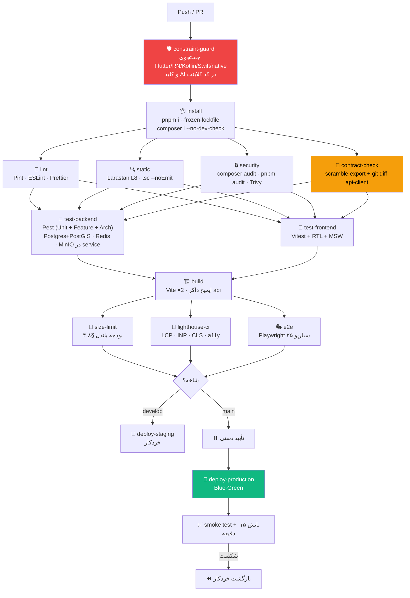

### `constraint-guard` — اجرای HC-1 و HC-5

```yaml
# .github/workflows/constraint-guard.yml
- name: ممنوعیت Native (HC-1)
  run: |
    if grep -rniE '(react-native|flutter|\.kt\b|\.swift\b|capacitor|cordova|expo-)' \
       --include='*.json' --include='*.ts' --include='*.tsx' --include='*.php' \
       --exclude-dir=node_modules --exclude-dir=vendor . ; then
      echo "::error::نقض HC-1 — ارجاع به فناوری Native یافت شد"; exit 1
    fi

- name: کلید AI در کلاینت ممنوع (HC-5)
  run: |
    if grep -rniE '(openrouter|openai|anthropic|generativelanguage|@google/genai)' apps/*/src ; then
      echo "::error::نقض HC-5 — ارجاع به سرویس AI در کد کلاینت"; exit 1
    fi

- name: وابستگی‌های مرده پروتوتایپ
  run: |
    if grep -qE '"(@google/genai|express|dotenv)"' apps/*/package.json ; then
      echo "::error::وابستگی مرده پروتوتایپ بازگشته است"; exit 1
    fi
```

### انتشار Blue-Green

۱) بیلد و Push ایمیج با تگ SHA ← ۲) اجرای مهاجرت‌ها (فقط Expand، هرگز مخرب) ← ۳) بالا آوردن استک `green` در کنار `blue` ← ۴) Health Check + Smoke Test روی `green` ← ۵) تغییر Upstream در nginx و Reload بدون قطعی ← ۶) نگه‌داشتن `blue` به‌مدت ۳۰ دقیقه ← ۷) در صورت هشدار، بازگشت آنی با تعویض مجدد Upstream ← ۸) خاموش کردن `blue`.

**پنجره انتشار:** روزهای کاری، ۱۰:۰۰ تا ۱۶:۰۰ — نه پنجشنبه، نه شب. دلیل: اگر چیزی خراب شود، انسانی برای رفعش بیدار باشد.

---

# فصل ۱۱ — نقشه راه پیاده‌سازی

## ۱۱.۱. نمای کلی فازها

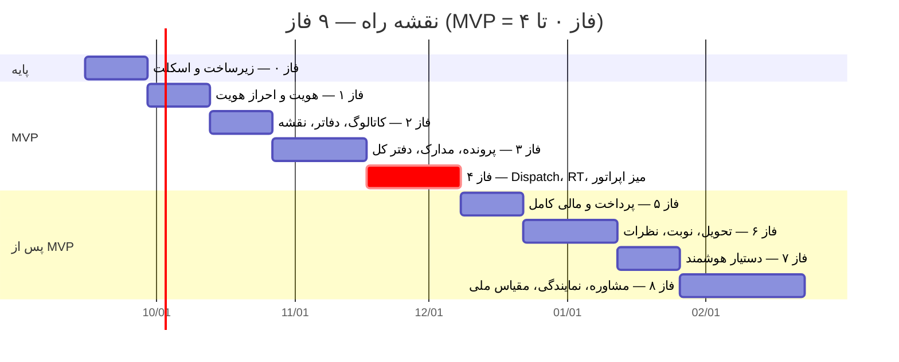

| فاز | مدت | وابستگی | خروجی قابل نمایش |
|---|---|---|---|
| ۰ | ۲ هفته | — | مخزن قابل بیلد، CI سبز، محیط Staging بالا |
| ۱ | ۲ هفته | ۰ | ورود واقعی شهروند و اپراتور با OTP پیامکی |
| ۲ | ۲ هفته | ۱ | کاتالوگ خدمات و نقشه دفاتر با داده واقعی |
| ۳ | ۳ هفته | ۲ | ثبت پرونده، آپلود مدرک، رهگیری تایم‌لاین |
| **۴** | **۳ هفته** | ۳ | **🎯 MVP — حلقه کامل شهروند↔اپراتور** |
| ۵ | ۲ هفته | ۴ | پرداخت آنلاین، کیف پول، تسویه با دفاتر |
| ۶ | ۳ هفته | ۵ | پیک و تحویل، نوبت حضوری، نظرات و SLA |
| ۷ | ۲ هفته | ۴ | چت‌بات و دستیار صوتی واقعی |
| ۸ | ۴ هفته | ۶،۷ | مشاوره، نمایندگی، اشتراک، آماده‌سازی ملی |

**مجموع تا MVP: ۱۰ هفته. مجموع کل: ۲۱ هفته.**

---

## فاز ۰ — زیرساخت و اسکلت

**ماژول‌ها:** هیچ ماژول دامنه‌ای. فقط داربست.

**کارها:**
1. Monorepo با pnpm + Turborepo طبق §۴.۱.
2. `apps/api`: Laravel 12، ساختار `Modules/`، `ServiceProvider` خودکارِ ماژول‌ها، Pint، Larastan L8، Pest.
3. `apps/citizen-pwa` و `apps/operator-desk`: Vite + React 19 + TS strict + Tailwind 4 + ESLint با قواعد §۴.۲.
4. `packages/domain`: همه Enumها و برچسب‌های فارسی‌شان (۱۱ وضعیت، ۵ نوبت‌دار، ۱۰ کد بازگشت، ۳ تگ خدمت، ۶ نوع سند تحویلی، ۵ وضعیت تحویل، ۳ نوع پیک، ۶ دسته مشاوره، ۳ حالت مشاوره).
5. `packages/ui-kit`: توکن‌های §۴.۷ + ۸ کامپوننت پایه (`Button`, `Input`, `Sheet`, `Dialog`, `Badge`, `StatusPill`, `Skeleton`, `Toast`) با Fallback شیشه‌ای.
6. `docker/compose.yml`: postgres+postgis، redis، minio، mailpit، api، reverb، horizon.
7. خط لوله CI کامل §۱۰.۵ شامل `constraint-guard`.
8. Scramble + orval + دروازه `contract-check` روی یک Endpoint نمونه `GET /health`.
9. زیرساخت Audit Log، `Money` value object، `EnvelopeEncryptor`، Middlewareهای `Idempotent`/`ForceJson`/`AuditLog`.
10. Seeder استان‌ها و شهرها.
11. استقرار Staging با Compose + nginx + Blue-Green.

**معیارهای پذیرش:**
- [ ] `pnpm build` و `pnpm test` در ریشه بدون خطا اجرا می‌شوند.
- [ ] `docker compose up` کل استک را بالا می‌آورد و `GET /api/v1/health` مقدار `{"status":"ok","db":"ok","redis":"ok","storage":"ok"}` می‌دهد.
- [ ] `constraint-guard` روی یک کامیت آزمایشی حاوی `react-native` **Fail** می‌شود.
- [ ] تست معماری Pest Arch روی یک نقض عمدی مرز ماژول **Fail** می‌شود.
- [ ] تغییر یک Endpoint بدون تولید مجدد کلاینت، `contract-check` را **Fail** می‌کند.
- [ ] Storybook `ui-kit` هر ۸ کامپوننت را در حالت RTL و با `data-perf="low"` نمایش می‌دهد.
- [ ] Lighthouse روی صفحه خالی PWA امتیاز ≥۹۵ می‌دهد و باندل اولیه <۶۰KB gzip است.

**تخمین:** ۲ هفته.

---

## فاز ۱ — هویت و احراز هویت

**ماژول‌ها:** `Identity`، `Integration/Sms`

**کارها:**
1. مهاجرت‌ها: `citizens`، `operators`، `otp_challenges`، `sessions`، `personal_access_tokens`، جداول spatie. (جداول `provinces`/`cities` از فاز ۰ موجودند و Seeder آن‌ها همان‌جا اجرا شده است — بدون مهاجرت تکراری.)
2. رمزنگاری ستونی کد ملی/موبایل + ستون‌های هش (§۶.۲) با Cast سفارشی Eloquent.
3. اعتبارسنجی چک‌دیجیت کد ملی ایرانی به‌عنوان Rule.
4. `SendOtpAction`، `VerifyOtpAction` با تمام محدودیت‌های نرخ §۷.۵.
5. `SmsGateway` + `KavenegarDriver` + `SmsIrDriver` + `FakeDriver` + Contract Test.
6. ورود اپراتور (کد دفتر + نام کاربری + Argon2id + OTP) و Session کوکی.
7. RBAC: ۷ نقش §۷.۳، Permissionها، `OfficeScope`، Middleware `office.scope`.
8. Endpointها: `POST /auth/otp/request`، `/auth/otp/verify`، `POST /auth/refresh` (تبدیل کوکی refresh به PAT کوتاه‌عمر برای Service Worker)، `POST /auth/logout`، `GET /auth/me`، `GET /auth/devices`، `DELETE /auth/devices/{id}`، `POST /auth/operator/login`.
9. فرانت: اسلایس `auth` در هر دو اپ، `OtpInput`، شمارنده، مدیریت توکن در حافظه + کوکی refresh.
10. `AuditLogger` روی همه رویدادهای احراز هویت + زنجیره هش + `VerifyAuditChainCommand`.

**معیارهای پذیرش:**
- [ ] شهروند جدید با موبایل + کد ملی معتبر ثبت‌نام و وارد می‌شود؛ پیامک واقعی در Staging می‌رسد.
- [ ] کد OTP **در هیچ پاسخ API ظاهر نمی‌شود** (تست خودکار).
- [ ] کد ملی نامعتبر (چک‌دیجیت غلط) با `AUTH_NATIONAL_ID_INVALID` رد می‌شود.
- [ ] چهارمین درخواست OTP در ۱۵ دقیقه `429` با `Retry-After` می‌دهد.
- [ ] پنج تلاش غلط، challenge را باطل و حساب را ۱۵ دقیقه قفل می‌کند.
- [ ] در دیتابیس، ستون کد ملی **قابل خواندن با چشم نیست** (رمزنگاری‌شده) اما جستجو با هش کار می‌کند.
- [ ] اپراتور دفتر A نمی‌تواند با توکن خود به هیچ منبع دفتر B دسترسی یابد (`404`).
- [ ] `VerifyAuditChainCommand` روی یک ردیف دستکاری‌شده Fail می‌شود.
- [ ] پوشش تست ماژول `Identity` ≥۸۵٪.

**تخمین:** ۲ هفته.

---

## فاز ۲ — کاتالوگ خدمات، شبکه دفاتر و نقشه

**ماژول‌ها:** `ServiceCatalog`، `OfficeNetwork`، `Integration/Geo`

**کارها:**
1. مهاجرت‌ها: `service_categories`، `services`، `document_types`، `service_required_docs`، `offices`، `office_service_coverage`، `office_specialties`، `office_medals`، `office_announcements`.
2. فعال‌سازی PostGIS، ستون `location geography(POINT,4326)`، ایندکس GIST.
3. `search_vector` + Trigger + `pg_trgm` + نرمال‌سازی «ی/ك» فارسی.
4. اسکریپت `tools/extract-seed-data.ts` و Seederهای §۶.۹.
5. `OfficeFinder` با کوئری امتیاز هوشمند §۵.۶ و کش ژئوهش.
6. Endpointها: `GET /categories`، `/services`، `/services/{slug}`، `/offices`، `/offices/nearby`، `/offices/{id}`، `/document-types`.
7. `GeoProvider` + `NeshanDriver` + `FakeDriver` + پروکسی کش تایل در nginx.
8. فرانت شهروند: اسلایس‌های `service-catalog` (جستجو، فیلتر دسته و تگ) و `offices-map` (Leaflet، مارکرهای SVG سفارشی، ۳ تم، فیلتر امتیاز/فاصله، Bottom Sheet جزئیات دفتر).
9. مدیریت موقعیت کاربر با Fallback سه‌مرحله‌ای §۸.۴.
10. کش Service Worker برای کاتالوگ و تایل‌ها (اولین بخش Offline).

**معیارهای پذیرش:**
- [ ] هر ۱۰ دسته و همه خدمات `mockData.ts` در دیتابیس‌اند و از API برمی‌گردند.
- [ ] جستجوی «کارت ملی» و «كارت ملي» (املای عربی) نتیجه یکسان می‌دهد.
- [ ] `/offices/nearby` با مختصات میدان ولیعصر، دفاتر را با فاصله واقعی PostGIS و مرتب بر `smart_score` برمی‌گرداند؛ p95 < ۲۰۰ms با ۱۰k دفتر Seed شده.
- [ ] فیلتر «فقط آنلاین» فقط دفاتر `registered_online` را می‌دهد.
- [ ] نقشه در حالت Offline، آخرین تایل‌های کش‌شده را نمایش می‌دهد.
- [ ] کاتالوگ خدمات پس از یک‌بار بازدید، کاملاً Offline کار می‌کند.
- [ ] باندل مسیر نقشه به‌صورت Lazy و جدا بارگذاری می‌شود؛ باندل اولیه همچنان ≤۱۸۰KB.

**تخمین:** ۲ هفته.

---

## فاز ۳ — پرونده، مدارک و دفتر کل

**ماژول‌ها:** `CaseWorkflow`، `Documents`، `Payments` (حداقلی)

**کارها:**
1. مهاجرت‌های پارتیشن‌شده: `case_requests` (LIST بر `province_code`، ۳۱ پارتیشن + default)، `case_timeline_steps`، `case_documents`، `return_reasons`، `case_returns`، `gov_inquiries`.
2. `CaseStateMachine` §۵.۴ با تست ۱۰۰٪ روی هر گذار مجاز و هر گذار غیرمجاز.
3. Seed ۱۰ کد بازگشت با متن‌های فارسی `mockData.ts`.
4. مهاجرت‌های دفتر کل: `ledger_accounts`، `ledger_transactions`، `ledger_entries` + `LedgerService` با تضمین تراز.
5. `Documents`: آپلود دو مرحله‌ای §۵.۶، `ProcessDocumentJob` (MIME واقعی، ClamAV، حذف EXIF، نرمال‌سازی، تحلیل کیفیت با OpenCV، رمزنگاری پاکتی، MinIO)، Signed URL 60 ثانیه‌ای + ثبت `document.viewed`.
6. مهاجرت‌های مخزن شخصی: `vault_documents`، `vault_document_versions`، `vault_document_attributes`.
7. Endpointها: `POST /cases`، `GET /cases`، `GET /cases/{trackingCode}`، `POST /cases/{id}/documents`، `POST /cases/{id}/cancel`، `POST /documents/upload-intent`، `/upload-complete`، `GET /documents/{id}/url`، `GET /vault`، `POST /vault`.
8. Middleware `Idempotent` روی `POST /cases`.
9. `ExpireActionRequiredCasesCommand` و شمارنده SLA.
10. فرانت شهروند: اسلایس `case-tracking` (لیست + تایم‌لاین گرافیکی ۶ مرحله‌ای با `TurnOwnerChip`)، جریان ۵ مرحله‌ای `ServiceRequest`، اسلایس `documents-vault`، صف Offline §۴.۶.

**معیارهای پذیرش:**
- [ ] ثبت پرونده، در **یک تراکنش** پرونده + دو ورودی دفتر کل + گام اول تایم‌لاین را می‌سازد؛ شکست هر بخش، همه را برمی‌گرداند.
- [ ] هر ۱۱ وضعیت و همه گذارهای جدول §۳.۵ تست دارند؛ گذار غیرمجاز `CASE_INVALID_TRANSITION` می‌دهد.
- [ ] تلاش مستقیم برای `$case->status = ...` خارج از State Machine، تست معماری را Fail می‌کند.
- [ ] `SUM(debit) = SUM(credit)` برای هر تراکنش — تست Property-Based روی ۱۰۰۰ تراکنش تصادفی.
- [ ] موجودی کیف پول از دفتر کل مشتق می‌شود؛ هیچ ستون `balance` قابل نوشتنی در Schema وجود ندارد.
- [ ] فایل آپلودشده در MinIO با دانلود مستقیم **غیرقابل خواندن** است (Ciphertext).
- [ ] EXIF شامل GPS از تصویر آپلودی حذف شده است (تست با فایل نمونه GPS-دار).
- [ ] آپلود فایل `.php` با پسوند `.jpg` رد می‌شود.
- [ ] تصویر تار، `quality_warnings: ["blur"]` می‌گیرد.
- [ ] ارسال دوباره همان `Idempotency-Key` پرونده دوم نمی‌سازد و وجه دوم کسر نمی‌کند.
- [ ] پرونده `action_required` پس از ۷۲ ساعت خودکار لغو و استرداد جزئی می‌شود.
- [ ] در حالت Offline، ثبت پرونده در صف می‌رود و پس از اتصال دقیقاً یک‌بار ارسال می‌شود (E5 + E6).
- [ ] پوشش `CaseStateMachine` و `LedgerService` = ۱۰۰٪.

**تخمین:** ۳ هفته.

---

## فاز ۴ — موتور Dispatch، Real-Time و میز کار اپراتور 🎯 MVP

**ماژول‌ها:** `CaseWorkflow` (Dispatch)، `OfficeNetwork` (صف)، `Messaging`

**کارها:**
1. مهاجرت‌ها: `dispatch_offers`، `case_messages`، `notifications`، `office_sla_events`.
2. `DispatchCaseJob` §۵.۸ با ۵ دور، شعاع افزایشی `[5,10,15,25,40]`، دسته ۳ دفتری، TTL 90 ثانیه.
3. `ExpireDispatchOfferJob` + `ExpireDispatchOffersCommand`.
4. پذیرش رقابتی با `SELECT … FOR UPDATE` و پاسخ `409 OFFER_ALREADY_TAKEN`.
5. راه‌اندازی Reverb + همه کانال‌های §۵.۷ + مجوزدهی با Policy.
6. Endpointهای اپراتور: `GET /desk/offers`، `POST /offers/{id}/accept`، `/decline`، `GET /desk/cases`، `GET /desk/cases/{id}`، `POST /cases/{id}/review`، `POST /cases/{id}/return`، `POST /cases/{id}/inquiry`، `POST /cases/{id}/complete`، `GET /desk/queue`.
7. `GovernmentInquiryJob` با Circuit Breaker + شبیه‌سازهای §۸.۵.
8. پیام‌رسان پرونده: `GET/POST /cases/{id}/messages` + Broadcast.
9. اعلان‌ها: `SendCaseNotificationJob` (SMS + Web Push) با الگوهای §۸.۳.
10. فرانت اپراتور: اسلایس‌های `offers` (کارت پیشنهاد با شمارنده معکوس زنده)، `workspace` (DataGrid مجازی‌شده + پنل بررسی مدرک + مودال بازگشت با ۱۰ کد)، `queue`.
11. فرانت شهروند: اتصال Real-Time §۴.۱۰ + Fallback Polling، اسلایس `messaging`.
12. کانال Presence برای جلوگیری از بررسی هم‌زمان یک پرونده توسط دو اپراتور.

**معیارهای پذیرش:**
- [ ] ثبت پرونده در کمتر از ۵ ثانیه، پیشنهاد را به سه دفتر نزدیک آنلاین می‌رساند.
- [ ] دو اپراتور که هم‌زمان می‌پذیرند: دقیقاً یکی `200`، دیگری `409` (تست همزمانی با ۲۰ درخواست موازی).
- [ ] عدم پاسخ در ۹۰ ثانیه، پیشنهاد را منقضی و دور بعد را آغاز می‌کند.
- [ ] پس از ۵ دور بی‌نتیجه، پرونده لغو و وجه کاملاً مسترد می‌شود.
- [ ] تغییر وضعیت توسط اپراتور، ظرف <۲ ثانیه بدون رفرش در مرورگر شهروند دیده می‌شود.
- [ ] با مسدود کردن WSS، کلاینت ظرف ۱۰ ثانیه به Polling می‌افتد و همچنان به‌روز می‌ماند.
- [ ] بازگشت با هر یک از ۱۰ کد کار می‌کند و SMS متناسب می‌فرستد.
- [ ] هر بازکردن مدرک توسط اپراتور در `audit_logs` با `document.viewed` ثبت است.
- [ ] شبیه‌ساز استعلام هر ۵ سناریوی §۸.۵ را درست بازتولید می‌کند.
- [ ] پنج خطای متوالی استعلام، Circuit Breaker را باز می‌کند و پیام مناسب به شهروند می‌رسد.
- [ ] DataGrid با ۵۰۰ پرونده در <۱۲۰ms رندر می‌شود.
- [ ] **همه ۲۵ سناریوی E2E مربوط به فازهای ۰–۴ سبزند.**
- [ ] 🎯 **سفر کامل E1 و E2 انتها-به-انتها روی Staging با کاربر واقعی انجام شده است.**

**تخمین:** ۳ هفته. **این پایان MVP است.**

---

## فاز ۵ — پرداخت و مالی کامل

**ماژول‌ها:** `Payments`، `Integration/Payment`

**کارها:** `payment_intents`، `payouts`؛ `PaymentGateway` + `ZarinPalDriver` + `ZibalDriver` + `FakeDriver` + Contract Test؛ شارژ و تأیید کیف پول؛ `ReconcilePaymentIntentsJob`؛ استرداد کامل و جزئی؛ قاعده تقسیم کارمزد §۸.۲؛ `GenerateOfficePayoutsCommand`؛ Materialized Balance؛ اسلایس `wallet` شهروند؛ میز `finance` اپراتور (فقط مدیر) با گزارش درآمد، تسویه و مغایرت.

**معیارهای پذیرش:**
- [ ] شارژ واقعی از درگاه آزمون ZarinPal، موجودی را درست افزایش می‌دهد.
- [ ] دستکاری مبلغ در کلاینت هیچ اثری ندارد (مبلغ سمت سرور محاسبه می‌شود).
- [ ] بازگشت جعلی `Status=OK` بدون تأیید درگاه، هیچ واریزی ایجاد نمی‌کند.
- [ ] تأیید دوباره یک `authority` رد می‌شود.
- [ ] پرداختی که کاربر وسط راه مرورگر را بست، ظرف ۵ دقیقه توسط Job مغایرت‌گیری نجات می‌یابد.
- [ ] تسویه روزانه، سهم هر دفتر را درست محاسبه می‌کند و گزارش مدیر دفتر با دفتر کل تطبیق کامل دارد.
- [ ] هشدار «مغایرت دفتر کل» روی یک ورودی دستی نامتوازن فعال می‌شود.

**تخمین:** ۲ هفته.

---

## فاز ۶ — تحویل، نوبت حضوری، نظرات و پروفایل دفتر

**ماژول‌ها:** `Delivery`، `OfficeNetwork` (تکمیل)، `Integration/Postal`

**کارها:** `delivery_requests`، `delivery_events`، `appointments`، `office_reviews`؛ فلوی کامل پیک با ۶ نوع سند، ۳ نوع پیک، ۵ وضعیت، OTP تحویل (bcrypt، یک‌بارمصرف)، پرداخت `cod`/`prepaid`/`office_wallet`، پرچم‌های `require_old_doc_return` و `is_sealed_pack`؛ تولید بارنامه PDF؛ `PostalClient` + شبیه‌ساز + `SyncPostTrackingCommand`؛ نوبت‌دهی با حضور/غیبت و نتیجه؛ نظرات شهروندان با پاسخ مدیر و امتیاز SLA؛ میزهای `delivery`، `reviews`، `office_profile` اپراتور؛ اسلایس‌های `appointments` و `smart_reminder` شهروند.

**معیارهای پذیرش:**
- [ ] چرخه کامل تحویل: ایجاد → تخصیص پیک → در راه → OTP → `delivered` → پرونده `completed`.
- [ ] OTP اشتباه رد و پس از ۳ تلاش، OTP جدید لازم می‌شود.
- [ ] تحویل ناموفق، مرسوله را به دفتر برمی‌گرداند و پرونده به `ready_for_issue`.
- [ ] بارنامه PDF با فونت فارسی درست و بارکد قابل اسکن تولید می‌شود.
- [ ] رزرو نوبت متداخل رد می‌شود؛ `queue_number` در هر روز و دفتر یکتاست.
- [ ] امتیاز دفتر پس از ثبت نظر تأییدشده به‌درستی بازمحاسبه می‌شود.
- [ ] نقض SLA در `office_sla_events` ثبت و به مدیر دفتر اعلام می‌شود.

**تخمین:** ۳ هفته.

---

## فاز ۷ — دستیار هوشمند (چت‌بات و صوت)

**ماژول‌ها:** `AiAssistance`، `Integration/Ai`

**کارها:** `ai_conversations`، `ai_messages`، `ai_usage_records`؛ استقرار و مقاوم‌سازی `ai-egress-proxy` با mTLS؛ `AiProvider` + `OpenRouterDriver` + `FakeDriver`؛ `PiiRedactor` + تست نشت؛ خط لوله RAG §۵.۶ (تشخیص نیت → بازیابی FTS+PostGIS → ناشناس‌سازی → LLM → بازگردانی)؛ پخش SSE؛ دستیار صوتی §۸.۱.۵ با `MediaRecorder` و Fallback؛ محدودیت نرخ و بودجه + Circuit Breaker + پاسخ Fallback بدون LLM؛ اسلایس `ai-assistant` با همان ظاهر Liquid Glass پروتوتایپ.

**معیارهای پذیرش:**
- [ ] چت‌بات به «برای تعویض کارت ملی چه مدارکی لازم است؟» پاسخ درست با استناد به خدمت واقعی می‌دهد.
- [ ] پاسخ شامل `suggested_actions` است و کلیک روی آن، فرم درخواست همان خدمت را باز می‌کند.
- [ ] **تست نشت PII سبز است:** در ۵۰ سناریو، هیچ کد ملی/موبایل/آدرس/نام کامل در Payload خروجی نیست.
- [ ] هیچ کلید AI در باندل کلاینت نیست (`constraint-guard` سبز).
- [ ] CSP، اتصال مستقیم مرورگر به OpenRouter را مسدود می‌کند (تست دستی تأییدشده).
- [ ] با خاموش کردن پروکسی، پاسخ Fallback مبتنی بر جستجو داده می‌شود، نه خطای ۵۰۰.
- [ ] رونویسی صوت فارسی روی ۱۰ نمونه، دقت قابل قبول دارد.
- [ ] p95 پاسخ چت‌بات ≤ ۴ ثانیه.
- [ ] عبور از سقف ۳۰ پیام در ساعت، `429` با پیام فارسی می‌دهد.

**تخمین:** ۲ هفته.

---

## فاز ۸ — مشاوره، نمایندگی حقوقی، اشتراک و آماده‌سازی مقیاس ملی

**ماژول‌ها:** `Consultation`، `Identity` (نمایندگی)، سخت‌سازی زیرساخت

**کارها:** `advisors`، `advisor_specialties`، `advisor_reviews`، `consultation_sessions`، `session_messages`، `subscription_plans`، `subscriptions`، `quota_usages`، `delegations`؛ ۶ دسته مشاوره و ۳ حالت (`text`/`call`/`case_review`) با محاسبه هزینه از مهر زمانی سرور؛ امتیاز سه‌بعدی (دقت/فن بیان/صبوری)؛ ثبت‌نام و تأیید مشاور؛ پلن‌های اشتراک با سهمیه؛ اتصال «مشاوره → اجرای خدمت مرتبط»؛ نمایندگی حقوقی با OTP دوطرفه، سقف مبلغ و انقضا؛ Read Replica + PgBouncer؛ Redis Sentinel؛ MinIO توزیع‌شده؛ Reverb چندنمونه؛ تست بار k6 تا ۱۰k کاربر همزمان؛ آماده‌سازی مهاجرت K8s (مانیفست‌های معادل).

**معیارهای پذیرش:**
- [ ] جلسه مشاوره صوتی، هزینه را از مهر زمانی سرور محاسبه می‌کند؛ دستکاری کلاینت بی‌اثر است.
- [ ] «بررسی عمیق پرونده» با آپلود سند و ثبت نظر مشاور کار می‌کند.
- [ ] تسویه ۸۰/۲۰ مشاور در دفتر کل درست ثبت می‌شود.
- [ ] نمایندگی فقط با OTP هر دو طرف فعال می‌شود.
- [ ] نماینده خارج از `allowed_service_ids` یا فراتر از `max_amount_rials` رد می‌شود.
- [ ] هر استفاده از نمایندگی به موکل اعلان می‌دهد.
- [ ] نمایندگی منقضی خودکار غیرفعال می‌شود.
- [ ] سهمیه اشتراک هرگز منفی نمی‌شود (تست همزمانی).
- [ ] تست بار k6: ۱۰k کاربر همزمان، همه SLOهای §۹.۵ رعایت می‌شوند.
- [ ] Failover دیتابیس در <۲ دقیقه بدون از دست رفتن داده تأییدشده.
- [ ] بازیابی از بکاپ روی محیط تازه، RTO <۴ ساعت را برآورده می‌کند.

**تخمین:** ۴ هفته.

---

# فصل ۱۲ — پروتکل تحویل به مدل‌های پیاده‌ساز

## ۱۲.۱. قواعد کار برای هر مدل پیاده‌ساز

هر مدلی که یک فاز را می‌گیرد، **موظف** است:

1. **این سند را کامل بخواند** — به‌ویژه فصل قیود، §۳.۵ (ماشین وضعیت)، فصل ۷ (امنیت)، و §۱۰.۴ (سبک کد).
2. **هیچ فرضی نسازد.** اگر چیزی در سند نیست، در بخش «سؤالات باز» فایل وظیفه ثبت کند و **متوقف شود**، نه اینکه حدس بزند.
3. **خارج از دامنه فاز خود کد ننویسد.** اگر ماژول دیگری لازم است، آن را با Fake/Stub ماک کند.
4. **اول تست بنویسد** برای منطق دامنه‌ای بحرانی (State Machine، Ledger، Redactor).
5. **سقف اندازه فایل را رعایت کند** (۴۰۰ خط). فایل بزرگ‌تر = شکستن، نه تخفیف دادن قاعده Lint.
6. **قرارداد API را همگام نگه دارد** — پس از هر تغییر Endpoint، `php artisan scramble:export && pnpm generate:client` را اجرا و خروجی را Commit کند.
7. **پیش از اعلام اتمام**، همه معیارهای پذیرش فاز را واقعاً اجرا و نتیجه را گزارش کند.
8. **هیچ‌وقت داده واقعی شهروند در تست یا Seed نگذارد.**

## ۱۲.۲. قالب استاندارد فایل وظیفه

> این قالب را برای هر فاز کپی کنید، `{{…}}` را پر کنید، و مستقیماً به مدل بعدی بدهید.

````markdown
# وظیفه پیاده‌سازی — فاز {{N}}: {{عنوان فاز}}

## ۰. نقش تو
تو یک مهندس نرم‌افزار ارشد Full-Stack هستی که روی «سامانه جامع خدمات شهروندی و پیشخوان هوشمند»
کار می‌کنی. مهارت تو: Laravel 12 (PHP 8.3)، React 19 + TypeScript، PostgreSQL/PostGIS.

## ۱. پیش‌نیاز مطالعه (اجباری، پیش از نوشتن هر خط کد)
- `ARCHITECTURE.md` — کل سند، به‌ویژه:
  - «قیود قطعی حاکم بر کل سند» (HC-1 تا HC-7)
  - §۳.۵ ماشین وضعیت پرونده
  - §۵.۲ ساختار پوشه‌ها و §۵.۳ نگاشت DDD
  - §۶ مدل داده (ERD، ایندکس، پارتیشن)
  - فصل ۷ امنیت — کل فصل
  - §۱۰.۴ سبک کد
  - فاز {{N}} در فصل ۱۱ — دامنه دقیق کار تو
- کد موجود در ماژول‌های: {{لیست ماژول‌های وابسته}}

## ۲. دامنه کار (Scope)
### باید انجام دهی
{{کپی دقیق «کارها»ی فاز از فصل ۱۱}}

### نباید انجام دهی
- هیچ کدی در ماژول‌های {{ماژول‌های خارج از فاز}}
- هیچ تغییری در `packages/api-client/src/generated` به‌صورت دستی
- هیچ Refactor فرصت‌طلبانه‌ای خارج از دامنه

## ۳. فایل‌های مرتبط
| مسیر | نقش |
|---|---|
{{جدول فایل‌هایی که می‌سازی یا تغییر می‌دهی}}

## ۴. قیود (نقض هرکدام = رد کار)
- ❌ هیچ Native App / Flutter / React Native / Kotlin / Swift (HC-1)
- ❌ هیچ کلید یا فراخوانی AI در کد کلاینت (HC-5)
- ❌ هیچ فایل > ۴۰۰ خط · هیچ متد PHP > ۴۰ خط (§۱۰.۴) · هیچ تابع TS > ۶۰ خط
- ❌ هیچ رشته فارسی Hard-code در JSX
- ❌ هیچ کلاس CSS جهت‌دار فیزیکی (`ml-*`, `left-*`)
- ❌ هیچ `any` در TypeScript، هیچ `mixed` در PHP
- ❌ هیچ `Http::`/Guzzle داخل ماژول‌های دامنه (فقط `app/Integration`)
- ❌ هیچ نوشتن مستقیم روی `$case->status` (فقط `CaseStateMachine`)
- ❌ هیچ ستون `balance` قابل نوشتن (موجودی همیشه از دفتر کل مشتق است)
- ❌ هیچ PII در لاگ، URL، رویداد Real-Time یا Prompt هوش مصنوعی
- ✅ همه تاریخ‌ها UTC ISO-8601 در DB؛ جلالی فقط در لایه ارائه
- ✅ همه مبالغ ریال، عدد صحیح، فیلد با پسوند `_rials`

## ۵. تعریف انجام‌شده (Definition of Done)
- [ ] همه معیارهای پذیرش فاز {{N}} (فصل ۱۱) اجرا و **سبز** شده‌اند
- [ ] `pnpm lint && pnpm typecheck && pnpm test` بدون خطا
- [ ] `./vendor/bin/pint --test && ./vendor/bin/phpstan && ./vendor/bin/pest` بدون خطا
- [ ] پوشش تست ماژول ≥ آستانه §۱۰.۲
- [ ] تست‌های معماری Pest Arch سبز
- [ ] `php artisan scramble:export && pnpm generate:client` اجرا و خروجی Commit شده
- [ ] هیچ مهاجرت مخربی؛ همه `down()` تست‌شده
- [ ] Endpointهای جدید در OpenAPI مستند و در Postman/Bruno collection موجودند
- [ ] رشته‌های فارسی در فایل ترجمه، نه در کد
- [ ] بودجه عملکرد §۴.۸ رعایت شده (اگر فاز فرانت‌اند دارد)
- [ ] `constraint-guard` سبز

## ۶. سؤالات باز
{{اگر چیزی مبهم بود، اینجا بنویس و متوقف شو — حدس نزن}}

## ۷. خروجی مورد انتظار
۱. کد کامل، Commit شده در شاخه `feat/phase-{{N}}-{{slug}}`
۲. گزارش کوتاه: چه ساختی، چه تصمیم‌هایی گرفتی، چه چیزی باقی مانده
۳. نتیجه واقعی اجرای هر معیار پذیرش (خروجی دستور، نه ادعا)
````

## ۱۲.۳. نمونه پرشده — فاز ۳

````markdown
# وظیفه پیاده‌سازی — فاز ۳: پرونده، مدارک و دفتر کل

## ۲. دامنه کار
### باید انجام دهی
1. مهاجرت‌های پارتیشن‌شده `case_requests` (LIST بر province_code، ۳۱ پارتیشن + default)،
   `case_timeline_steps`, `case_documents`, `return_reasons`, `case_returns`, `gov_inquiries`
2. `app/Modules/CaseWorkflow/Domain/CaseStateMachine.php` طبق §۵.۴ — کپی دقیق جدول گذارها از §۳.۵
3. Seeder ۱۰ کد بازگشت با متن فارسی از `src/data/mockData.ts` → `RETURN_REASON_DICTIONARY`
4. `ledger_accounts` / `ledger_transactions` / `ledger_entries` + `LedgerService`
5. آپلود دو مرحله‌ای + `ProcessDocumentJob` (MIME واقعی، ClamAV، حذف EXIF، نرمال‌سازی،
   تحلیل تاری با واریانس لاپلاسین، رمزنگاری پاکتی، MinIO)
6. Endpointها: POST /cases · GET /cases · GET /cases/{trackingCode} ·
   POST /cases/{id}/documents · POST /cases/{id}/cancel ·
   POST /documents/upload-intent · POST /documents/upload-complete · GET /documents/{id}/url
7. Middleware `Idempotent` روی POST /cases
8. فرانت: `features/case-tracking`, `features/service-request`, `features/documents-vault`,
   `shared/offline/outbox.ts`

### نباید انجام دهی
- موتور Dispatch (فاز ۴) — فعلاً پرونده در `searching_office` می‌ماند
- درگاه پرداخت (فاز ۵) — فقط برداشت از کیف پول با دفتر کل
- Real-Time (فاز ۴)
- استعلام واقعی دولتی (فاز ۴)

## ۳. فایل‌های مرتبط
| مسیر | نقش |
|---|---|
| `apps/api/app/Modules/CaseWorkflow/**` | ماژول اصلی |
| `apps/api/app/Modules/Documents/**` | آپلود و رمزنگاری |
| `apps/api/app/Modules/Payments/Domain/LedgerService.php` | دفتر کل |
| `apps/api/app/Shared/Crypto/EnvelopeEncryptor.php` | از فاز ۰ موجود است — استفاده کن |
| `apps/api/app/Shared/Http/Middleware/Idempotent.php` | از فاز ۰ موجود است |
| `packages/domain/src/case-status.ts` | از فاز ۰ موجود — منبع حقیقت وضعیت‌ها |
| `apps/citizen-pwa/src/features/case-tracking/**` | UI رهگیری |
| `src/components/CaseTrackingView.tsx` (پروتوتایپ) | 📖 **فقط برای الهام بصری** — کپی نکن |

## ۵. تعریف انجام‌شده — افزوده‌های خاص این فاز
- [ ] پوشش `CaseStateMachine` و `LedgerService` **دقیقاً ۱۰۰٪**
- [ ] تست Property-Based: ۱۰۰۰ تراکنش تصادفی، همیشه SUM(debit)=SUM(credit)
- [ ] تست: فایل در MinIO با دانلود مستقیم غیرقابل خواندن است
- [ ] تست: تصویر GPS-دار پس از پردازش EXIF ندارد
- [ ] تست: `.php` با پسوند `.jpg` رد می‌شود
- [ ] تست همزمانی: دو POST /cases با یک Idempotency-Key → یک پرونده، یک برداشت
````

## ۱۲.۴. ترتیب اجرا و وابستگی‌ها

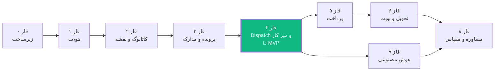

فازهای ۵ و ۷ پس از فاز ۴ **موازی‌پذیر** هستند (ماژول‌های مجزا، بدون تداخل فایل). بقیه ترتیبی‌اند.

---

# پیوست الف — تصمیمات گرفته‌شده به‌جای کارفرما

تصمیم‌هایی که کارفرما درباره‌شان اظهارنظر نکرد و معمار طبق اختیار تفویض‌شده گرفت.

| # | تصمیم | گزینه‌های رد شده | دلیل |
|---|---|---|---|
| D-01 | **Modular Monolith** با ۱۰ Bounded Context | Microservices · مونولیت ساده | تیم AI-only بدون DevOps + نیاز به ACID در تراکنش ثبت پرونده. مرزهای ماژول = مرزهای سرویس آینده. |
| D-02 | **PHP 8.3 + Laravel 12 + Octane/FrankenPHP** | PHP-FPM · Swoole | Octane زمان Boot را حذف و توان را ۳–۵ برابر می‌کند؛ FrankenPHP نصب ساده‌تر و HTTP/3. |
| D-03 | **React 19 + Vite (بدون SSR/Next.js)** | Next.js · Remix | SEO فقط برای کاتالوگ لازم است (با Prerender حل می‌شود)؛ SSR با PWA-Offline در تضاد و برای AI پیچیده‌تر است. |
| D-04 | **TanStack Query + Zustand** | Redux Toolkit · Context | حجم State کلاینتی کم است؛ `networkMode: offlineFirst` و `persistQueryClient` مستقیماً HC-2 را حل می‌کنند. |
| D-05 | **Neshan به‌جای OSM/CartoDB** | OSM · Mapbox · MapLibre | تایل‌های خارجی از ایران کند/مسدودند (مشکل فعلی پروتوتایپ)؛ Neshan آدرس فارسی و Reverse-Geo ایرانی دارد. Leaflet بدون WebGL برای گوشی ضعیف. |
| D-06 | **ریال به‌عنوان واحد ذخیره (integer)** | تومان اعشاری (مثل پروتوتایپ) | حذف کامل خطای ممیز شناور در تقسیم کارمزد بین دفتر و پلتفرم. |
| D-07 | **ذخیره UTC ISO-8601، تبدیل جلالی در لبه** | ذخیره رشته شمسی (مثل پروتوتایپ) | تاریخ شمسی رشته‌ای قابل مرتب‌سازی، مقایسه، یا محاسبه SLA نیست. |
| D-08 | **افزودن سه وضعیت `draft`، `delivering`، `cancelled`** | ۸ وضعیت پروتوتایپ | `draft` لازمه ثبت Offline؛ `delivering` مرحله پیک را در پرونده منعکس می‌کند؛ «لغو» با «رد» یکی نیست (اثر مالی متفاوت). |
| D-09 | **موجودیت `Operator` جدا از `PishkhanOffice`** | لاگین دفتر (مثل پروتوتایپ) | Audit Log باید بگوید کدام انسان مدرک را رد کرد؛ یک دفتر چند اپراتور دارد. |
| D-10 | **`DispatchOffer` با TTL و پذیرش رقابتی** | اساین مستقیم | بدون آن، «اساین دفتر» یعنی تحمیل به دفتری که ظرفیت ندارد. |
| D-11 | **پارتیشن‌بندی جداول حجیم از همان فاز ایجادشان (فاز ۰ و ۳)، نه بعداً** | پارتیشن‌بندی تأخیری | تبدیل جدول ۱۰۰M ردیفی در تولید، عملیاتی پرریسک و چندساعته است. |
| D-12 | **Sanctum؛ توکن در حافظه + کوکی، نه `localStorage`** | `localStorage` · Passport/OAuth2 | XSS نباید بتواند توکن را بدزدد؛ OAuth2 برای مصرف‌کننده داخلی Overkill است. |
| D-13 | **هفت نقش به‌جای چهار** (افزودن `citizen_delegate`، `advisor`، `auditor`) | چهار نقش درخواستی | نمایندگی حقوقی، مشاوران و بازرسی همگی در دامنه پروتوتایپ هستند و نقش خودشان را لازم دارند. |
| D-14 | **`ai-egress-proxy` + ناشناس‌سازی اجباری** | فراخوانی مستقیم | آشتی دادن HC-5 (Gemini) با HC-7 (اقامت داده) فقط از این راه ممکن است. |
| D-15 | **تحلیل کیفیت مدرک به‌صورت محلی (OpenCV)، نه با LLM** | ارسال تصویر به مدل چندوجهی | تصویر شناسنامه شهروند نباید از کشور خارج شود. تشخیص تاری/برش با پردازش تصویر کلاسیک قابل انجام است. |
| D-16 | **Docker Compose، نه Kubernetes** | K8s از روز اول | بدون SRE، کلاستر خراب بدتر از VM کم‌کشش است. مسیر مهاجرت باز نگه داشته شده. |
| D-17 | **GitHub Actions با Self-Hosted Runner داخل ایران** | Runner ابری | Registry و سرورهای مقصد داخل ایران‌اند و از GitHub Cloud در دسترس نیستند. |
| D-18 | **سقف سخت ۴۰۰ خط فایل با Lint در سطح Error** | راهنمای نرم | مدل‌های AI ذاتاً به سمت فایل بزرگ می‌روند؛ بدون مانع سخت، `OfficePortalView` دوباره متولد می‌شود. |
| D-19 | **`available_actions` از سرور می‌آید** | تصمیم‌گیری کلاینت | جلوگیری از واگرایی منطق مجوز بین دو اپ و بین کلاینت و سرور. |
| D-20 | **حذف `maximum-scale=1.0, user-scalable=no`** | حفظ متای پروتوتایپ | نقض مستقیم WCAG 1.4.4؛ برای سامانه‌ای با کاربر سالمند غیرقابل قبول. |
| D-21 | **Fallback مات برای شیشه + `useDeviceCapability()`** | افکت شیشه‌ای بی‌قید | `backdrop-filter` روی اندروید قدیمی فریم‌ریت را نابود می‌کند — تنها راه رعایت واقعی HC-2. |
| D-22 | **Fallback اجباری Polling برای Real-Time** | فقط WebSocket | فایروال دفاتر دولتی اغلب WSS را مسدود می‌کند؛ بدون Fallback، اپراتور هیچ پیشنهادی نمی‌بیند. |
| D-23 | **درگاه دوم (Zibal) و پیامک دوم (SMS.ir) از روز اول** | تک‌ارائه‌دهنده | قطعی درگاه یعنی توقف کامل درآمد؛ Adapter چندارائه‌دهنده هزینه اضافی ندارد. |
| D-24 | **زبان سند: فارسی؛ کد، JSON و برچسب دیاگرام: انگلیسی** | تماماً انگلیسی | همسویی با `PROJECT_ANALYSIS.md` و `PROJECT_GRAPH.md`؛ اصطلاح فنی انگلیسی برای مدل پیاده‌ساز بدون ابهام است. |
| D-25 | **شبیه‌سازهای دولتی قطعی (رقم آخر کد ملی)، نه تصادفی** | پاسخ تصادفی | مسیرهای خطا باید قابل بازتولید و تست باشند. |

---

# پیوست ب — واژه‌نامه دامنه (Ubiquitous Language)

| فارسی | English | تعریف دقیق |
|---|---|---|
| پرونده | `CaseRequest` | یک درخواست خدمت از ثبت تا تحویل؛ ریشه Aggregate اصلی سامانه |
| کد رهگیری | `trackingCode` | شناسه یکتای انسانی‌خوان پرونده، الگوی `CR-YYYY-NNNNN` |
| نوبت‌دار | `turnOwner` | اینکه اکنون توپ در زمین کیست: شهروند / دفتر / دولت / پست / سامانه |
| اساین | `dispatch` | فرایند یافتن و پیشنهاد پرونده به دفتر مناسب |
| پیشنهاد اساین | `DispatchOffer` | پیشنهاد زمان‌دار (۹۰ ثانیه) یک پرونده به یک دفتر |
| دفتر پیشخوان | `PishkhanOffice` | دفتر ارائه خدمات دولتی |
| اپراتور / باجه‌دار | `Operator` | کارمند دفتر که پرونده را بررسی می‌کند |
| مدیر دفتر | `OfficeManager` | مسئول دفتر؛ دسترسی مالی و مدیریتی |
| نقص مدرک | `returnReason` | یکی از ۱۰ کد استاندارد بازگشت پرونده برای اصلاح |
| استعلام | `GovernmentInquiry` | پرس‌وجو از سامانه دولتی بالادست |
| مخزن مدارک | `DocumentVault` | مجموعه اسناد هویتی ذخیره‌شده شهروند |
| نمایندگی حقوقی | `LegalDelegation` | اجازه اقدام یک شهروند از طرف شهروند دیگر |
| موکل / نماینده | `principal` / `agent` | دهنده و گیرنده نمایندگی |
| کیف پول | `Wallet` | حساب اعتباری شهروند؛ موجودی از دفتر کل مشتق است |
| دفتر کل | `Ledger` | سیستم حسابداری دوطرفه تغییرناپذیر |
| سهم دفتر | `officeShare` | بخشی از کارمزد که به دفتر تعلق می‌گیرد |
| تحویل | `DeliveryRequest` | ارسال مدرک صادرشده با پیک یا پست |
| کد تحویل | `deliveryOtp` | کد یک‌بارمصرف تأیید تحویل درب منزل |
| بارنامه | `Waybill` | سند چاپی همراه مرسوله |
| نوبت حضوری | `Appointment` | زمان رزروشده مراجعه به دفتر |
| مشاور | `ConsultationAdvisor` | متخصص تأییدشده در یکی از ۶ حوزه |
| جلسه مشاوره | `ConsultationSession` | یک جلسه متنی، تماسی یا بررسی عمیق پرونده |
| مهلت | `slaDeadline` | زمان پایان مجاز اقدام نوبت‌دار فعلی |
| زبان بصری شیشه‌ای | Liquid Glass | زبان طراحی سامانه: سطوح نیمه‌شفاف با محو و پاشش رنگی |

---

<div align="center">

**پایان سند معماری — نسخه ۱.۰.۰**

این سند حاوی هیچ Placeholder، هیچ «بعداً تصمیم می‌گیریم» و هیچ ابهام عمدی نیست.
هر بخش، مستقیماً قابل تبدیل به کد است.

</div>
