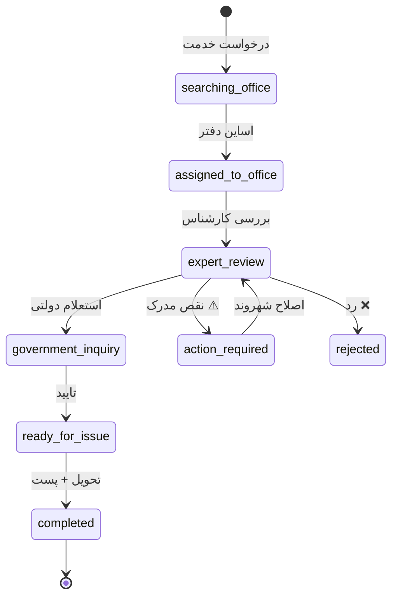

# 🕸️ گراف معماری پروژه (Project Graph)

> این سند نمای گرافی معماری «سامانه جامع خدمات شهروندی و پیشخوان هوشمند» را ترسیم می‌کند.
> داده‌های گراف از ابزار **Graphify** (تجزیه AST — ۲۲۹ نود، ۴۳۲ یال، ۱۳ کامونیتی) استخراج شده است.

---

## ۱. خروجی‌های گرافیکی (فایل‌های تعاملی)

| فایل | حجم | توضیح |
|---|---|---|
| `graphify-out/graph.html` | 197KB | 🌟 **گراف تعاملی کامل** — کلیک روی نود، جستجو، فیلتر کامونیتی (vis.js) |
| `graphify-out/graph.svg` | 582KB | نمودار برداری SVG کل گراف (مناسب مستندات و چاپ) |
| `graphify-out/architecture-callflow.html` | 158KB | نمودار معماری و جریان فراخوانی (Mermaid-based) |
| `graphify-out/GRAPH_TREE.html` | 28KB | درخت جمع‌شونده D3 ساختار فایل‌ها |
| `graphify-out/GRAPH_REPORT.md` | 6KB | گزارش خودکار (نودهای مرکزی، کامونیتی‌ها) |
| `graphify-out/graph.json` | 231KB | داده خام گراف (قابل کوئری با `graphify query`) |

---

## ۲. گراف معماری کلی (Mermaid)

```mermaid
flowchart TD
    subgraph ENTRY["🚪 نقطه ورود"]
        MAIN["main.tsx<br/>StrictMode + createRoot"]
    end

    subgraph CORE["🧠 هسته برنامه"]
        APP["App.tsx<br/>(~650 خط — تمام State ها)<br/>appMode / activeTab / auth"]
        TYPES["types.ts<br/>~35 اینترفیس و تایپ"]
    end

    subgraph VIEWS["🖥️ ویوهای اصلی (تب‌ها)"]
        HOME["Header + WalletCard<br/>CategoryFilter + CtaSlider"]
        CATALOG["ServicesCatalogView<br/>+ ServiceCard"]
        MAP["OfficesMap<br/>(71KB — Leaflet)"]
        CASES["CaseTrackingView<br/>(39KB — تایم‌لاین ۸ مرحله‌ای)"]
        PROFILE["UserProfileView<br/>(103KB — مخزن مدارک)"]
        CONSULT["ConsultationHubView"]
    end

    subgraph MODALS["🪟 مودال‌ها (۹ عدد)"]
        CHAT["SmartChatbotModal"]
        VOICE["VoiceAssistantModal"]
        REQ["ServiceRequestModal"]
        APPT["AppointmentModal"]
        DELEG["LegalDelegationModal"]
        OTHERS["CitizenLogin / OfficeLogin<br/>AdvisorRegistration / BusinessSubscription<br/>ConsultationDetail / LiveSession / QualityCheck"]
    end

    subgraph OFFICE["🏢 حالت اپراتور دفتر"]
        OPLOGIN["OfficeLoginView"]
        OPORTAL["OfficePortalView<br/>(247KB / 4,231 خط)"]
    end

    subgraph DATA["📦 لایه داده (Mock)"]
        MOCK["mockData.ts<br/>2,215 خط — خدمات، دفاتر، پرونده‌ها"]
        CDATA["consultationData.ts<br/>مشاوران و پلن‌ها"]
    end

    subgraph EXT["🌐 وابستگی‌های خارجی"]
        LEAFLET["Leaflet + OSM/CartoDB Tiles"]
        MOTION["Motion (Framer)"]
        LUCIDE["lucide-react"]
        TW["Tailwind CSS v4"]
    end

    MAIN --> APP
    APP --> HOME & CATALOG & MAP & CASES & PROFILE & CONSULT
    APP --> CHAT & VOICE & REQ & APPT & DELEG
    APP --> OPLOGIN & OPORTAL
    APP --> MOCK

    HOME & CATALOG & MAP & CASES & PROFILE & CONSULT --> TYPES
    CHAT & VOICE & REQ & APPT & DELEG & OTHERS --> TYPES
    OPLOGIN --> OPORTAL
    OPORTAL --> TYPES & MOCK
    CONSULT --> CDATA
    CHAT --> MOCK
    MAP --> LEAFLET
    VIEWS & MODALS -.-> MOTION & LUCIDE & TW

    style APP fill:#10b981,color:#fff
    style OPORTAL fill:#ef4444,color:#fff
    style MOCK fill:#f59e0b,color:#fff
    style TYPES fill:#3b82f6,color:#fff
```



---

## ۳. نودهای مرکزی (God Nodes) — پر اتصال‌ترین نمادها

بر اساس خروجی واقعی `graphify god-nodes`:

| رتبه | نماد | اتصالات | فایل | نقش |
|---|---|---|---|---|
| ۱ | `CaseRequest` | ۱۷ | types.ts | مدل پرونده — قلب گردش کار |
| ۲ | `PishkhanOffice` | ۱۷ | types.ts | مدل دفتر پیشخوان |
| ۳ | `CitizenService` | ۱۶ | types.ts | مدل خدمت شهروندی |
| ۴ | `CitizenProfile` | ۱۵ | types.ts | مدل پروفایل شهروند |
| ۵ | `ConsultationAdvisor` | ۹ | types.ts | مدل مشاور |
| ۶ | `ChatMessage` | ۹ | types.ts | مدل پیام‌رسان |
| ۷ | `Appointment` | ۷ | types.ts | مدل نوبت |
| ۸ | `WalletTransaction` | ۷ | types.ts | مدل تراکنش کیف پول |
| ۹ | `CATEGORIES` | ۷ | mockData.ts | داده دسته‌بندی خدمات |

> 💡 **نتیجه معماری:** همه‌چیز به اینترفیس‌های `types.ts` گره خورده — هر تغییر در این فایل بیشترین اثر موجی (ripple) را روی کل پروژه دارد.

---

## ۴. کامونیتی‌های گراف (خوشه‌های ۱۳گانه)

| کامونیتی | اعضای نمونه | تم |
|---|---|---|
| Community 0 | types.ts، ConsultationHubView، ConsultationDetail، LiveSession، consultationData | **اکوسیستم مشاوره** |
| Community 1 | App.tsx، mockData، ServicesCatalog، ServiceCard، CategoryFilter، CtaSlider، OfficeLogin | **کاتالوگ و داده خدمات** |
| Community 3 | CaseRequest، PishkhanOffice، CitizenService، OfficesMap، ServiceRequestModal، SmartChatbot | **گردش کار خدمت و نقشه** |
| Community 6 | UserProfileView، ChatMessage، CitizenProfile، MessagesView | **پروفایل و پیام‌رسان** |
| Community 7 | CitizenLogin، CitizenProfile، ConsultationAdvisor | **احراز هویت شهروند** |
| Community 8 | OfficePortalView | **پنل اپراتور دفتر** (فایل عظیم، کامونیتی مستقل) |
| Community 9 | Navbar، LiquidTabBar | **ناوبری** |

---

## ۵. چرخه عمر پرونده (Case Lifecycle)



---

## ۶. نحوه بروزرسانی گراف

```bash
graphify extract . --code-only     # بازسازی کامل (AST محلی، بدون API key)
graphify update .                  # فقط فایل‌های تغییر‌کرده
graphify watch src                 # همگام‌سازی زنده هنگام کدنویسی
graphify god-nodes --top 10        # نودهای مرکزی
graphify query "سوال"              # پرسش از گراف
```
